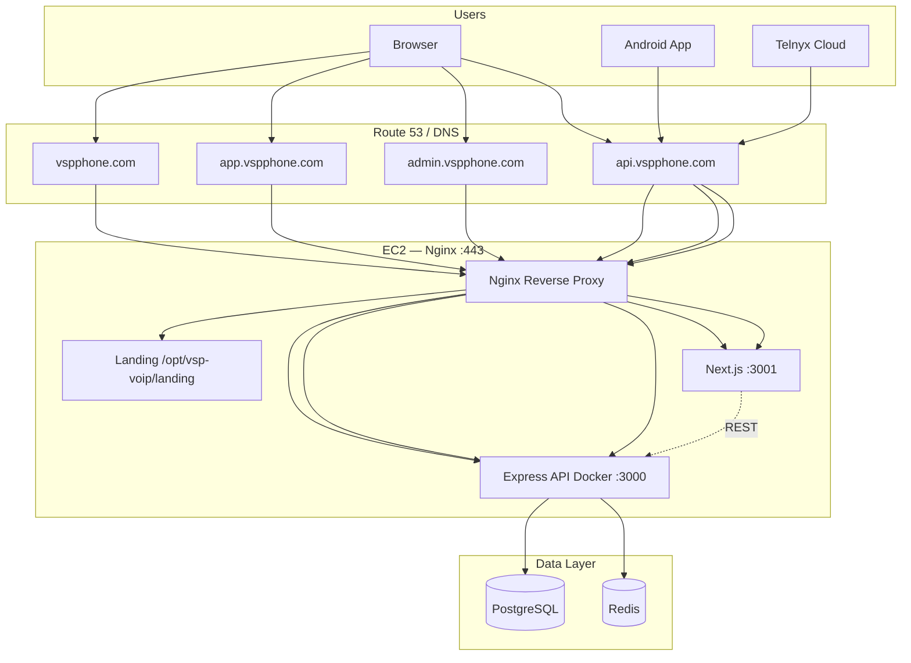

# VSP Phone — Production Deployment Checklist

Target architecture for **vspphone.com** SaaS production on AWS EC2.

---

## Architecture



### Ports (EC2 host)

| Service | Port | Notes |
|---------|------|-------|
| Nginx | 80, 443 | Public HTTPS termination |
| API (Docker) | 3000 | `docker compose` — bind to 127.0.0.1 only after Nginx |
| Next.js portal | 3001 | `pm2` or systemd — tenant + admin (same app) |
| PostgreSQL | 5432 | Docker internal (do not expose publicly) |
| Redis | 6379 | Docker internal |

### WebSocket / WebRTC

| Flow | Path | Notes |
|------|------|-------|
| Telnyx WebRTC | Direct to Telnyx | Mobile softphone — **no** API WebSocket required |
| Telnyx Call Control webhooks | `https://api.vspphone.com/webhook/call-control` | Must stay reachable; do not break |
| Telnyx voice/SMS webhooks | `https://api.vspphone.com/webhook/*` | Update in Telnyx portal after cutover |
| Next.js HMR (dev only) | `ws://localhost:3001` | Not used in production |

---

## Pre-deploy checklist

- [ ] DNS A records: `vspphone.com`, `www`, `api`, `app`, `admin` → EC2 public IP
- [ ] EC2 security group: 22 (SSH), 80, 443 open; **close** public 3000/3001 after Nginx
- [ ] Backup current `.env` and database (`docker compose exec postgres pg_dump`)
- [ ] Note current Telnyx webhook URLs (rollback reference)
- [ ] `git pull` latest code on EC2

---

## Environment variables (EC2 `.env`)

```env
NODE_ENV=production
PORT=3000

# Production URLs — REQUIRED
API_PUBLIC_URL=https://api.vspphone.com
WEB_ORIGIN=https://app.vspphone.com
ADMIN_ORIGIN=https://admin.vspphone.com

# Auth (must match across all API restarts — invalidates existing JWTs if changed)
JWT_SECRET=<strong-random-secret>
SETTINGS_ENCRYPTION_KEY=<32-byte-key>

# Telnyx (DO NOT CHANGE during cutover)
TELNYX_API_KEY=<existing>
TELNYX_PUBLIC_KEY=<existing>
TELNYX_CALL_CONTROL_APP_ID=<existing>
TELNYX_CREDENTIAL_CONNECTION_ID=<existing>

WEBHOOK_STRICT=true
```

### Next.js (`web/.env.production` or pm2 env)

```env
NEXT_PUBLIC_API_URL=https://api.vspphone.com
PORT=3001
```

---

## Deployment steps

### 1. API (Docker — unchanged call logic)

```bash
cd /opt/vsp-voip
git pull
# Update .env with production URLs above
docker compose up -d --build
docker compose logs api -f   # verify Telnyx webhook URLs show https://api.vspphone.com
curl -s https://api.vspphone.com/ready | jq .
```

### 2. Web portal (Next.js)

```bash
cd /opt/vsp-voip/web
npm ci
NEXT_PUBLIC_API_URL=https://api.vspphone.com npm run build
PORT=3001 pm2 start npm --name vsp-web -- start
# Or: pm2 restart vsp-web
```

### 3. Landing page

```bash
# Static files already in repo at landing/
sudo mkdir -p /opt/vsp-voip/landing
sudo cp -r /opt/vsp-voip/landing/* /opt/vsp-voip/landing/
```

### 4. Nginx + SSL

```bash
sudo bash /opt/vsp-voip/deploy/ssl-setup.sh
sudo cp /opt/vsp-voip/deploy/nginx/vspphone.conf /etc/nginx/sites-available/vspphone.conf
sudo ln -sf /etc/nginx/sites-available/vspphone.conf /etc/nginx/sites-enabled/
sudo rm -f /etc/nginx/sites-enabled/default
sudo nginx -t && sudo systemctl reload nginx
```

### 5. Telnyx webhook cutover (after HTTPS verified)

Update in Telnyx Mission Control → Call Control App → Webhook URL:

```
https://api.vspphone.com/webhook/call-control
```

Also update messaging/voice/recording webhook URLs shown in API startup logs.

**Test inbound call before announcing go-live.**

### 6. Mobile APK rebuild

```powershell
.\scripts\build-mobile-android.ps1 -Release -ApiUrl "https://api.vspphone.com"
# Copy APK to landing/apk/ on server for download link
```

### 7. Verify mobile auth

```bash
API_URL=https://api.vspphone.com \
EMAIL=admin@asuitech.com \
PASSWORD='Admin@123' \
node scripts/verify-mobile-auth.js
```

Expected: all routes return 200 (or 403 for super-admin-only edge cases).

---

## Route verification matrix

| Feature | Web route | API route | Auth |
|---------|-----------|-----------|------|
| Dashboard | `/dashboard` | `GET /api/dashboard/stats` | JWT |
| Calls | `/calls` | `GET /api/calls` | JWT + tenantId |
| Recordings | `/recordings` | `GET /api/tenant/recordings` | JWT + tenantId |
| SMS | `/sms` | `GET /api/sms/conversations` | JWT + tenantId |
| Profile | `/settings` | `GET /api/tenant/profile` | JWT + tenantId |
| Voicemail | `/voicemail` | `GET /api/tenant/voicemails` | JWT + tenantId |
| Admin | `/admin` | `GET /api/admin/*` | JWT + SUPER_ADMIN |

---

## Files changed for production

| File | Change |
|------|--------|
| `server.js` | `ADMIN_ORIGIN` CORS allowlist |
| `lib/env.js` | Require `ADMIN_ORIGIN` in production |
| `.env.example` | Production URL template |
| `mobile/lib/core/storage/token_storage.dart` | In-memory token cache (auth race fix) |
| `mobile/lib/core/network/dio_provider.dart` | 401 retry interceptor |
| `mobile/lib/features/auth/providers/auth_providers.dart` | Refresh data providers after login |
| `mobile/lib/config/api_config.dart` | Default `https://api.vspphone.com` |
| `landing/index.html` | Public marketing site |
| `deploy/nginx/vspphone.conf` | Subdomain routing |
| `deploy/ssl-setup.sh` | Certbot commands |
| `scripts/verify-mobile-auth.js` | Auth smoke test |

---

## Risk assessment

| Risk | Severity | Mitigation |
|------|----------|------------|
| Telnyx webhook URL change breaks inbound calls | **Critical** | Update webhooks only after `curl https://api.vspphone.com/ready` passes; test inbound call immediately; keep old URL documented for rollback |
| JWT_SECRET change logs out all users | Medium | Do not rotate JWT_SECRET during cutover unless compromised |
| Nginx strips `Authorization` header | High | Config includes `proxy_set_header Authorization $http_authorization`; run `verify-mobile-auth.js` |
| Database/tenant data loss | Critical | `pg_dump` backup before deploy; do not run destructive migrations manually |
| Public port 3000 bypasses SSL | Medium | Bind API to `127.0.0.1:3000` in compose after Nginx is live |
| Mobile app cached old HTTP URL | Medium | Rebuild APK with `https://api.vspphone.com`; distribute new build |
| `ADMIN_ORIGIN` missing breaks prod startup | Medium | Add to `.env` before `docker compose up` |
| Let's Encrypt rate limits | Low | Use `--dry-run` first; ensure DNS propagated |
| CORS blocks web portal | Medium | Set `WEB_ORIGIN` and `ADMIN_ORIGIN` exactly matching browser URLs |
| Call recording sync slow on first load | Low | Mobile uses `sync=0` query param; optional |

---

## Rollback plan

1. Revert Telnyx webhooks to `http://vspphone.com:3000/webhook/call-control`
2. `git checkout` previous commit; `docker compose up -d --build`
3. Restore `.env` backup
4. Re-open security group port 3000 if needed for interim HTTP access

---

## Post-launch monitoring

- `GET https://api.vspphone.com/ready` — DB + Redis healthy
- `docker compose logs api -f` — webhook events during test calls
- Telnyx debugger — verify `call.initiated`, `call.answered`, `call.hangup`
- Admin portal → Live Operations for SIP telemetry
