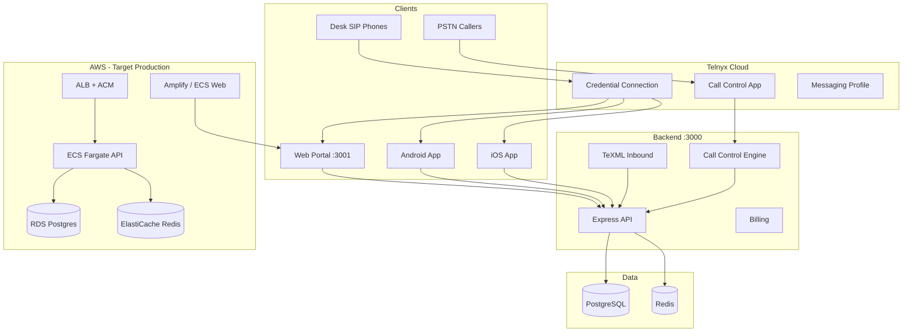

# VSP-VOIP — Complete Application Audit & Documentation

**Date:** June 2026  
**Scope:** Backend API, Web Portal, Android App, iOS App, AWS Deployment  
**Audience:** Product, engineering, and go-live planning

---

## 1. Executive summary

VSP-VOIP is a **multi-tenant cloud PBX** built on **Telnyx**, with:

| Layer | Stack | Role |
|-------|-------|------|
| **API** | Node.js, Express, Prisma, PostgreSQL, Redis | Voice routing, billing, tenant data |
| **Web** | Next.js 16, React 19, Telnyx WebRTC | Tenant + super-admin portal, browser softphone |
| **Mobile** | Flutter, Telnyx WebRTC, FCM, CallKit | Tenant mobile app (calls, SMS read, voicemail) |

**Overall product maturity:** **Pilot / closed-beta ready** for concierge onboarding (first ~10 customers). **Not GA-ready** without AWS production deploy, mobile device QA, and several enterprise PBX features (queues, receptionist, full outbound security).

---

## 2. Architecture overview



### Business model (approved)

**Company → Extension → DID → Employee → Device**

- Extensions and DIDs are long-lived assets; employees are reassignable.
- **Desk SIP** = `Extension.telnyxSipUsername`
- **Mobile / WebRTC** = `User.telnyxSipUsername`

---

## 3. Feature matrix by platform

| Feature | Backend | Web | Android | iOS |
|---------|---------|-----|---------|-----|
| Login / auth | ✅ | ✅ | ✅ | ✅ |
| QR extension provision | ✅ | ✅ (generate) | ✅ (scan) | ✅ (scan) |
| Outbound softphone | ✅ | ✅ | ✅ | ✅ |
| Inbound softphone | ✅ | ✅ (tab open) | ✅ (push) | ✅ (PushKit) |
| Internal ext dial (101→102) | ✅ | ✅ | ❌ broken | ❌ broken |
| Desk SIP dual-target inbound | ✅ | N/A | N/A | N/A |
| Extension admin | ✅ | ✅ | ❌ | ❌ |
| Ring groups | ✅ | ✅ | ❌ | ❌ |
| DND / forwarding config | ✅ | ✅ | ❌ | ❌ |
| Enterprise security | ✅ partial | ✅ UI | ❌ | ❌ |
| SMS read | ✅ | ✅ | ✅ | ✅ |
| SMS send | ✅ | ✅ | ❌ | ❌ |
| Voicemail inbox | ✅ | ✅ | ✅ | ✅ |
| Voicemail settings | ✅ | ✅ | ❌ | ❌ |
| Call history | ✅ | ✅ | ✅ | ✅ |
| Recordings | ✅ | ✅ | ✅ | ✅ |
| Buy numbers / cart | ✅ | ✅ | ❌ | ❌ |
| Billing (Stripe/Razorpay) | ✅ | ✅ partial | ❌ | ❌ |
| Super admin | ✅ | ✅ | ❌ | ❌ |
| Call queues (ACD) | ❌ | ❌ | ❌ | ❌ |
| Receptionist console | ❌ | ❌ | ❌ | ❌ |

---

## 4. Scores (June 2026)

Scores reflect **code completeness + production readiness**, not marketing quality.

| Component | Score | Grade | Summary |
|-----------|-------|-------|---------|
| **Backend API** | **76/100** | B | Rich Telnyx PBX, billing, extensions; missing queues, outbound enforcement, IaC |
| **Web Portal** | **74/100** | B- | Full admin + tenant UX; JWT in localStorage, no frontend tests |
| **Android App** | **72/100** | C+ | Core calling works; internal dial gap, no Play release signing, device QA pending |
| **iOS App** | **65/100** | C | CallKit/VoIP wired; requires Mac build, TestFlight QA, simulator limits |
| **Voice / PBX** | **78/100** | B | Inbound dual-target, ring groups, internal dial (backend); no ACD |
| **Billing & commerce** | **80/100** | B+ | Stripe strong; Razorpay checkout incomplete |
| **Security & compliance** | **62/100** | D+ | Extension security UI; outbound not enforced, no RLS, JWT risks |
| **DevOps / AWS** | **45/100** | F | Docker + docs only; **not deployed**, no Terraform/ECS defs in repo |
| **Testing & QA** | **48/100** | F | Phase validation scripts; almost no unit/E2E, mobile QA manual |
| **Documentation** | **82/100** | B+ | Strong phase reports + launch guides; some doc drift vs code |

### **Overall platform score: 70/100** — Pilot-ready, not enterprise-GA

---

## 5. Positives (strengths)

### Backend
- End-to-end **Telnyx** integration: TeXML inbound, Call Control, SMS, recording, number purchase
- **Multi-tenant** model with quotas, suspension, billing grace
- **Extension lifecycle** (Phase 4A–5C): desk SIP creds, dual-target inbound, internal extension dial
- **Ring groups** with strategies, group voicemail, analytics
- **Billing integrity** jobs, revenue protection, Stripe + manual bank + Razorpay webhooks
- **Operational endpoints**: `/health`, `/ready`, admin dashboards, voice quality telemetry
- **Docker** + Compose for local/staging; CI smoke test on Postgres + Redis

### Web
- Modern **Next.js 16 / React 19** portal with ~70 routes
- Complete **extension management** UI (drawer, SIP, QR, security, analytics)
- **Browser softphone** with inbound/outbound WebRTC + extension dial
- **Super-admin** suite: tenants, inventory, billing, platform settings, monitoring
- **Call routing** UI: greeting, IVR, business hours, ring groups

### Mobile
- **Flutter** clean architecture (Riverpod, GoRouter)
- **Inbound push** path: FCM (Android) + PushKit/CallKit (iOS)
- **Outbound WebRTC** with caller ID, mute, speaker, call logging
- **QR provisioning** for extension onboarding
- **Voicemail + recordings** in-app playback
- Debug **APK build script** working on Windows

### Documentation & process
- Phase reports (3A–5C), launch checklist, Telnyx/Stripe go-live guides
- Validation scripts per phase (`npm run validate:phase*`)

---

## 6. Drawbacks & gaps (by area)

### Critical (block production launch)

| Gap | Impact |
|-----|--------|
| **AWS not deployed** | No production environment; Telnyx webhooks need public HTTPS |
| **No IaC** | Manual ECS/RDS/Redis setup; error-prone, not reproducible |
| **Mobile release QA** | Inbound/outbound on physical devices not signed off |
| **Android release keystore** | Play Store upload blocked |
| **iOS requires Mac + TestFlight** | Cannot build/sign IPA on Windows |
| **`API_PUBLIC_URL` + Redis in prod** | Call Control + simultaneous ring need both |

### High (limit enterprise sales)

| Gap | Impact |
|-----|--------|
| **Call queues (ACD)** | Not implemented — contact-center customers excluded |
| **Receptionist console** | No transfer, park, pickup, monitor |
| **Mobile internal extension dial** | `102` normalized to `+102` — broken vs backend Phase 5C |
| **Outbound security enforcement** | Permissions stored but not checked at dial time |
| **JWT in localStorage (web)** | XSS could steal tokens; no httpOnly cookies |
| **No frontend tests** | Regressions likely on UI changes |
| **Razorpay checkout** | Placeholder in web cart |
| **Uploads not on S3** | Greetings/payment proofs on local disk — lost on container restart |

### Medium (pilot acceptable)

| Gap | Impact |
|-----|--------|
| **No PostgreSQL RLS** | Tenant isolation relies on app layer only |
| **Single API instance** | No HA until second ECS task |
| **Busy forward incomplete** | Schema exists; Call Control busy detection partial |
| **Call screening** | DTMF backend only; no in-app accept/reject |
| **Intercom** | API only; no auto-answer UX |
| **SMS push on mobile** | Not implemented |
| **10DLC registration** | US SMS at scale needs carrier compliance |
| **Doc drift** | `mobile-app.html` outdated vs Flutter code |

### Low (roadmap)

| Gap | Impact |
|-----|--------|
| **Self-serve signup** | Intentionally concierge for first 10 |
| **Visual DND/schedule editor** | JSON/toggle only |
| **Holiday calendar** | Deferred |
| **SOC2 / audit CSV export** | Deferred |
| **Desk phone RPS/inventory** | Manual Zoiper/Linphone only |

---

## 7. Component deep-dive

### 7.1 Backend API

**Entry:** `server.js`  
**Routes:** `routes/portal.js`, `routes/admin.js`, `routes/extensions.js`, `routes/ringGroups.js`  
**Voice:** `lib/inboundCallControl.js`, `lib/inboundRouting.js`, `lib/internalExtensionDial.js`, `lib/ringGroupRouter.js`

**Key env vars (production):**

```env
DATABASE_URL=postgresql://...?sslmode=require
REDIS_URL=rediss://...
JWT_SECRET=...
SETTINGS_ENCRYPTION_KEY=...
TELNYX_API_KEY=...
TELNYX_PUBLIC_KEY=...
API_PUBLIC_URL=https://api.yourdomain.com
WEB_ORIGIN=https://app.yourdomain.com
STRIPE_WEBHOOK_SECRET=...
SMTP_HOST=...
```

**Webhooks (Telnyx → API):**

| Path | Purpose |
|------|---------|
| `/webhook/call-control` | Inbound Call Control, internal dial, mobile ring |
| `/webhook/voice` | Credential connection, outbound recording |
| `/webhook/sms` | SMS inbound |
| `/webhook` | Legacy TeXML inbound |

---

### 7.2 Web portal

**Path:** `web/` — port **3001**  
**API client:** `web/src/lib/api.ts` (~2300 lines)

**Run locally:**

```powershell
npm run dev:api          # port 3000
npm run dev:web          # port 3001
# Set NEXT_PUBLIC_API_URL=http://localhost:3000 in web/.env.local
```

**Production build:**

```powershell
cd web && npm run build && npm start
```

---

### 7.3 Mobile (Android + iOS)

**Path:** `mobile/` — Flutter **1.0.0-beta.1+2**  
**Package:** `com.vspvoip.mobile`

**Run locally:**

```powershell
cd mobile
flutter run --dart-define=API_BASE_URL=http://10.0.2.2:3000   # emulator
flutter run --dart-define=API_BASE_URL=http://LAN_IP:3000     # physical device
```

**Build Android APK:**

```powershell
npm run build:mobile:android
# Output: mobile/build/app/outputs/flutter-apk/app-debug.apk
```

**Build iOS (macOS only):**

```bash
./scripts/build-mobile-ios.sh --simulator
# Open mobile/ios/Runner.xcworkspace in Xcode for device/TestFlight
```

**Mobile-specific blockers:**

- Firebase `google-services.json` must match `com.vspvoip.mobile`
- Telnyx credential connection: FCM + APNs VoIP keys
- iOS VoIP push **does not work on simulator**
- Cleartext HTTP enabled for dev — disable for production

---

## 8. AWS deployment guide (summary)

Full guide: [`docs/launch/production-deployment-guide.md`](./launch/production-deployment-guide.md)

### Target architecture (first 10 customers)

| AWS service | Purpose |
|-------------|---------|
| **Route 53** | DNS for `api.` and `app.` domains |
| **ACM** | TLS certificates on ALB |
| **ALB** | HTTPS → ECS API; Telnyx webhook ingress |
| **ECS Fargate** | API container from repo `Dockerfile` |
| **RDS PostgreSQL 16** | Primary database (`db.t4g.small`) |
| **ElastiCache Redis 7** | Sessions, rate limits, Call Control state |
| **Secrets Manager** | JWT, Telnyx, Stripe, SMTP secrets |
| **CloudWatch** | Logs + alarms |
| **Amplify or ECS** | Next.js web static/SSR |
| **S3** (recommended) | Greetings audio, payment proof uploads |

### Deployment steps (checklist)

1. **RDS** — create Postgres 16, security group, 7-day backups  
2. **ElastiCache** — Redis 7 with TLS + AUTH  
3. **ECR** — push `docker build -t vsp-voip-api .`  
4. **ECS Fargate** — task def: 512 CPU / 1024 MB, env from Secrets Manager  
5. **ALB** — target group → ECS, health check `/ready`  
6. **ACM** — cert for `api.yourdomain.com`  
7. **Route 53** — A/ALIAS to ALB  
8. **Migrate DB** — `npx prisma migrate deploy`  
9. **Seed once** — super admin only  
10. **Telnyx** — set `API_PUBLIC_URL`, verify webhooks  
11. **Web** — deploy to Amplify with `NEXT_PUBLIC_API_URL=https://api.yourdomain.com`  
12. **Smoke test** — `npm run validate:p0`, inbound call test, Stripe webhook  

### What is NOT in the repo (must create manually)

- Terraform / CloudFormation templates
- ECS task definition JSON
- ALB listener rules
- S3 bucket + IAM for uploads
- WAF rules (recommended before scale)

### Docker local (staging)

```powershell
docker compose up --build
# API :3000, Postgres, Redis
```

**Gap:** `uploads/` not persisted in Compose — add volume or S3 before prod.

---

## 9. Recommended roadmap (priority order)

| Priority | Item | Unlocks |
|----------|------|---------|
| P0 | Deploy AWS (ECS + RDS + Redis + ALB) | Production go-live |
| P0 | Mobile device QA (Android release + iOS TestFlight) | Closed beta |
| P0 | Android keystore + Play internal track | Mobile distribution |
| P1 | Fix mobile internal extension dial | Phase 5C parity |
| P1 | S3 for uploads + signed URLs | Durable media |
| P1 | Outbound security enforcement | Enterprise security |
| P2 | httpOnly auth / refresh tokens (web) | Security hardening |
| P2 | Frontend + API integration tests | Regression safety |
| P2 | Razorpay checkout completion | India payments |
| P3 | Call queues (Phase 5B roadmap) | Contact center |
| P3 | Receptionist console (Phase 5C roadmap) | Operator workflows |
| P3 | SMS send on mobile | Feature parity |

---

## 10. Quick reference — run everything locally

```powershell
# Terminal 1 — API + DB (requires PostgreSQL + Redis locally or Docker)
npm run dev:api

# Terminal 2 — Web portal
npm run dev:web

# Terminal 3 — Mobile emulator
cd mobile
flutter run --dart-define=API_BASE_URL=http://10.0.2.2:3000

# Or install pre-built APK
adb install -r mobile\build\app\outputs\flutter-apk\app-debug.apk
```

**Test login:** `admin@asuitech.com` / `Admin@123` (tenant admin)

---

## 11. Related documentation index

| Document | Topic |
|----------|-------|
| `docs/launch/production-deployment-guide.md` | AWS architecture |
| `docs/launch/launch-checklist.md` | Go-live checklist |
| `docs/launch/remaining-risks-report.md` | Risk matrix |
| `docs/PHASE4A–4C` | Extension management |
| `docs/PHASE5A–5C` | Ring groups, inbound dual-target, internal dial |
| `docs/PHASE3B-*` | Mobile inbound calling |
| `mobile/README.md` | Flutter setup |
| `mobile/docs/inbound-calling-setup.md` | FCM / APNs setup |

---

*This audit reflects repository state as of June 2026. Re-run validation scripts after major releases.*
