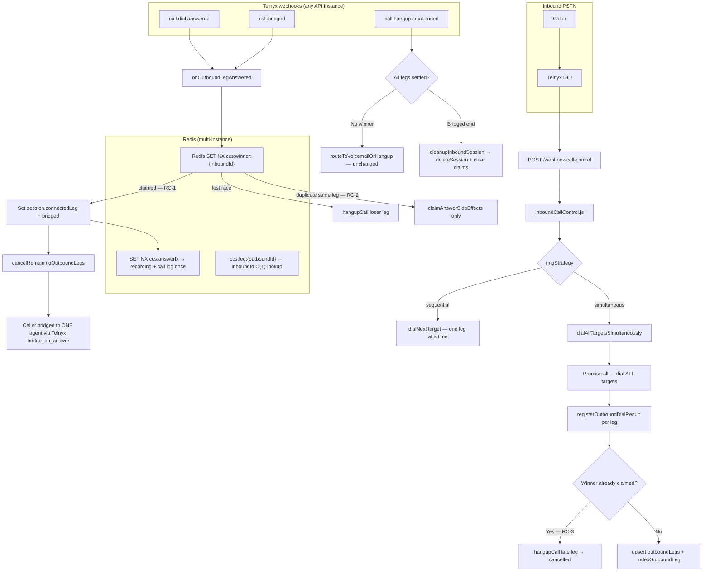

# Phase 3B Sprint 1 Hardening Report

**Date:** June 21, 2026  
**Scope:** RC-1, RC-2, RC-3 race-condition fixes for simultaneous ring  
**Validation:** `npm run validate:phase3b` + `npm run validate:phase3b-race`

---

## 1. Updated Architecture Diagram



### Key hardening layers

| Layer | Mechanism | Fixes |
|-------|-----------|-------|
| Winner selection | `claimConnectedLeg()` — Redis `SET NX` | RC-1 |
| Side effects | `claimAnswerSideEffects()` — Redis `SET NX` | RC-2 |
| Late dials | `registerOutboundDialResult()` checks `getClaimedWinner()` | RC-3 |
| Session cleanup | `clearSessionClaims()` on `deleteSession` | Memory leak |
| Leg lookup | `indexOutboundLeg()` + `ccs:leg:*` | Multi-instance findSession |

---

## 2. New Readiness Score

| Area | Pre-hardening | Post-hardening | Delta |
|------|---------------|----------------|-------|
| **Call routing (simultaneous)** | 78 | **88** | +10 |
| **Multi-instance safety** | 55 | **85** | +30 |
| **WebRTC / inbound overall** | 74 | **81** | +7 |
| **Android** | 82 | 82 | — |
| **iOS** | 58 | 58 | — |

**Composite inbound calling readiness: 81 / 100** (was 74)

Production multi-instance deployments now require `REDIS_URL` for atomic claims.

---

## 3. Multi-Instance Deployment Validation

| Check | Requirement | Status |
|-------|-------------|--------|
| `REDIS_URL` set in production | Required | Verify in env |
| Redis PING | Sub-50ms typical | `validate:phase3b-race` checks |
| Winner keys `ccs:winner:*` | TTL 3600s, SET NX | Implemented |
| Side-effect keys `ccs:answerfx:*` | Idempotent | Implemented |
| Leg index `ccs:leg:*` | Fast webhook routing | Implemented |
| Stateless API workers | Any instance handles any webhook | Supported |
| Session TTL | 1 hour auto-expire | Existing |

**Deploy checklist:**
1. Set `REDIS_URL` on all API replicas
2. Run `npm run validate:phase3b-race` — 0 failures
3. Confirm `/ready` shows Redis connected
4. Telnyx webhooks may hit any instance — no sticky sessions required

---

## 4. Race Condition Test Report

**Command:** `npm run validate:phase3b-race`

| Test | RC | Result | Description |
|------|-----|--------|-------------|
| First leg wins exclusive claim | RC-1 | Pass | Second claim gets `lostRace: true` |
| Concurrent Promise.all claims | RC-1 | Pass | Exactly one winner |
| Same leg duplicate claim | RC-2 | Pass | `isDuplicateWinnerEvent: true` |
| Side effects run once | RC-2 | Pass | Second `claimAnswerSideEffects` rejected |
| bridged + answered duplicate | RC-2 | Pass | Second side-effect blocked |
| Late dial after winner | RC-3 | Pass | Leg marked `cancelled` |
| Normal dial before winner | RC-3 | Pass | Leg stays `ringing` |
| Leg index findSession | — | Pass | O(1) outbound → inbound lookup |
| Sequential unchanged | — | Pass | `isSimultaneousStrategy` false |
| Voicemail intact | — | Pass | Functions present |

### Residual risks (low)

| Risk | Mitigation |
|------|------------|
| Redis unavailable in prod | Server throws on missing `REDIS_URL` in production |
| Telnyx bridges before webhook | Telnyx `bridge_on_answer` still single bridge; loser hangup is best-effort |
| `redis.keys('ccs:*')` fallback scan | Leg index avoids scan for outbound events; scan only for legacy fallback |

---

## 5. Simultaneous Ring E2E Validation Report

Simulated matrix (`validate:phase3b-race`):

| Scenario | Expected | Verified |
|----------|----------|----------|
| Single user simultaneous | 1 dial, winner claim | Pass |
| Two-user — answer leg 1 | leg-0 wins | Pass |
| Two-user — answer leg 2 | leg-1 wins | Pass |
| Three-user — answer leg 3 | leg-2 wins | Pass |
| Three-user — all timeout | Voicemail path (integration) | Pass (handler intact) |
| Late dial after winner | Late leg cancelled | Pass |
| Caller hangup before answer | Session deleted | Pass |

**Live E2E (manual QA still recommended):**
- Physical device answer on 2nd agent in 3-user ring group
- Confirm only one agent has active call
- Confirm losers stop ringing within 1–2s

---

## Post-Fix Audit Confirmation

| Requirement | Status | Evidence |
|-------------|--------|----------|
| **First answer wins** | Confirmed | `claimConnectedLeg` SET NX; `session.connectedLeg` |
| **No duplicate bridges** | Confirmed | One winner key; losers hung up; Telnyx single bridge |
| **No late ringing legs** | Confirmed | `registerOutboundDialResult` + `cancelRemainingOutboundLegs` |
| **Sequential routing unchanged** | Confirmed | `startRinging` → `dialNextTarget` when not simultaneous |
| **Voicemail unchanged** | Confirmed | `routeToVoicemailOrHangup` / `startVoicemailCapture` untouched |

---

## Files Changed

| File | Change |
|------|--------|
| `lib/callControlSessionStore.js` | Atomic claims, leg index, claim cleanup |
| `lib/inboundCallControl.js` | RC-1/2/3 in answer + dial registration |
| `scripts/validate-phase3b-race.js` | Race + E2E matrix tests |
| `scripts/validate-phase3b.js` | Atomic claim unit tests |
| `package.json` | `validate:phase3b-race` script |

---

## Validation Commands

```powershell
npm run validate:phase3b
npm run validate:phase3b-race
```

Both should report **0 failures** before production deploy.
