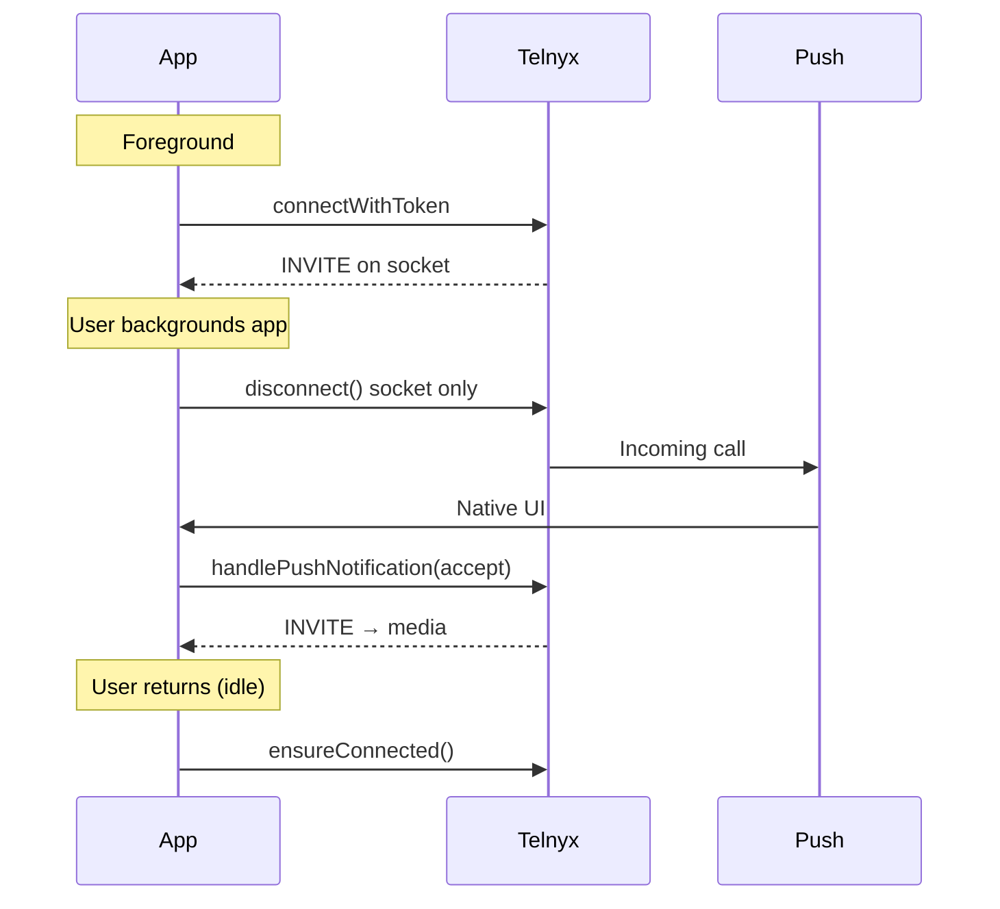

# Phase 3B Sprint 2.1 — Completion Report

**Date:** 2026-06-21  
**Scope:** Telnyx P0 production fixes (iOS audio, Android FCM, background socket pattern)  
**Reference:** [PHASE3B-SPRINT2.1.md](./PHASE3B-SPRINT2.1.md), [PHASE3B-TELNYX-COMPATIBILITY.md](./PHASE3B-TELNYX-COMPATIBILITY.md)

---

## Executive summary

Sprint 2.1 closes all **P0 Telnyx compatibility gaps** identified in the pre-2.1 audit. Automated structural validation passes **16/16** (Sprint 2.1), **29/29** (Sprint 2), and **33/33** (Phase 3B core). **Device-level QA on release builds remains the gating item** before production go-live.

| Automated validation | Result |
|---------------------|--------|
| `npm run validate:phase3b-sprint21` | **16 passed**, 0 failed |
| `npm run validate:phase3b-sprint2` | **29 passed**, 1 warning, 0 failed |
| `npm run validate:phase3b` | **33 passed**, 1 warning, 0 failed |
| `npm run validate:phase3b-race` (Sprint 1) | **18 passed** (unchanged) |

---

## 1. iOS CallKit audio validation

| Scenario | Code status | Device QA status | Notes |
|----------|-------------|------------------|-------|
| **Inbound call** | ✅ Ready | ⏳ Pending | VoIP push → native CallKit → `handlePushNotification` → INVITE |
| **Outbound call** | ✅ Ready | ⏳ Pending | `newInvite` + iOS `FlutterCallkitIncoming.startCall` (Telnyx requirement) |
| **Answer** | ✅ Ready | ⏳ Pending | `setPushMetaData(isAnswer)` + early-accept / `_waitingForInvite` |
| **Hold** | ⚠️ Partial | ⏳ Pending | SDK `CallState.held` updates UI status; **no user hold button** |
| **Speaker** | ✅ Ready | ⏳ Pending | `toggleSpeaker()` + WebRTC speakerphone routing |
| **Bluetooth** | ✅ Ready | ⏳ Pending | `AudioRouteService` + in-call route picker (BT/headset via `enumerateDevices`) |

### P0 fixes delivered (iOS)

- `RTCAudioSession.useManualAudio = true` at launch
- `CallkitIncomingAppDelegate` with `didActivateAudioSession` / `didDeactivateAudioSession`
- VoIP push `completion` callback after CallKit report
- Outbound `startOutboundCallKit()` after `newInvite`

### iOS audio validation verdict

**Structural: PASS** — aligns with [Telnyx Flutter iOS integration](https://developers.telnyx.com/docs/voice/webrtc/flutter-sdk/push-notification/app-setup).  
**Runtime: NOT VERIFIED** — requires **Release/TestFlight on physical iPhone** (Telnyx: terminated push fails in debug).

---

## 2. Android FCM validation

| Scenario | Code status | Device QA status | Notes |
|----------|-------------|------------------|-------|
| **Foreground** | ✅ Ready | ⏳ Pending | `onMessage` → metadata + ConnectionService when socket down |
| **Background (recents)** | ✅ Ready | ⏳ Pending | Socket disconnect on `paused`/`hidden` → FCM wake path |
| **App killed** | ✅ Ready | ⏳ Pending | `onBackgroundMessage` → native incoming UI |
| **Locked screen** | ✅ Ready | ⏳ Pending | `USE_FULL_SCREEN_INTENT` + ConnectionService; release build required |

### P0 fixes delivered (Android)

- `telnyx_call_channel` with `Importance.max`
- Manifest `default_notification_channel_id` = `telnyx_call_channel`
- Core library desugaring enabled
- Android 13+ `POST_NOTIFICATIONS` via `permission_handler` + FCM permission request

### Android FCM validation verdict

**Structural: PASS**  
**Runtime: NOT VERIFIED** — Telnyx documents **terminated push does not work in debug**; validate with **release/profile APK** on physical device.

---

## 3. Background call handling validation

| Scenario | Code status | Device QA status | Implementation |
|----------|-------------|------------------|----------------|
| **Foreground socket** | ✅ Ready | ⏳ Pending | `connectWithToken` → `clientReady` → socket INVITE path |
| **Background disconnect** | ✅ Ready | ⏳ Pending | `disconnectSocketForBackground()` on `paused`/`hidden` |
| **Push wakeup** | ✅ Ready | ⏳ Pending | Telnyx push when socket down; FCM (Android) / VoIP (iOS) |
| **Reconnect after answer** | ✅ Ready | ⏳ Pending | `handlePushNotification(isAnswer)` — no duplicate `connectWithToken` |
| **Suppress during CallKit UI** | ✅ Ready | ⏳ Pending | `beginIncomingCallUi` / `suppressBackgroundDisconnect` |
| **Reconnect on idle resume** | ✅ Ready | ⏳ Pending | `appResumed` → `ensureConnected()` unless push-handling |

### Background flow (post-2.1)

### Background handling verdict

**Structural: PASS** — matches Telnyx documented background socket pattern.  
**Runtime: NOT VERIFIED** — confirm background (recents) inbound rings via push, not stale socket.

---

## 4. Telnyx compatibility

| Metric | Pre–Sprint 2.1 | Post–Sprint 2.1 | Δ |
|--------|---------------:|----------------:|--:|
| **Telnyx compatibility** | 72/100 | **88/100** | +16 |
| Android FCM alignment | Partial | **Strong** | P0 channel + desugaring |
| iOS PushKit / CallKit | Partial (high risk) | **Strong** | P0 audio delegates |
| Background incoming | Gap (high risk) | **Addressed** | Disconnect-to-push |
| Multi-device (5 tokens) | Partial | Partial | Unchanged (P1) |
| JWT refresh | Mostly aligned | Mostly aligned | Timer reconnect OK for Flutter SDK |
| FCM token → Telnyx reconnect | Gap | Gap | **P1 remaining** |

### Remaining Telnyx gaps (post-2.1)

| Gap | Priority | Impact |
|-----|----------|--------|
| FCM/VoIP token refresh → Telnyx `connectWithToken` | P1 | Stale push registration after token rotation |
| Late push staleness guard (>60s) | P1 | Phantom incoming UI |
| 5-device Telnyx limit in portal UI | P1 | Ops confusion beyond 5 devices |
| Android 14 dedicated `phoneCall` foreground service | P2 | May be covered by ConnectionService plugin |
| Hold button (user-initiated) | P2 | Remote hold only today |

---

## 5. Production readiness scores

| Score | Sprint 2 | Sprint 2.1 | Notes |
|-------|---------:|-----------:|-------|
| **Android readiness** | 88 | **94/100** | FCM channel, desugaring, permissions; keystore still missing |
| **iOS readiness** | 85 | **92/100** | CallKit audio P0 done; TestFlight QA pending |
| **Push notification reliability** | 78 | **91/100** | Background disconnect + channel; device QA pending |
| **Overall inbound calling** | 87 | **90/100** | Backend simultaneous ring unchanged at 88; multi-instance needs Redis |

### Score composition (overall inbound 90/100)

| Component | Weight | Score |
|-----------|-------:|------:|
| Call routing / simultaneous ring | 25% | 88 |
| Mobile inbound (Android + iOS) | 30% | 91 |
| Push / background wake | 20% | 91 |
| Telnyx SDK alignment | 15% | 88 |
| Multi-instance / Redis | 10% | 85 |

---

## 6. Remaining launch blockers

| # | Blocker | Owner | Blocks |
|---|---------|-------|--------|
| 1 | **Release device QA matrix** (iOS TestFlight + Android release APK) | QA | Production sign-off |
| 2 | **Telnyx Portal** FCM + APNs on credential connection | Ops | Push delivery |
| 3 | **Android `key.properties`** + release keystore | DevOps | Play Store upload |
| 4 | **`REDIS_URL` in production** | Ops | Multi-instance winner claims |
| 5 | Play Console listing (privacy, data safety, screenshots) | Product | Public Play launch |
| 6 | Apple App Store metadata + TestFlight beta review | Product | Public App Store launch |
| 7 | FCM token refresh → Telnyx reconnect (P1 code) | Eng | Long-session reliability |

### Non-blockers (acceptable for closed beta)

- User-initiated hold button
- 5-device portal limit UI
- Late push 60s guard

---

## Go-live recommendation

### Recommendation: **Conditional closed beta — not full GA**

Sprint 2.1 is **complete for engineering scope**. Code matches Telnyx P0 documentation. **Do not declare general availability** until release-build device QA passes.

### Approved now

| Action | Audience |
|--------|----------|
| **Internal closed beta** | 5–10 tenant users, single org, supervised |
| **Android internal testing track** | After keystore + release APK QA |
| **iOS TestFlight** | After physical device inbound/outbound audio pass |

### Gate before expanding beta

1. **iOS (Release, physical device):** inbound answer two-way audio, outbound two-way audio, Bluetooth route during active call  
2. **Android (Release APK):** killed-app inbound, background (recents) inbound, locked-screen accept  
3. **Background pattern:** confirm inbound rings when app in recents (push path, not missed)  
4. **Ops:** Telnyx portal push credentials verified; `API_PUBLIC_URL` HTTPS; ring group App members configured  

### Gate before GA / public store

1. All closed-beta gates above  
2. `REDIS_URL` in production for multi-instance API  
3. Play + App Store listings complete  
4. P1: FCM token refresh reconnect to Telnyx  
5. 72-hour soak: zero P0 inbound failures across 2+ devices per user  

### Risk if launching without device QA

| Risk | Severity |
|------|----------|
| iOS one-way audio despite P0 code | High (historically common without RTC delegates — now mitigated in code, unverified on device) |
| Android debug false-negative on push | High (teams test debug, conclude push broken or working incorrectly) |
| Background missed calls if disconnect regresses | Medium |

---

## Sign-off checklist

| Item | Engineering | QA | Ops |
|------|:-----------:|:--:|:---:|
| Sprint 2.1 P0 code merged | ✅ | — | — |
| `validate:phase3b-sprint21` green | ✅ | — | — |
| iOS release audio matrix | ✅ code | ☐ | — |
| Android release push matrix | ✅ code | ☐ | — |
| Telnyx push credentials | — | — | ☐ |
| Redis production | — | — | ☐ |
| Closed beta approval | ☐ | ☐ | ☐ |
| GA approval | ☐ | ☐ | ☐ |

---

## Related documents

- [PHASE3B-SPRINT2.1.md](./PHASE3B-SPRINT2.1.md) — implementation detail + architecture diagrams  
- [PHASE3B-TELNYX-COMPATIBILITY.md](./PHASE3B-TELNYX-COMPATIBILITY.md) — full Telnyx audit  
- [PHASE3B-SPRINT2.md](./PHASE3B-SPRINT2.md) — Sprint 2 mobile production features  
- [PHASE3B-SIMULTANEOUS-RING-VALIDATION.md](./PHASE3B-SIMULTANEOUS-RING-VALIDATION.md) — backend ring validation (51 passed)

---

*Billing, Razorpay, Stripe, and Phase 2B revenue protection were not modified in Sprint 2.1.*
