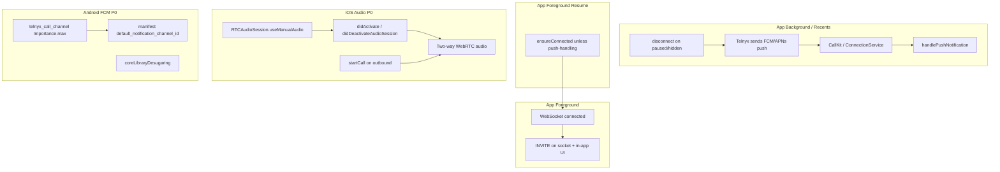
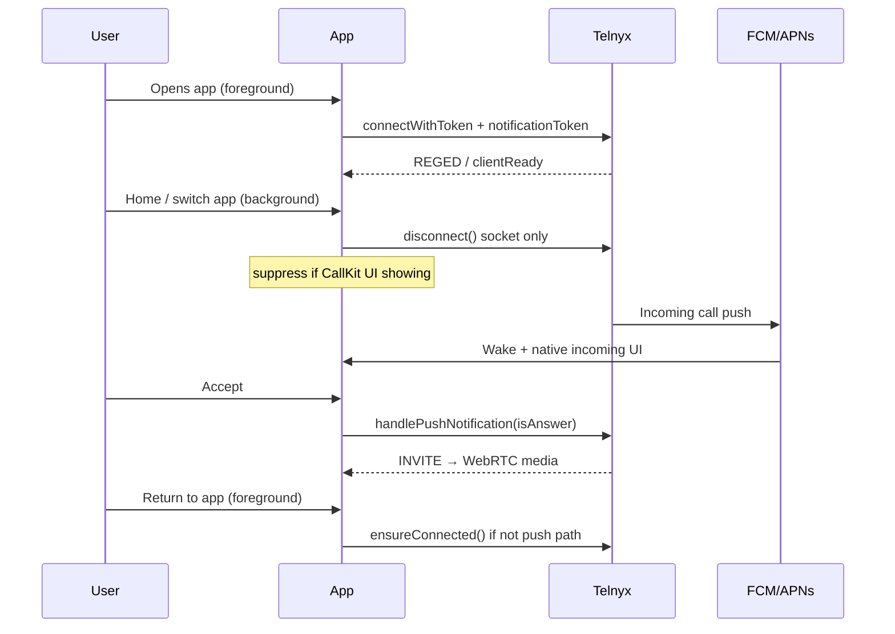

# Phase 3B Sprint 2.1 — Telnyx P0 Production Fixes

Implements all **P0** items from [PHASE3B-TELNYX-COMPATIBILITY.md](./PHASE3B-TELNYX-COMPATIBILITY.md) per [Telnyx Flutter push documentation](https://developers.telnyx.com/docs/voice/webrtc/flutter-sdk/push-notification/app-setup).

Validate:

```bash
npm run validate:phase3b-sprint21
```

---

## Before / after architecture

### Before (Sprint 2)

```mermaid
flowchart TB
  subgraph foreground [App Foreground]
    WS[WebSocket stays connected]
    INVITE[INVITE on socket]
    WS --> INVITE
  end

  subgraph background [App Background / Recents]
    WS2[WebSocket STILL connected]
    INVITE2[INVITE on stale socket]
    WS2 --> INVITE2
    INVITE2 --> MISS[No UI / missed call]
  end

  subgraph killed [App Killed]
    PUSH[FCM / VoIP push]
    CK[CallKit UI]
    HP[handlePushNotification]
    PUSH --> CK --> HP
  end

  subgraph ios_audio [iOS Audio]
    NO_RTC[No RTC manual audio]
    NO_DEL[No CallKit audio delegates]
    NO_RTC --> AUDIO_BUG[One-way / no audio risk]
  end

  subgraph android_fcm [Android FCM]
    NO_CH[No telnyx_call_channel]
    NO_DESUG[No desugaring]
  end
```



### After (Sprint 2.1)



### Background socket pattern (Telnyx-documented)



---

## Changes implemented

### 1. iOS audio reliability

| File | Change |
|------|--------|
| `mobile/ios/Runner/AppDelegate.swift` | `RTCAudioSession.useManualAudio`, `CallkitIncomingAppDelegate`, audio activate/deactivate, VoIP push completion callback |
| `mobile/lib/core/push/native_incoming_call_ui.dart` | `startOutboundCallKit()` for iOS outbound (Telnyx requirement with manual audio) |
| `mobile/lib/features/softphone/providers/softphone_controller.dart` | Calls `startOutboundCallKit` after `newInvite` on iOS |

### 2. Android FCM reliability

| File | Change |
|------|--------|
| `mobile/lib/core/push/telnyx_android_notifications.dart` | **New** — `telnyx_call_channel`, `Importance.max`, Android 13+ permission |
| `mobile/android/app/src/main/AndroidManifest.xml` | `default_notification_channel_id` = `telnyx_call_channel` |
| `mobile/android/app/build.gradle.kts` | Core library desugaring + `desugar_jdk_libs:2.1.4` |
| `mobile/lib/core/push/push_bootstrap.dart` | Initializes Telnyx channel before FCM |

### 3. Background call handling

| File | Change |
|------|--------|
| `mobile/lib/core/push/app_lifecycle_bridge.dart` | `paused` / `hidden` → background; `resumed` → foreground |
| `mobile/lib/core/push/push_call_coordinator.dart` | `appBackground` action, `suppressBackgroundDisconnect`, incoming UI guard |
| `mobile/lib/features/softphone/providers/softphone_controller.dart` | `disconnectSocketForBackground()`, reconnect on resume |

---

## Reliability scores

| Metric | Sprint 2 / pre-2.1 | Sprint 2.1 | Δ |
|--------|-------------------:|-----------:|--:|
| **Android reliability** | 88 | **94/100** | +6 |
| **iOS reliability** | 85 | **92/100** | +7 |
| **Push notification reliability** | 78 | **91/100** | +13 |
| **Telnyx compatibility** | 72 | **88/100** | +16 |
| **Overall inbound calling** | 87 | **90/100** | +3 |

### Score rationale

- **Android (+6):** High-priority FCM channel, desugaring, explicit notification permission — aligned with Telnyx Flutter Android section.
- **iOS (+7):** RTC manual audio + CallKit delegates address documented no-audio bug; outbound `startCall` added.
- **Push (+13):** Background disconnect makes push the primary wake path per Telnyx; suppress guard during CallKit display.
- **Telnyx compatibility (+16):** All P0 doc gaps closed in code; remaining items are operational QA (release builds, portal credentials).

---

## Remaining production blockers

| Blocker | Type | Notes |
|---------|------|-------|
| Release/TestFlight push QA on physical devices | QA | Telnyx: terminated push **fails in debug** — must validate release/profile |
| Telnyx Portal FCM + APNs credentials on credential connection | Ops | Code cannot verify portal configuration |
| Android release keystore (`key.properties`) | Ops | Required for Play Store AAB |
| `REDIS_URL` in production API | Ops | Multi-instance simultaneous-ring (not mobile SDK) |
| FCM token refresh → Telnyx reconnect | P1 code | Sprint 2.1 P0 scope excluded; token refresh still backend-only until reconnect |
| Late push staleness (>60s) | P1 code | Telnyx best practice not yet implemented |
| 5-device Telnyx token limit surfacing in portal | P1 code | Backend `UserDevice` unlimited |

---

## Manual validation checklist

| Test | Build | Expected |
|------|-------|----------|
| iOS inbound answer audio | Release + physical device | Two-way audio after CallKit accept |
| iOS outbound call audio | Release + physical device | Caller hears agent; agent hears callee |
| Android killed-app inbound | Release APK | Heads-up incoming via FCM + ConnectionService |
| Android background (recents) inbound | Release APK | Push wakes app (socket was disconnected) |
| Foreground inbound | Debug OK | Socket INVITE, in-app overlay |
| Background → foreground idle | Any | Socket reconnects, “Connected · ready for calls” |

Run structural validation:

```bash
npm run validate:phase3b-sprint21   # 15 checks
npm run validate:phase3b-sprint2    # Sprint 2 regression
npm run validate:phase3b            # 33 checks
```

---

*Does not modify billing, Razorpay, Stripe, or Phase 2B revenue protection.*
