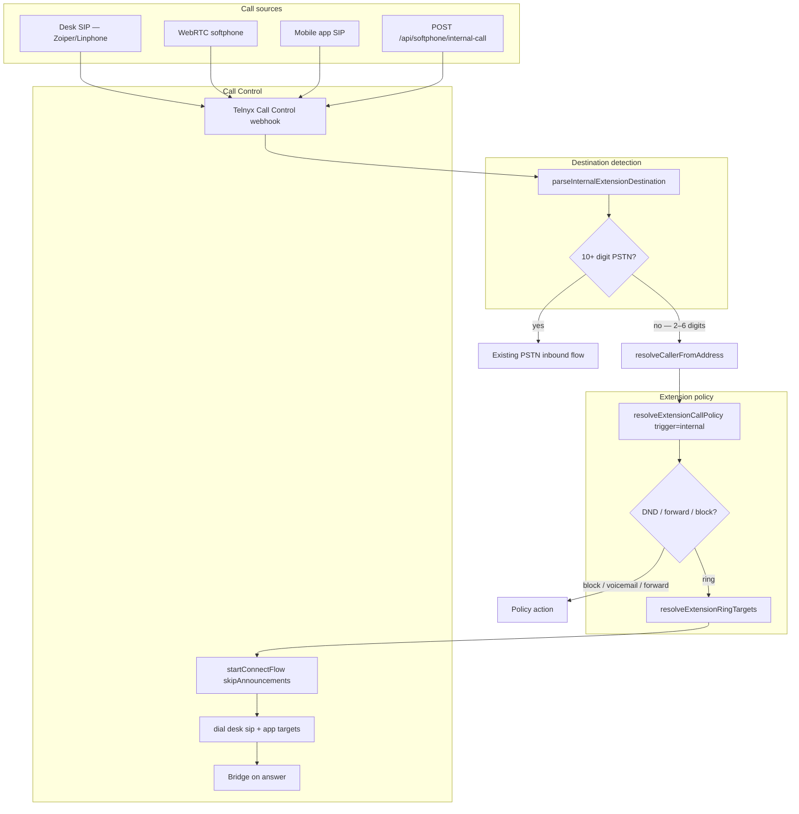

# Phase 5C — Internal Extension Dialing

Implementation report for direct extension dialing (101, 102, 103) without a DID, reusing `resolveExtensionRingTargets()` for desk + mobile + WebRTC.

**Status:** Implemented  
**Schema migration:** None (code-only deploy)

---

## Pre-flight validation (before internal dial)

Complete Phase A/B desk registration and inbound dual-target checks first.

| Step | Command / action | Expected |
|------|------------------|----------|
| Desk credential | `npx tsx scripts/verify-extension-desk-registration.ts --extension-number 101 --simulate-webhook` | PASS, `Extension.sipRegistered=true` |
| Live desk register | Zoiper or Linphone with Ext 101 desk SIP creds | Telnyx shows Registered |
| Inbound dual-target | Call +1 (956) 396-1388 | Rings desk SIP, mobile app, WebRTC browser |
| Internal prerequisites | `npx tsx scripts/validate-internal-extension-dial.ts` | Each ext has ≥1 ring target |

### Manual E2E — internal dial

| From | Dial | Expect |
|------|------|--------|
| Zoiper (Ext 101 desk) | `102` | Ext 102 desk + app + WebRTC ring; answer on any device |
| WebRTC softphone | `103` | Ext 103 all devices ring |
| Mobile app | `101` | Ext 101 all devices ring |

### Manual E2E — policy checks

| Condition | Dial | Expect |
|-----------|------|--------|
| Target DND (voicemail) | ext | Voicemail or unavailable message |
| Target DND (forward) | ext | Forward destination rings |
| Security block | ext from blocked caller | Rejection message |
| Whitelist (internal allowed) | ext from another ext | Allowed when `allowInternalExtensions` enabled |

---

## Routing flow



### Path details

1. **Desk SIP / WebRTC / mobile** — Outbound dial of 2–6 digit extension hits Telnyx Credential Connection outbound routing → Call Control `call.initiated` (incoming) with `to=102` or `sip:102@…`.
2. **Caller ID** — `resolveCallerFromAddress()` maps `Extension.telnyxSipUsername` (desk) or `User.telnyxSipUsername` (app/WebRTC) to tenant + caller extension.
3. **Policy** — `resolveExtensionCallPolicy(..., { trigger: 'internal' })` applies security, DND, schedule/always forward. Call screening is inbound-only.
4. **Ring** — `resolveExtensionRingTargets()` returns desk (`type: sip`) + app (`type: app`); strategy from `multiDeviceEnabled`.
5. **WebRTC UI** — Softphone dials extension digits without `+` prefix via `client.newCall({ destinationNumber: '102' })`.
6. **API path** — `POST /api/softphone/internal-call` for server-orchestrated calls (mobile); rings caller WebRTC leg first, then targets on `call.answered`.

---

## API changes

| Method | Path | Body | Response |
|--------|------|------|----------|
| `POST` | `/api/softphone/internal-call` | `{ "extensionNumber": "102" }` | `{ success, callControlId, targetExtensionNumber, targetDisplayName, ringStrategy, targetCount, policyAction }` |

**Errors:** `400` invalid/missing extension, no devices; `403` security block; `404` extension not found; `503` Call Control not configured.

**Unchanged:** `/api/softphone/token`, mobile QR, user Telnyx credentials, ring groups, call queues.

---

## Database impact

| Area | Impact |
|------|--------|
| **Schema** | None |
| **Extension** | Reuses existing `telnyxSipUsername`, `sipRegistered`, forwarding, security |
| **User** | Reuses `telnyxSipUsername` for app/WebRTC targets |
| **Call logs** | Internal calls may appear with `to=102`, `from=ext:101` when logged |

---

## Key files

| File | Role |
|------|------|
| `lib/internalExtensionDial.js` | Parse ext dest, caller resolution, desk/API handlers |
| `lib/extensionInbound.js` | `resolveExtensionCallPolicy()` with `trigger: 'internal'` |
| `lib/inboundCallControl.js` | Internal intercept in `handleCallInitiated`, `call.answered` |
| `lib/inboundRouting.js` | `resolveExtensionRingTargets()` (unchanged contract) |
| `lib/extensionFeatures.js` | Forward-to-extension uses full ring targets |
| `routes/portal.js` | `POST /softphone/internal-call` |
| `web/src/app/(app)/softphone/page.tsx` | 2–6 digit extension dial |

---

## Validation script

```powershell
npx tsx scripts/validate-internal-extension-dial.ts
```

Prints ring targets, policy snapshot, and caller resolution for extensions 101–103.
