# V3 Database Entity-Relationship Diagram

**Version:** 3.0.0  
**Scope:** Tenant Portal V3 models + shared platform entities

---

## Mermaid ER Diagram

```mermaid
erDiagram
    Tenant ||--o{ User : has
    Tenant ||--o{ Extension : has
    Tenant ||--o{ PhoneNumber : owns
    Tenant ||--o{ V3DeskDevice : has
    Tenant ||--o{ V3CallFlow : has
    Tenant ||--o{ V3RingGroup : has
    Tenant ||--o{ V3Queue : has
    Tenant ||--o{ V3BusinessHoursSchedule : has
    Tenant ||--o{ V3Holiday : has
    Tenant ||--o{ V3VoicemailBox : has
    Tenant ||--o{ V3SoftphoneProfile : has
    Tenant ||--o{ V3UserPreference : has
    Tenant ||--o{ V3DevicePreference : has
    Tenant ||--o{ V3PresenceConfig : has
    Tenant ||--o{ V3TenantBackup : has
    Tenant ||--o{ V3RuntimeSyncJob : has
    Tenant ||--o{ V3RuntimeLink : has
    Tenant ||--o{ V3MigrationRun : has
    Tenant ||--o| V3FeatureFlag : has

    User ||--o| V3SoftphoneProfile : profile
    User ||--o| V3PresenceConfig : presence
    User ||--o| V3UserPreference : preferences
    User ||--o{ V3DevicePreference : devices

    Extension ||--o| PhoneNumber : assigned
    Extension }o--o| V3DeskDevice : provisioned
    Extension }o--o| V3VoicemailBox : mailbox

    V3RingGroup }o--o{ Extension : members
    V3Queue }o--o{ Extension : agents
    V3CallFlow }o--o| PhoneNumber : did

    V3RuntimeSyncJob }o--|| V3RuntimeLink : tracks
    V3MigrationRun }o--o| V3TenantBackup : backup

    V3CallSession ||--o{ V3CallLeg : legs
    V3CallSession ||--o{ V3CommandOutbox : commands
    Tenant ||--o{ V3CallSession : telephony

    Tenant {
        uuid id PK
        string name
        string slug
    }

    User {
        uuid id PK
        uuid tenantId FK
        string email
        string role
    }

    Extension {
        uuid id PK
        uuid tenantId FK
        string number
        uuid userId FK
    }

    PhoneNumber {
        uuid id PK
        uuid tenantId FK
        string number
        string inventoryStatus
    }

    V3DeskDevice {
        uuid id PK
        uuid tenantId FK
        string macAddress
        string status
    }

    V3CallFlow {
        uuid id PK
        uuid tenantId FK
        json definition
        string status
    }

    V3RingGroup {
        uuid id PK
        uuid tenantId FK
        json memberExtensionIds
    }

    V3Queue {
        uuid id PK
        uuid tenantId FK
        json agentExtensionIds
    }

    V3VoicemailBox {
        uuid id PK
        uuid tenantId FK
        string mailboxNumber
    }

    V3RuntimeSyncJob {
        uuid id PK
        uuid tenantId FK
        string entityType
        string status
    }

    V3RuntimeLink {
        uuid id PK
        uuid tenantId FK
        string v3EntityType
        string runtimeEntityId
    }

    V3MigrationRun {
        uuid id PK
        uuid tenantId FK
        string status
        json report
    }

    V3TenantBackup {
        uuid id PK
        uuid tenantId FK
        json payload
    }

    V3TestLabRun {
        uuid id PK
        uuid tenantId FK
        string status
        json report
    }
```

---

## Model Summary

| Model | Table purpose |
|-------|---------------|
| `V3DeskDevice` | Desk phone inventory |
| `V3CallFlow` | Call flow definitions |
| `V3RingGroup` | Ring group config |
| `V3Queue` | Queue config |
| `V3BusinessHoursSchedule` | Hours rules |
| `V3Holiday` | Holiday calendar |
| `V3VoicemailBox` | Voicemail config |
| `V3SoftphoneProfile` | User softphone settings |
| `V3PresenceConfig` | Presence status |
| `V3TenantBackup` | Tenant snapshots |
| `V3RuntimeSyncJob` | Sync job queue |
| `V3RuntimeLink` | V3 ↔ runtime entity map |
| `V3MigrationRun` | Migration history |
| `V3TestLabRun` | Test Lab results |
| `V3FeatureFlag` | Per-tenant telephony flags |
| `V3CallSession/Leg/Outbox` | Telephony-v3 engine (separate stack) |

---

## Shared Platform Models

V3 services also read/write legacy models: `Tenant`, `User`, `Extension`, `PhoneNumber`, `AuditLog` (via `auditService`).

---

## Migrations

11 V3-specific migrations — see `release/v3.0.0/UPGRADE.md`
