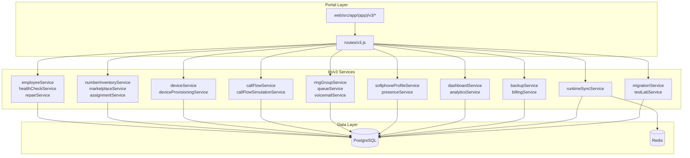
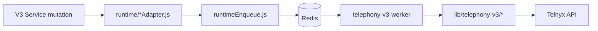
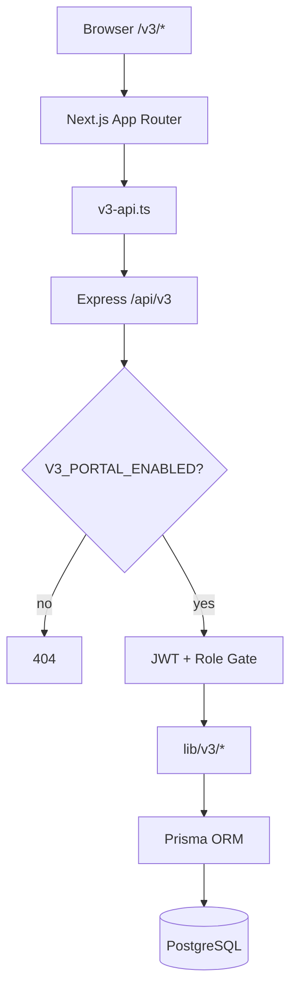
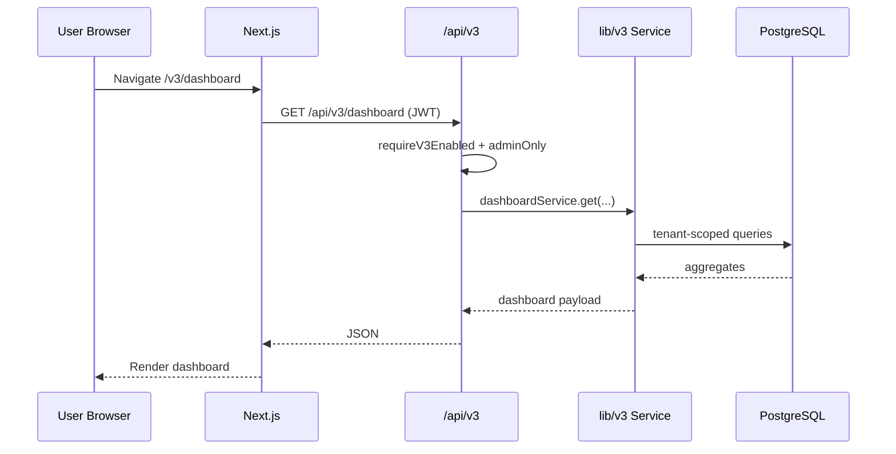
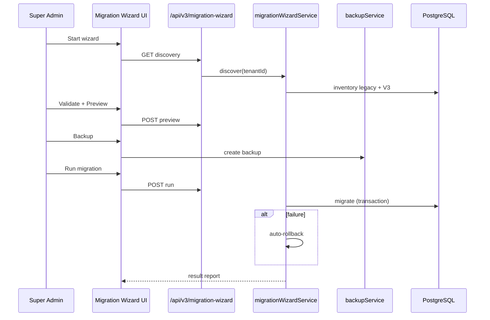
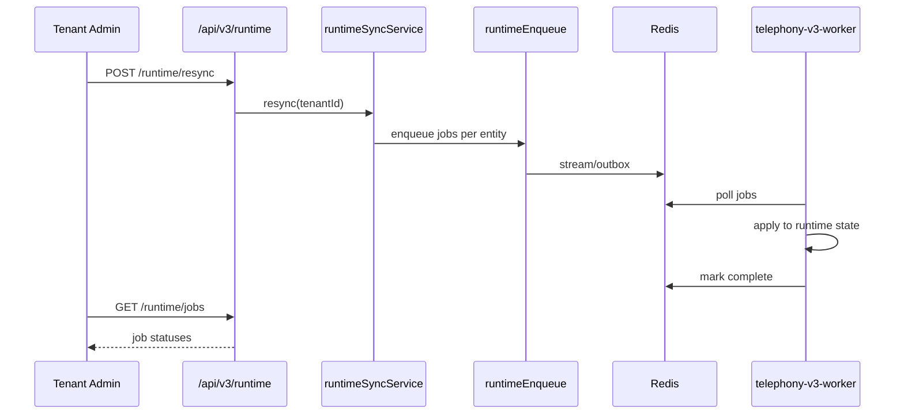

# V3 Service Dependencies & Flow Diagrams

**Version:** 3.0.0

---

## V3 Services Map

---

## Runtime Adapters

| Adapter | Entity |
|---------|--------|
| `extensionRuntimeAdapter` | Extensions |
| `numberRuntimeAdapter` | DIDs |
| `ringGroupRuntimeAdapter` | Ring groups |
| `queueRuntimeAdapter` | Queues |
| `callFlowRuntimeAdapter` | Call flows |
| `businessHoursRuntimeAdapter` | Hours |
| `holidayRuntimeAdapter` | Holidays |
| `voicemailRuntimeAdapter` | Voicemail |
| `deviceRuntimeAdapter` | Desk devices |

---

## Portal Architecture

---

## Request Flow

---

## Migration Flow

---

## Runtime Sync Flow

---

## Related

- `docs/architecture/system-architecture.md`
- `docs/developer/RuntimeAdapters.md`
