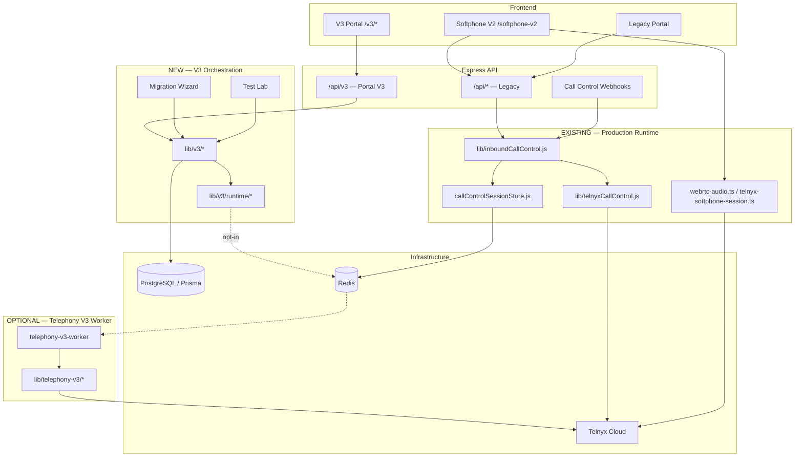

# V3 System Architecture

**Version:** 3.0.0  
**Last updated:** 2026-07-03

---

## Executive Summary

VSP Phone operates two parallel telephony paths:

1. **Existing production runtime** — Legacy Call Control + WebRTC softphone V2 (unchanged in V3.0.0 default deploy)
2. **New V3 orchestration** — Portal configuration layer with optional runtime sync to telephony-v3 worker

---

## Architecture Diagram



---

## Component Reference

| Component | Path | Role | V3.0.0 default |
|-----------|------|------|----------------|
| **Frontend V3** | `web/src/app/(app)/v3/` | Admin UI | On with flag |
| **Frontend WebRTC** | `softphone-v2/` | Agent calls | **Production** |
| **API V3** | `routes/v3.js` | Portal REST | On with flag |
| **Prisma** | `prisma/schema.prisma` | ORM + 22 V3 models | Always |
| **Redis** | — | Sessions, runtime jobs | Always |
| **PostgreSQL** | — | Primary datastore | Always |
| **Runtime Sync** | `lib/v3/runtime/` | Config bridge | **Off** |
| **Telnyx** | — | PSTN/SIP/WebRTC | Always |
| **Call Control** | `lib/inboundCallControl.js` | Inbound orchestration | **Production** |
| **Workers** | `telephony-v3-worker` | V3 telephony engine | **Off** |
| **WebRTC** | Telnyx SDK + `webrtc-audio.ts` | Browser media | **Production** |
| **Background Jobs** | `V3RuntimeSyncJob`, outbox | Async sync | Off until enabled |

---

## Separation of Concerns

### Existing Production Runtime (Do Not Modify for Portal GA)

- Inbound PSTN → `inboundCallControl.js` → WebRTC agent
- Outbound → Telnyx SDK softphone V2
- Bridge grace, recording, voicemail on legacy path
- Redis `ccs:*` session keys

### New V3 Orchestration (Portal GA Scope)

- Tenant admin configuration
- Health, billing, backup, migration
- Call flow **design** (not live routing until sync)
- Optional: enqueue sync jobs to worker

---

## Data Flow — Portal Only (Default)

```
Admin → /v3/* → /api/v3 → lib/v3 → PostgreSQL
                                    (no worker, no Call Control changes)
```

## Data Flow — With Runtime Sync (Opt-In)

```
Admin saves config → lib/v3 → runtimeAdapter → Redis job
    → telephony-v3-worker → lib/telephony-v3 → Telnyx
(Legacy path may still handle calls until cutover)
```

---

## Deployment Topology (EC2)

```
Nginx (TLS) → PM2 Next.js (web) :3001
           → Docker API :3000
           → Docker postgres, redis
           → Docker telephony-v3-worker (optional)
```

---

## Security Boundaries

| Boundary | Mechanism |
|----------|-----------|
| Tenant isolation | JWT `tenantId` on all queries |
| Portal gate | `V3_PORTAL_ENABLED` |
| Runtime gate | `V3_RUNTIME_SYNC_ENABLED` + allowlist |
| Super-admin ops | Role middleware + UI guards |
| Telephony protected files | No V3 portal changes |

---

## Related

- `docs/architecture/database-er.md`
- `docs/architecture/service-dependencies.md`
- `docs/developer/Architecture.md`
- `release/v3.0.0/FEATURES.md`
