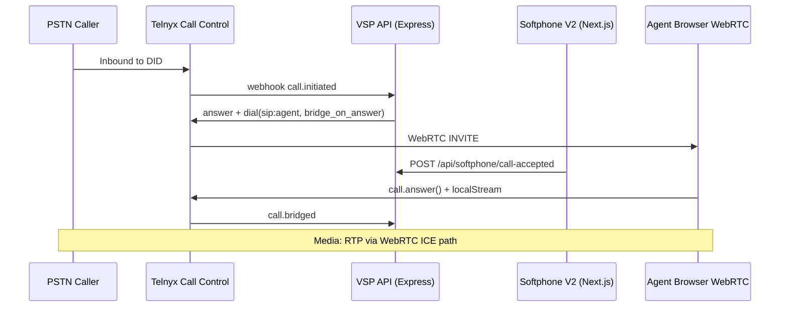
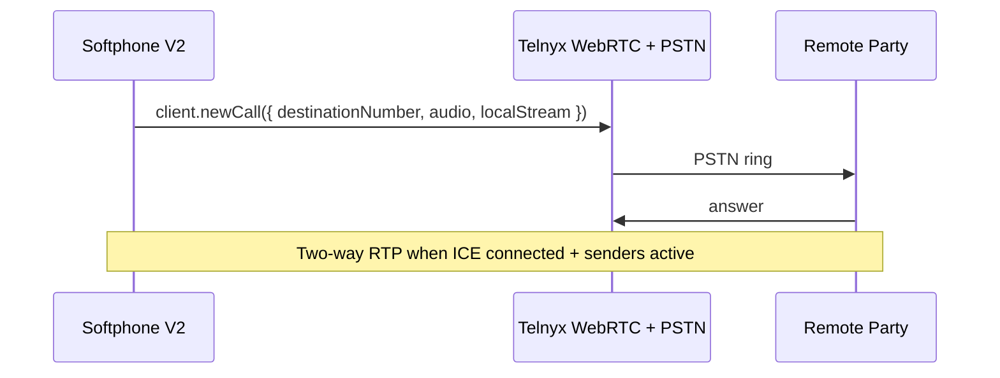

# VSP Phone + Telnyx Architecture

How VSP Phone maps onto Telnyx Voice, Call Control, and WebRTC — for debugging media, signaling, and routing issues.

## High-level call flows

### Inbound PSTN → WebRTC agent (Softphone V2)

**VSP files:** `lib/inboundCallControl.js`, `web/src/app/(app)/softphone-v2/page.tsx`, `web/src/lib/webrtc-audio.ts`

### Outbound WebRTC → PSTN

**VSP files:** `web/src/app/(app)/softphone-v2/page.tsx`, `web/src/lib/telnyx-softphone-session.ts`

## Media path (WebRTC)

VSP does **not** terminate RTP on AWS. Media flows:

1. Browser ↔ Telnyx POP (WebRTC: ICE, STUN, TURN, DTLS-SRTP)
2. Telnyx ↔ PSTN/SIP peer (carrier network)

Signaling only traverses VSP API (HTTPS + webhooks).

| Layer | VSP config | Telnyx doc area |
|-------|------------|-----------------|
| Signaling | `login_token`, `trickleIce`, `prefetchIceCandidates` | [javascript-sdk/](./javascript-sdk/) |
| ICE / TURN | SDK-provided via token | [webrtc/](./webrtc/), ICE & TURN explainer |
| Local mic | `getUserMedia`, `ICallOptions.localStream` | Device management, ICallOptions |
| Remote audio | `remoteElement` / `bindRemoteAudioTarget` | IClientOptions, production best practices |
| Peer connection | `call.peer.instance` (RTCPeerConnection) | Call class reference |

## Call Control vs WebRTC

| Concern | Call Control API | WebRTC JS SDK |
|---------|------------------|---------------|
| Inbound DID routing | ✅ Primary | Receives SIP/WebRTC leg |
| Bridge PSTN ↔ agent | ✅ `bridge`, `dial` | Agent leg |
| Blind transfer | ✅ REST commands | Not used for transfer signaling |
| Browser media | ❌ | ✅ |
| Webhook events | ✅ `call.*` | SDK notifications |

## Infrastructure (VSP production)

| Component | Role |
|-----------|------|
| **EC2** | Hosts Docker API + PM2 Next.js |
| **Docker** | API container (`api.vspphone.com`) |
| **PM2** | Web portal (`app.vspphone.com:3001`) |
| **Nginx** | TLS termination, reverse proxy |
| **PostgreSQL** | Prisma — tenants, DIDs, CDRs |
| **Redis** | Session/cache, bridge grace coordination |

Telnyx webhooks hit `api.vspphone.com` (Nginx → Docker API).

## Authentication layers

| Layer | Mechanism | VSP location |
|-------|-----------|--------------|
| Tenant portal users | JWT | `web/src/lib/api.ts`, auth middleware |
| Telnyx REST | API key in `.env` | Server-side only |
| WebRTC login | Telephony credential JWT | `/api/softphone/token` |
| Webhooks | Ed25519 signature | Webhook middleware |

## Future: Flutter mobile

When adding Flutter, use Telnyx Flutter Voice SDK docs synced under `javascript-sdk/flutter/` (same KB refresh script). Push notification setup differs from web — see Flutter push sections.

## Debugging checklist

1. **Signaling:** Telnyx debugger, SDK `debug: true`, `[VSP Softphone]` console logs
2. **Webhooks:** API logs for `call.initiated`, `call.bridged`, `call.hangup`
3. **Media:** ICE state, `outbound-rtp` / `inbound-rtp` stats, selected candidate pair
4. **Firewall:** Allow `rtc.telnyx.com:443`, STUN/TURN UDP 3478, TURN TCP 443

See [error-codes/](./error-codes/) and [best-practices/](./best-practices/) after sync.
