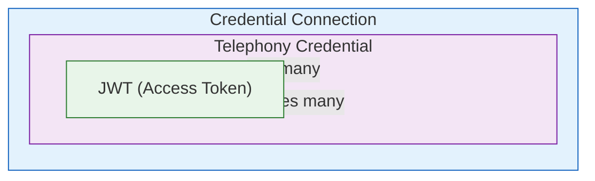
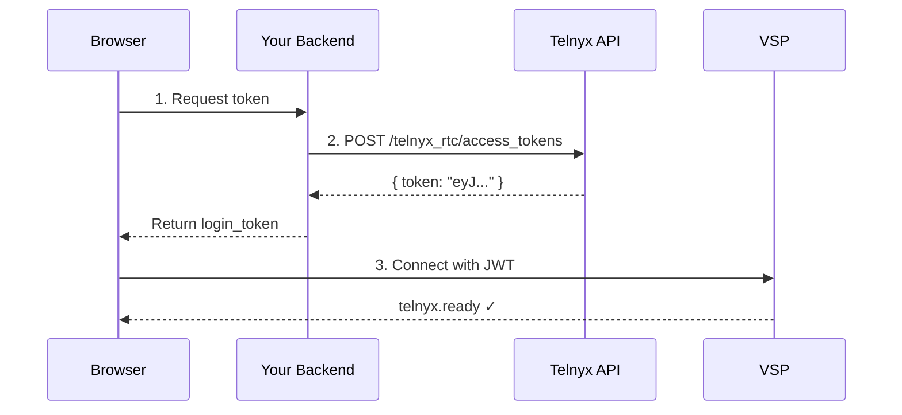
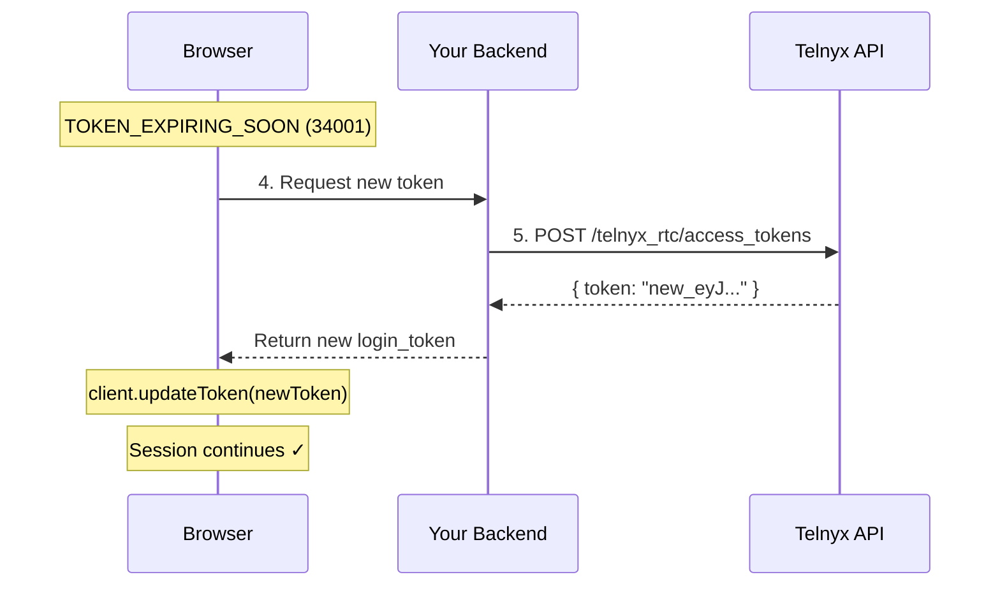
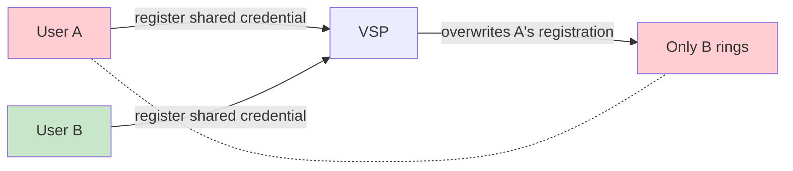
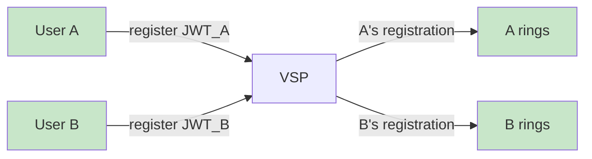

> ## Documentation Index
> Fetch the complete documentation index at: https://developers.telnyx.com/llms.txt
> Use this file to discover all available pages before exploring further.

# Authentication Architecture

> How the three Telnyx WebRTC authentication methods relate — Credential Connections, Telephony Credentials, and JWTs — and when to use each.

# Authentication Architecture

Telnyx WebRTC has three authentication methods. They're not interchangeable — they form a hierarchy, and using the wrong one is the most common cause of security issues and unexpected behavior.

***

## The Hierarchy



* **One Credential Connection** can have **multiple Telephony Credentials**
* **Each Telephony Credential** can generate **multiple JWTs**

***

## The Three Methods

### 1. Credential Connection (`login` + `password`)

```javascript theme={null}
const client = new TelnyxRTC({
  login: 'my_credential',
  password: 'my_password',
});
```

**What it is:** Direct username/password authentication to the SIP infrastructure.

**When to use:** Local development and testing only.

**Limitations:**

* Credentials are long-lived — they remain valid until manually deleted
* No per-user isolation — one credential = one SIP registration
* No automatic rotation or refresh

**Portal page:** [Credential Connections](/development/webrtc/js-sdk/how-to/authenticating-your-app)

***

### 2. Telephony Credential (credential-based login)

```javascript theme={null}
const client = new TelnyxRTC({
  login: 'credential_username',
  password: 'credential_password',
  // Same API, but using a Telephony Credential instead of Connection credential
});
```

**What it is:** A SIP identity (username + password) managed under a Credential Connection.

**When to use:** Quick prototyping, testing with multiple identities.

<Callout type="warning">
  **One credential per user.** Never share a Telephony Credential across multiple users or browser tabs. Each credential = one SIP registration. If two tabs register with the same credential, only the most recent one receives incoming calls.
</Callout>

**Portal page:** [Telephony Credentials](/development/webrtc/js-sdk/how-to/authenticating-your-app)

***

### 3. JWT (`login_token`)

```javascript theme={null}
const client = new TelnyxRTC({
  login_token: 'eyJhbGciOiJSUzI1NiIs...', // JWT string
});
```

**What it is:** A time-limited, cryptographically signed token that authenticates your client.

**When to use:** Production. Always. This is the recommended method.

**Why it's recommended:**

* **Time-limited** — tokens expire 24 hours after creation (or when the parent credential expires, whichever comes first)
* **Per-device** — each device should use its own credential → its own JWT, preventing registration conflicts
* **Refresh-aware** — the SDK emits a `TOKEN_EXPIRING_SOON` warning (code 34001) before expiry, so your app can request a fresh token from your backend
* **Multiple concurrent sessions** — different users/devices can each have their own JWT without overwriting each other's SIP registration

**Portal page:** [JWT Authentication](/development/webrtc/js-sdk/how-to/authenticating-your-app)

***

## Comparison

|                    | Credential Connection | Telephony Credential | JWT                                   |
| ------------------ | --------------------- | -------------------- | ------------------------------------- |
| **SDK field**      | `login` + `password`  | `login` + `password` | `login_token`                         |
| **Anonymous**      | —                     | —                    | `anonymous_login` (object)            |
| **Lifetime**       | Permanent             | Permanent            | 24 hours (or credential expiry)       |
| **In browser?**    | Dev only              | Dev only             | Production-ready                      |
| **Per-user**       | No                    | Yes                  | Yes                                   |
| **Revocable**      | Delete credential     | Delete credential    | Disable parent credential             |
| **Rotation**       | Manual                | Manual               | App handles via TOKEN\_EXPIRING\_SOON |
| **Incoming calls** | Single registration   | Single registration  | Multi-user                            |
| **Setup effort**   | Low                   | Low                  | Medium (needs backend)                |

***

## The JWT Flow in Production

### Initial connection



### Token refresh

JWTs expire after 24 hours. The SDK warns you before expiry so you can refresh without disconnecting:



**Your backend must:**

1. Have a Telnyx API key (`TELNYX_API_KEY`)
2. Expose an endpoint that creates tokens for a given telephony credential
3. Return the token to the browser
4. Handle token refresh requests when `TOKEN_EXPIRING_SOON` (34001) fires

See [Authenticating Your App](/development/webrtc/js-sdk/how-to/authenticating-your-app) for the full implementation.

***

## Why "One Credential Per User" Matters

### Wrong — shared credential



When two users share one credential, the second registration overwrites the first. **User A never receives incoming calls.**

### Correct — separate JWTs



With JWTs, each token maps to a unique session. Multiple users can register concurrently without conflicts.

***

## Common Mistakes

| Mistake                                    | What Happens                                                | Fix                                 |
| ------------------------------------------ | ----------------------------------------------------------- | ----------------------------------- |
| Using `login`+`password` for production    | Long-lived credential, no rotation, no per-device isolation | Use `login_token` (JWT)             |
| Sharing one credential across users        | Only last user gets incoming calls                          | One credential/JWT per user         |
| Not handling `TOKEN_EXPIRING_SOON` (34001) | Token expires → disconnected after 24h                      | Implement token refresh in your app |
| Generating JWT in the browser              | API key in client code                                      | Generate JWT on your backend only   |

***

## See Also

* [Authenticating Your App](/development/webrtc/js-sdk/how-to/authenticating-your-app) — Full code examples for all three methods
* [IClientOptions](/development/webrtc/js-sdk/reference/iclientoptions) — `login_token`, `login`, `password` fields
