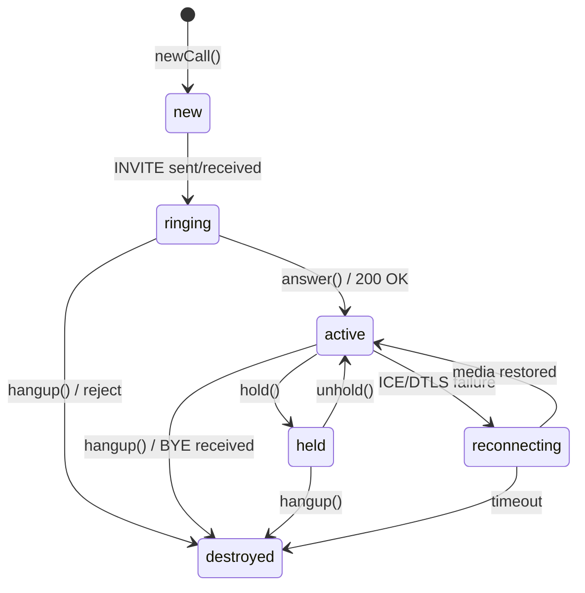

> ## Documentation Index
> Fetch the complete documentation index at: https://developers.telnyx.com/llms.txt
> Use this file to discover all available pages before exploring further.

# Call State Lifecycle

> Every state a Telnyx WebRTC call goes through, what triggers each transition, and what your app should do at each stage.

# Call State Lifecycle

A call is a state machine. Understanding every state and transition is essential for building a reliable UI and handling edge cases like reconnection, transfer, and one-way audio.

***

## State Diagram



***

## All States

| State          | Direction | Description                          | What your app should do             |
| -------------- | --------- | ------------------------------------ | ----------------------------------- |
| `new`          | Outbound  | Call object created, ICE gathering   | Show "Connecting..."                |
| `ringing`      | Outbound  | Remote party's phone is ringing      | Show ringing UI, play ringback tone |
| `ringing`      | Inbound   | Incoming call waiting                | Show incoming call UI, ring tone    |
| `active`       | Both      | Call connected, media flowing        | Show in-call UI, start timer        |
| `held`         | Both      | Call on hold (sendonly)              | Show held state, dim audio          |
| `reconnecting` | Both      | Media path lost, attempting recovery | Show reconnecting banner            |
| `destroyed`    | Both      | Call ended                           | Show call ended, clean up UI        |

***

## Outbound Call States (Detailed)

### `new` → `ringing`

```javascript theme={null}
const call = client.newCall({
 destinationNumber: '+12345678900',
 audio: true,
});

// call.state === 'new'
// SDK is: gathering ICE candidates, preparing SDP, sending INVITE
```

**What happens internally:**

1. SDK creates a PeerConnection
2. ICE gathering starts (host → srflx → relay candidates)
3. SDP offer created with codec preferences
4. INVITE sent over WebSocket to VSP
5. VSP translates to SIP INVITE → carrier

**Your app:** Show "Calling..." with a spinner. Don't start the call timer yet.

### `ringing`

```javascript theme={null}
// Remote party's phone is ringing
// call.state === 'ringing'
```

**What happens:**

* Remote phone is ringing (SIP 180 Ringing)
* You may hear ringback tone (generated locally by the SDK or played from network)

**Your app:** Play ringback tone if SDK doesn't auto-play it. Show "Ringing..." state.

### `ringing` → `active`

```javascript theme={null}
// Remote party answered
// call.state === 'active'
```

**What happens internally:**

1. SIP 200 OK received from carrier
2. SDP answer processed — codecs and ICE candidates agreed
3. DTLS handshake completes — media is encrypted
4. SRTP audio starts flowing in both directions
5. Audio element auto-created and attached to DOM

**Your app:** Start call timer. Show in-call controls (mute, hold, hangup). Check audio is playing.

***

## Inbound Call States (Detailed)

### `ringing` (incoming)

```javascript theme={null}
client.on('telnyx.notification', (notification) => {
 if (notification.type === 'callUpdate') {
 const call = notification.call;

 if (call.state === 'ringing' && call.direction === 'inbound') {
 // Incoming call!
 const from = call.remotePartyNumber;
 const to = call.remotePartyName;
 showIncomingCallUI({ from, to, call });
 }
 }
});
```

**What happens internally:**

1. VSP receives SIP INVITE from carrier
2. VSP pushes invite message to SDK over WebSocket
3. SDK creates a Call object with `state: 'ringing'`
4. `telnyx.notification` fires with `callUpdate`

**Your app:** Show incoming call UI. Play ringtone. Offer Accept/Reject buttons.

### `ringing` → `active` (answer)

```javascript theme={null}
// User clicks "Accept"
call.answer();
// call.state → 'active'
```

**What happens internally:**

1. SDK sends 200 OK over WebSocket
2. getUserMedia() — browser requests microphone permission
3. ICE gathering starts
4. SDP answer sent
5. DTLS handshake
6. Media flows

\*\* Important:\*\* `call.answer()` triggers `getUserMedia()`. If the user hasn't granted microphone permission, the browser will show a permission dialog. The call won't be fully active until permission is granted.

### `ringing` → `destroyed` (reject)

```javascript theme={null}
// User clicks "Reject"
call.hangup();
// call.state → 'destroyed'
```

**What happens:** SDK sends SIP 487 Request Terminated (or CANCEL if INVITE still in progress).

***

## Active Call States

### `active` → `held`

```javascript theme={null}
call.hold();
// call.state → 'held'
```

**What happens:**

1. SDK sends re-INVITE with `sendonly` media direction
2. Remote party's audio continues (they hear hold music if configured)
3. Your audio stops sending (microphone muted at SIP level)
4. Remote party receives a `callUpdate` with their call state changing

### `held` → `active`

```javascript theme={null}
call.unhold();
// call.state → 'active'
```

**What happens:**

1. SDK sends re-INVITE with `sendrecv` media direction
2. Two-way audio resumes

***

## Reconnecting State

```javascript theme={null}
// Network interruption during call
// call.state → 'reconnecting'
```

**What triggers it:**

* ICE connectivity checks fail (network change)
* DTLS session breaks
* WebSocket still connected but media path lost

**What the SDK does:**

1. ICE restart — re-gathers candidates
2. Attempts to re-establish DTLS
3. If successful → `call.state → 'active'` (call resumes)
4. If fails after timeout → `call.state → 'destroyed'` (call drops)

**Your app:** Show a "Reconnecting..." banner. Don't hang up — let the SDK try to recover. See [Handle Reconnection](/development/webrtc/js-sdk/how-to/handle-reconnection) for details.

***

## Destroyed State

All calls end up here. It's terminal — no further transitions.

```javascript theme={null}
client.on('telnyx.notification', (notification) => {
 if (notification.call.state === 'destroyed') {
 const call = notification.call;
 console.log(`Call ended. Direction: ${call.direction}`);
 console.log(`Duration: ${call.duration}s`);
 console.log(`End reason: ${call.cause}`); // normal, hangup, timeout, error
 }
});
```

**Common causes:**

| Cause              | Direction | Why                                         |
| ------------------ | --------- | ------------------------------------------- |
| `normal`           | Both      | Normal hangup — either party ended the call |
| `originatorCancel` | Outbound  | Caller hung up while ringing                |
| `timeOut`          | Outbound  | No answer within timeout period             |
| `rejected`         | Inbound   | Callee rejected the call                    |
| `error`            | Both      | Network error, ICE failure, or server error |
| `replaced`         | Both      | Call was replaced (attended transfer)       |

**Your app:** Clean up UI. Upload call report. Show call summary if applicable.

***

## State Transition Matrix

| From           | To             | Trigger                       | Direction |
| -------------- | -------------- | ----------------------------- | --------- |
| `new`          | `ringing`      | INVITE sent/received          | Outbound  |
| `ringing`      | `active`       | `answer()` / 200 OK           | Both      |
| `ringing`      | `destroyed`    | `hangup()` / reject / timeout | Both      |
| `active`       | `held`         | `hold()`                      | Both      |
| `held`         | `active`       | `unhold()`                    | Both      |
| `active`       | `destroyed`    | `hangup()` / BYE              | Both      |
| `held`         | `destroyed`    | `hangup()`                    | Both      |
| `active`       | `reconnecting` | ICE/DTLS failure              | Both      |
| `reconnecting` | `active`       | Media restored                | Both      |
| `reconnecting` | `destroyed`    | Timeout                       | Both      |

***

## Common Pitfalls

### Double answer

```javascript theme={null}
// WRONG — answering an already-active call
call.answer(); // First answer — starts PeerConnection
call.answer(); // Second answer — creates ANOTHER PeerConnection!

// Result: Two PeerConnections, the second one never connects properly
// SDK bug: CallReportCollector may track the wrong PC → reports show zero audio
```

**Fix:** Guard against double answer in your UI:

```javascript theme={null}
let answered = false;

function answerCall(call) {
 if (answered || call.state !== 'ringing') return;
 answered = true;
 call.answer();
}
```

### Not handling `destroyed`

```javascript theme={null}
// WRONG — only checking for 'active'
if (call.state === 'active') {
 startTimer();
}
// What if the call goes to 'destroyed'? Timer keeps running forever.

// CORRECT — handle both
if (call.state === 'active') {
 startTimer();
} else if (call.state === 'destroyed') {
 stopTimer();
 cleanupCall(call);
}
```

### Missing `reconnecting`

```javascript theme={null}
// If you don't handle reconnecting, the user thinks the call dropped
// and tries to call again — creating a second call

// Show a banner so the user knows to wait
if (call.state === 'reconnecting') {
 showReconnectingBanner();
}
```

***

## See Also

* [Call Class](/development/webrtc/js-sdk/reference/call) — Methods for each state
* [INotification](/development/webrtc/js-sdk/reference/inotification) — All notification types
* [Handle Reconnection](/development/webrtc/js-sdk/how-to/handle-reconnection) — Reconnection flow
* [Handle Multiple Calls](/development/webrtc/js-sdk/explanation/call-state-lifecycle) — Hold/resume patterns
* [How WebRTC Signaling Works](/development/webrtc/js-sdk/explanation/webrtc-signaling) — SIP message flow
