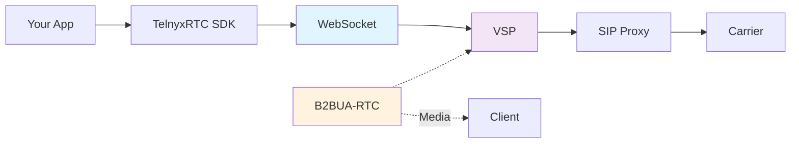
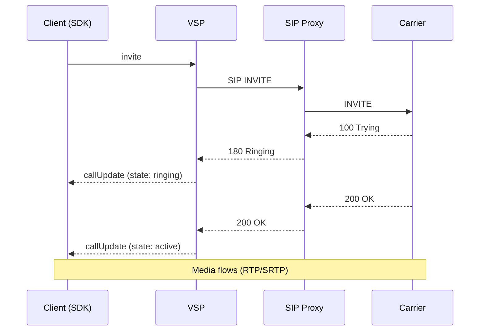
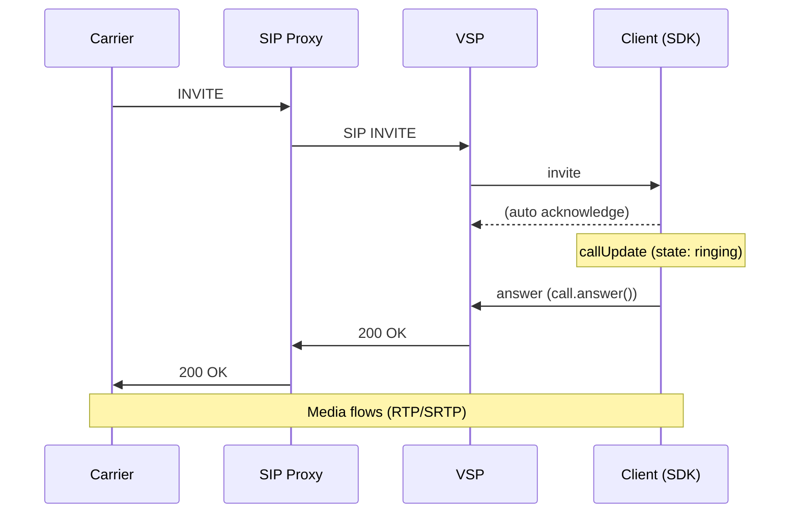
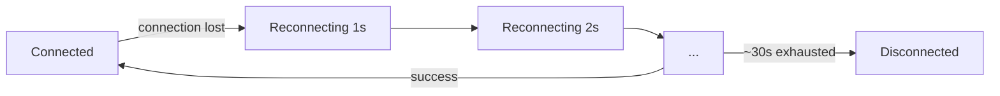

> ## Documentation Index
> Fetch the complete documentation index at: https://developers.telnyx.com/llms.txt
> Use this file to discover all available pages before exploring further.

# How WebRTC Signaling Works

> How the Telnyx WebRTC JS SDK communicates with Telnyx infrastructure — WebSocket connection, SIP signaling, and the full call flow from dial to hangup.

# How WebRTC Signaling Works

WebRTC itself has no signaling protocol — it only defines how to establish media. The signaling (how you say "call this number" or "I'm ringing") is up to the application. Here's how the Telnyx WebRTC SDK does it.

***

## The Signaling Path



**Key components:**

| Component         | Role                                         | Protocol        |
| ----------------- | -------------------------------------------- | --------------- |
| **Your App**      | User interface                               | JavaScript      |
| **TelnyxRTC SDK** | SDK logic                                    | Internal        |
| **VSP**           | Voice SDK Proxy — translates WebSocket ↔ SIP | WebSocket + SIP |
| **SIP Proxy**     | Routes SIP messages to carriers              | SIP/UDP         |
| **B2BUA-RTC**     | Media gateway (WebRTC ↔ RTP)                 | DTLS/SRTP + RTP |

<Callout type="info">
  **VSP handles signaling only.** B2BUA-RTC handles media only. They are separate systems.
</Callout>

***

## WebSocket Connection

The SDK opens a single persistent WebSocket to `rtc.telnyx.com`:

```javascript theme={null}
const client = new TelnyxRTC({ login_token: jwt });
client.connect();

// WebSocket lifecycle:
// 1. DNS resolves rtc.telnyx.com → nearest VSP instance
// 2. TLS handshake (port 443)
// 3. WebSocket upgrade
// 4. Login message sent (JWT or credential)
// 5. Server responds with session info
// 6. telnyx.ready fires — you can make/receive calls
```

### What the DNS resolution does

`rtc.telnyx.com` resolves to the nearest VSP based on DNS-based geo-routing:

| Region        | VSP DC    |
| ------------- | --------- |
| North America | NJ1       |
| Europe        | AMS3, FR5 |
| Asia-Pacific  | CN1       |

If the DNS routes to a suboptimal VSP (e.g., an Indian client hitting FR5 instead of CN1), call latency increases. See [Configure Network & Firewall](/development/webrtc/js-sdk/how-to/configure-network-firewall) for troubleshooting.

***

## Outbound Call Flow

When you call `client.newCall()`:



**What the SDK does at each step:**

1. **`newCall()`** — Creates a Call object, starts ICE gathering
2. **SIP INVITE** — SDK sends invite message over WebSocket, VSP translates to SIP
3. **SDP negotiation** — Codec selection (OPUS, PCMU, PCMA), ICE candidates exchanged
4. **Ringing** — Remote party's phone is ringing. `call.state === 'ringing'`
5. **Answer (200 OK)** — Remote party picked up. `call.state === 'active'`
6. **Media flows** — Audio transmitted via WebRTC (separate from signaling)

***

## Inbound Call Flow

When someone calls your WebRTC client:



**What the SDK does:**

1. **Incoming INVITE** — VSP receives SIP INVITE, pushes to SDK over WebSocket
2. **`callUpdate` notification** — `notification.call.state === 'ringing'`
3. **Your app decides** — Call `call.answer()` or `call.hangup()`
4. **Answer** — SDK sends 200 OK, establishes WebRTC media
5. **Media flows** — Two-way audio established

***

## Session Description Protocol (SDP)

During call setup, both sides exchange SDP (Session Description Protocol) to agree on:

| SDP Negotiates       | Example                                        |
| -------------------- | ---------------------------------------------- |
| **Audio codecs**     | OPUS (preferred), PCMU (G.711u), PCMA (G.711a) |
| **Codec parameters** | OPUS with FEC, stereo/mono, sample rate        |
| **ICE candidates**   | How to reach each other for media              |
| **DTLS fingerprint** | For encrypting media (SRTP)                    |
| **Media direction**  | Sendrecv (two-way), sendonly, recvonly         |
| **Bandwidth**        | Maximum bitrate                                |

The SDK handles SDP negotiation automatically. You don't need to construct SDP manually.

### Codec Priority

The SDK's default codec priority:

1. **OPUS** — Best quality, handles packet loss well, variable bitrate
2. **PCMU** — G.711μ-law, universal compatibility, 64kbps
3. **PCMA** — G.711A-law, European PSTN standard, 64kbps

<Callout type="info">
  OPUS is strongly preferred — it handles jitter and packet loss better than G.711, and uses less bandwidth.
</Callout>

***

## WebSocket Reconnection

If the WebSocket drops, the SDK automatically reconnects:



See [Handle Reconnection](/development/webrtc/js-sdk/how-to/handle-reconnection) for the full reconnection behavior and how to handle it in your app.

***

## Custom Headers

You can pass custom SIP headers in both directions:

### Outbound (your app → carrier)

```javascript theme={null}
const call = client.newCall({
  destinationNumber: '+12345678900',
  customHeaders: [
    { name: 'X-My-Header', value: 'value1' },
    { name: 'X-Another', value: 'value2' },
  ],
});
```

These appear as SIP headers in the INVITE.

### Inbound (carrier → your app)

Inbound custom headers are available in the notification:

```javascript theme={null}
client.on('telnyx.notification', (notification) => {
  if (notification.type === 'callUpdate' && notification.call.state === 'ringing') {
    const customHeaders = notification.call.customHeaders;
    // e.g., { 'X-Caller-Name': 'John' }
  }
});
```

***

## What Signals What

| Action           | SDK Method          | SIP Message             | Who Initiates |
| ---------------- | ------------------- | ----------------------- | ------------- |
| Make a call      | `newCall()`         | INVITE                  | Client        |
| Answer a call    | `call.answer()`     | 200 OK                  | Client        |
| Reject a call    | `call.hangup()`     | 487 Request Terminated  | Client        |
| End a call       | `call.hangup()`     | BYE                     | Either side   |
| Put on hold      | `call.hold()`       | re-INVITE with sendonly | Client        |
| Resume from hold | `call.unhold()`     | re-INVITE with sendrecv | Client        |
| Send DTMF        | `call.sendDigits()` | INFO (RFC 2833)         | Client        |
| Mute audio       | `call.mute()`       | (local only, no SIP)    | Client        |

<Callout type="info">
  Mute is a **local operation** — it stops sending audio from your microphone but doesn't send any SIP signal. The remote party doesn't know you're muted (unless you tell them via your app).
</Callout>

***

## See Also

* [Call State Lifecycle](/development/webrtc/js-sdk/explanation/call-state-lifecycle)
* [How ICE & TURN Work](/development/webrtc/js-sdk/explanation/ice-and-turn)
* [Handle Reconnection](/development/webrtc/js-sdk/how-to/handle-reconnection)
* [TelnyxRTC Class](/development/webrtc/js-sdk/reference/telnyxrtc)
