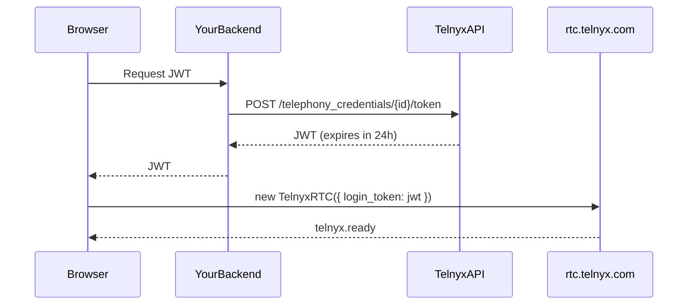
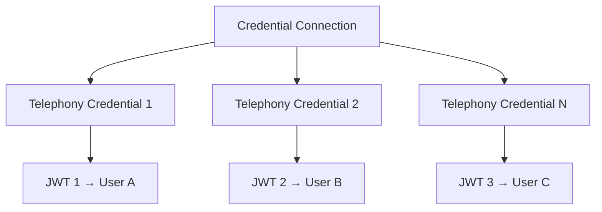

> ## Documentation Index
> Fetch the complete documentation index at: https://developers.telnyx.com/llms.txt
> Use this file to discover all available pages before exploring further.

# WebRTC JS SDK authentication

> How to authenticate the Telnyx WebRTC JS SDK using JWT, credentials, or anonymous login. Includes token refresh and security best practices.

# Authentication

The Telnyx WebRTC SDK supports three authentication methods. **Use JWT for all production applications.**

## Overview

| Method         | IClientOptions             | Use Case                 | Security                | Identity       |
| -------------- | -------------------------- | ------------------------ | ----------------------- | -------------- |
| **JWT**        | `login_token`              | Production               | Token expires in 24h    | Per-user       |
| **Credential** | `login` + `password`       | Development only         | Long-lived, no rotation | Per-credential |
| **Anonymous**  | `anonymous_login` (object) | AI assistant connections | No SIP identity         | Per-assistant  |

<Callout type="warning">
  **Use JWT (`login_token`) for all production applications.** Credentials (`login` + `password`) are long-lived with no automatic rotation. JWTs expire after 24 hours and can be refreshed via `TOKEN_EXPIRING_SOON`.
</Callout>

***

## Method 1: JWT (Recommended)

JWT is the most secure authentication method. You generate a short-lived token on your backend and pass it to the SDK.

### How It Works



### Step 1: Create a Credential Connection

Create a SIP Credential Connection in the Telnyx Portal or via API:

```bash theme={null}
curl -X POST https://api.telnyx.com/v2/credential_connections \
 -H "Authorization: Bearer YOUR_API_KEY" \
 -H "Content-Type: application/json" \
 -d '{
 "connection_name": "My WebRTC Connection",
 "transport_protocol": "TLS",
 "sip_uri_calling_preference": "enabled",
 "sip_uri_calling_region": "any"
 }'
```

See [Credential Connections](/development/webrtc/js-sdk/how-to/authenticating-your-app) for full configuration options.

### Step 2: Create a Telephony Credential

Each user needs their **own credential**. Never share one credential across multiple users.

```bash theme={null}
curl -X POST https://api.telnyx.com/v2/telephony_credentials \
 -H "Authorization: Bearer YOUR_API_KEY" \
 -H "Content-Type: application/json" \
 -d '{
 "connection_id": "YOUR_CONNECTION_ID",
 "name": "user-123"
 }'
```

See [Telephony Credentials](/development/webrtc/js-sdk/how-to/authenticating-your-app) for full CRUD operations.

### Step 3: Generate a JWT

Generate the JWT on your **backend** — never on the client. This requires your API key.

```bash theme={null}
curl -X POST https://api.telnyx.com/v2/telephony_credentials/{credential_id}/token \
 -H "Authorization: Bearer YOUR_API_KEY"
```

**Response:**

```
eyJhbGciOiJIUzUxMiIsInR5cCI6IkpXVCJ9.eyJhdWQiOiJ0ZWxueXhfdGVsZXBob255IiwiZXhwIjox...
```

This token expires in **24 hours**. You must handle refresh (see below).

**Node.js example:**

```javascript theme={null}
import Telnyx from 'telnyx';

const telnyx = new Telnyx(process.env.TELNYX_API_KEY);

// Express endpoint: return JWT to authenticated user
app.get('/api/telnyx-token', async (req, res) => {
 // Use the credential ID associated with this user
 const credentialId = getUserCredentialId(req.user.id);

 try {
 const token = await telnyx.telephonyCredentials.createToken(credentialId);
 res.send(token);
 } catch (err) {
 res.status(500).send({ error: 'Failed to generate token' });
 }
});
```

### Step 4: Use JWT in the SDK

```javascript theme={null}
import { TelnyxRTC } from '@telnyx/webrtc';

// Fetch JWT from your backend
const jwt = await fetch('/api/telnyx-token').then(r => r.text());

const client = new TelnyxRTC({
 login_token: jwt,
});

client.connect();
```

### Token Refresh

JWTs expire after 24 hours. Handle the `TOKEN_EXPIRING_SOON` warning to refresh without dropping the connection:

```javascript theme={null}
import { TELNYX_WARNING_CODES } from '@telnyx/webrtc';

client.on('telnyx.warning', async (warning) => {
 if (warning.code === 34001) {
 console.log('Token expiring soon — refreshing...');

 try {
 const newToken = await fetch('/api/telnyx-token').then(r => r.text());
 // Refresh token without reconnecting
 client.updateToken(newToken);
 console.log('Token refreshed ');
 } catch (err) {
 console.error('Failed to refresh token:', err);
 // Force reconnect if refresh fails
 client.disconnect();
 client.connect();
 }
 }
});
```

<Callout type="info">
  Start refreshing tokens at least **1 hour before expiry**. The `TOKEN_EXPIRING_SOON` warning fires \~1 hour before expiration.
</Callout>

***

## Method 2: Credential (Development Only)

Use `login` + `password` for local development and testing only.

```javascript theme={null}
const client = new TelnyxRTC({
 login: 'gencred...', // SIP username from Telephony Credential
 password: 'your-password', // SIP password
});
```

**When to use:**

* Local development and testing
* Quick prototyping before setting up JWT infrastructure

**When NOT to use:**

* Production applications
* Multi-user scenarios where each user needs their own identity
* Any environment where you need automatic token rotation

The `login` value is the `sip_username` from a Telephony Credential (e.g., `gencrednb4ADiBVjsvgvxem0OwkeNfryiIwhaUSJMJXjiwY3Y`). The `password` is set when creating the credential.

***

## Method 3: Anonymous (AI Assistants)

Connect to an AI assistant without requiring a credential. The `anonymous_login` option accepts an object specifying the target:

```javascript theme={null}
const client = new TelnyxRTC({
 anonymous_login: {
 target_type: 'ai_assistant',
 target_id: 'YOUR_AI_ASSISTANT_ID',
 },
});
```

**Use cases:**

* Click-to-call widgets connecting users directly to an AI assistant
* Embedding voice AI in web apps without managing credentials

**Limitations:**

* Cannot receive inbound calls
* No SIP identity — calls are outbound to the specified AI assistant only
* Limited call control features

### Continue a conversation

Pass a `conversation_id` to resume an existing conversation with the AI assistant:

```javascript theme={null}
const client = new TelnyxRTC({
 anonymous_login: {
 target_type: 'ai_assistant',
 target_id: 'YOUR_AI_ASSISTANT_ID',
 target_params: {
 conversation_id: 'conv_xyz789',
 },
 },
});
```

***

## Credential Hierarchy

Understanding how Telnyx auth resources relate to each other:



* **Credential Connection** — SIP-level configuration (transport, codecs, webhook)
* **Telephony Credential** — Individual identity (one per user)
* **JWT** — Short-lived token generated from a credential

<Callout type="warning">
  **One credential per user.** Never share a credential across multiple users. Each user should have their own credential and their own JWT. Sharing credentials causes registration conflicts — only the most recently connected device receives inbound calls.
</Callout>

***

## Common Mistakes

| Don't                                  | Do                                      |
| -------------------------------------- | --------------------------------------- |
| Use `login` + `password` in production | Use `login_token` (JWT)                 |
| Share one credential across users      | Create one credential per user          |
| Generate JWT on the client side        | Generate JWT on your backend            |
| Ignore token expiry                    | Handle `TOKEN_EXPIRING_SOON`            |
| Hardcode JWTs in source code           | Fetch JWTs from your backend at runtime |
| Store API keys in client code          | Keep API keys server-side only          |

***

## Server-Side Token Generation

Here's a complete Node.js/Express endpoint for generating JWTs:

```javascript theme={null}
import express from 'express';
import Telnyx from 'telnyx';

const app = express();
const telnyx = new Telnyx(process.env.TELNYX_API_KEY);

// Map your user IDs to Telnyx credential IDs
// In production, store this in your database
const userCredentialMap = {
 'user-123': 'credential-abc',
 'user-456': 'credential-def',
};

app.get('/api/telnyx-token', async (req, res) => {
 // Authenticate user (your auth middleware)
 const userId = req.user?.id;
 if (!userId) {
 return res.status(401).send({ error: 'Not authenticated' });
 }

 const credentialId = userCredentialMap[userId];
 if (!credentialId) {
 return res.status(404).send({ error: 'No credential found for user' });
 }

 try {
 const token = await telnyx.telephonyCredentials.createToken(credentialId);
 res.set('Cache-Control', 'no-store'); // Never cache JWTs
 res.send(token);
 } catch (err) {
 console.error('JWT generation failed:', err);
 res.status(500).send({ error: 'Token generation failed' });
 }
});

app.listen(3000);
```

***

## See Also

* [IClientOptions](/development/webrtc/js-sdk/interfaces/iclientoptions) — Full client configuration
* [Quickstart](/development/webrtc/js-sdk/quickstart) — Get started in 5 minutes
* [Credential Connections API](/api-reference/credential-connections) — Create connections via API
* [Telephony Credentials API](/api-reference/credentials) — Manage credentials via API
* [Create Access Token API](/api-reference/access-tokens/create-an-access-token) — Generate JWTs via API
* [Best Practices](/development/webrtc/js-sdk/how-to/production-best-practices#security) — Security best practices
