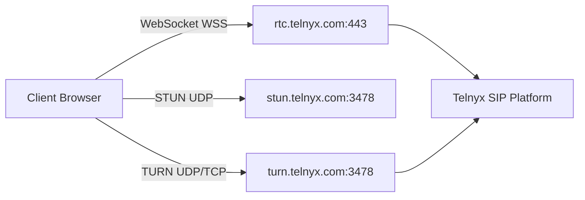

> ## Documentation Index
> Fetch the complete documentation index at: https://developers.telnyx.com/llms.txt
> Use this file to discover all available pages before exploring further.

# Network Connectivity Requirements

> Required endpoints, ports, and firewall configuration for the Telnyx WebRTC JS SDK.

# Network Connectivity Requirements

For the Telnyx WebRTC JS SDK to function properly, the client must be able to reach Telnyx's signaling and media infrastructure.

***

## Overview

The SDK requires connectivity to three types of endpoints:



***

## Signaling

The SDK uses a persistent WebSocket connection for call signaling (invite, answer, hangup, etc.).

| Property      | Value                        |
| ------------- | ---------------------------- |
| **Host**      | `rtc.telnyx.com`             |
| **Port**      | 443                          |
| **Protocol**  | WSS (WebSocket Secure / TLS) |
| **Direction** | Outbound                     |

**Requirements:**

* Outbound WebSocket connections must be allowed on port 443
* No HTTP long-polling fallback — WebSocket is required
* Connection must remain open for the duration of the session

**Custom endpoint:** You can override the signaling server using [IClientOptions](/development/webrtc/js-sdk/interfaces/iclientoptions) `env` property, but this is not recommended for production.

***

## STUN

STUN servers help the client discover its public IP address for ICE negotiation.

| Property      | Value                     |
| ------------- | ------------------------- |
| **Primary**   | `stun.telnyx.com:3478`    |
| **Fallback**  | `stun.l.google.com:19302` |
| **Protocol**  | UDP                       |
| **Direction** | Outbound                  |

The SDK automatically uses these STUN servers. No configuration required.

***

## TURN

TURN servers relay media when direct peer-to-peer connectivity is not possible (e.g., symmetric NAT, restrictive firewalls).

| Property           | Value                             |
| ------------------ | --------------------------------- |
| **Host**           | `turn.telnyx.com`                 |
| **Port (UDP)**     | 3478                              |
| **Port (TCP)**     | 3478                              |
| **Protocol**       | UDP (preferred) / TCP (fallback)  |
| **Authentication** | Automatic (long-term credentials) |
| **Direction**      | Outbound                          |

The SDK automatically provisions TURN credentials. No manual configuration required.

**UDP vs TCP:**

* **UDP** (preferred) — Lower latency, better for real-time audio
* **TCP** (fallback) — Higher latency, used only when UDP is blocked

<Callout type="info">
  TURN credentials are automatically provisioned by the SDK. You do not need to configure TURN usernames or passwords.
</Callout>

<Callout type="warning">
  TURNS (TURN over TLS on port 443) is not currently supported. If your network requires TURN fallback, allow TCP port `3478` to `turn.telnyx.com` instead.
</Callout>

***

## Firewall Configuration

### Minimum required rules

| Direction | Destination       | Port | Protocol | Purpose            |
| --------- | ----------------- | ---- | -------- | ------------------ |
| Outbound  | `rtc.telnyx.com`  | 443  | WSS      | Signaling          |
| Outbound  | `stun.telnyx.com` | 3478 | UDP      | STUN               |
| Outbound  | `turn.telnyx.com` | 3478 | UDP      | TURN (media relay) |
| Outbound  | `turn.telnyx.com` | 3478 | TCP      | TURN (fallback)    |

### Optional but recommended

| Direction | Destination         | Port  | Protocol | Purpose       |
| --------- | ------------------- | ----- | -------- | ------------- |
| Outbound  | `stun.l.google.com` | 19302 | UDP      | STUN fallback |

### Media ports

RTP media uses dynamic ports allocated by the browser. These are ephemeral and cannot be whitelisted by port number. Instead:

* **Ensure TURN is accessible** — TURN handles media relay when direct connectivity fails
* **Allow UDP outbound** to Telnyx media servers (the `remote_media_ip` seen in SDP)
* **Don't restrict outbound UDP to specific ports** — this will break WebRTC

***

## Restrictive Network Scenarios

### STUN fails (error 701)

**Symptom:** Client cannot discover its public IP. No `srflx` or `prflx` ICE candidates.

**Fix:**

1. Check firewall allows UDP to `stun.telnyx.com:3478`
2. If STUN is blocked, TURN may still work — the SDK falls back automatically
3. If both STUN and TURN are blocked, calls cannot connect

### TURN fails

**Symptom:** Client is on a restrictive network (symmetric NAT), can't get `relay` candidates.

**Fix:**

1. Check firewall allows TCP/3478 to `turn.telnyx.com`
2. If UDP is blocked, TCP TURN on port 3478 will work but with higher latency
3. Port 443 is not supported for TURN/TLS today
4. As a last resort, use `forceRelayCandidate: true` to skip direct connectivity attempts:

```javascript theme={null}
const call = client.newCall({
 destinationNumber: '+12345678900',
 forceRelayCandidate: true,
});
```

### Corporate VPN

**Symptom:** Calls fail or have poor quality through VPN.

**Fix:**

1. Whitelist `rtc.telnyx.com`, `stun.telnyx.com`, and `turn.telnyx.com` in VPN split-tunneling config
2. Ensure VPN doesn't block UDP traffic to TURN servers
3. Consider split-tunneling so WebRTC traffic bypasses the VPN

### Docker / Container environments

**Symptom:** STUN errors, no ICE candidates, one-way audio.

**Fix:**

1. Docker's default bridge network (`172.x` or `10.x`) can interfere with ICE candidate gathering
2. Use `--network host` mode for the container
3. Or configure the Docker network to use the host's network stack

***

## Testing Connectivity

### Quick test

Open your browser's DevTools console and run:

```javascript theme={null}
// Test WebSocket signaling
const ws = new WebSocket('wss://rtc.telnyx.com:443');
ws.onopen = () => console.log(' WebSocket OK');
ws.onerror = () => console.error(' WebSocket FAILED');

// Test STUN
const pc = new RTCPeerConnection({
 iceServers: [{ urls: 'stun:stun.telnyx.com:3478' }],
});
pc.createDataChannel('test');
pc.createOffer().then(offer => pc.setLocalDescription(offer));
pc.onicecandidate = (e) => {
 if (e.candidate) {
 const type = e.candidate.type;
 console.log(`ICE candidate type: ${type}`);
 if (type === 'srflx') console.log(' STUN works');
 if (type === 'relay') console.log(' TURN works');
 }
};
```

### Debug tools

* **SDK debug mode:** Set `debug: true` and `debugOutput: 'socket'` in [IClientOptions](/development/webrtc/js-sdk/interfaces/iclientoptions)
* **Debug visualizer:** Upload debug data to `https://webrtc-debug.telnyx.com/`
* **Call reports:** Enable `enableCallReports: true` for programmatic access to ICE stats

See [Debug Data & Call Quality Analysis](/development/webrtc/js-sdk/how-to/debug-call-issues) for interpreting debug output.

***

## Bandwidth Requirements

| Codec        | Bitrate    | Notes                                 |
| ------------ | ---------- | ------------------------------------- |
| Opus         | 6-510 kbps | Default, adaptive. Typical: \~30 kbps |
| PCMU (G.711) | 64 kbps    | Fallback codec                        |
| PCMA (G.711) | 64 kbps    | Fallback codec                        |

**Recommended minimum bandwidth per call:**

* **Audio only:** 100 kbps (including overhead)
* **With video:** 500-2000 kbps depending on resolution

**RTT requirements:**

| Quality    | RTT      |
| ---------- | -------- |
| Excellent  | \< 100ms |
| Good       | \< 150ms |
| Acceptable | \< 300ms |
| Poor       | > 300ms  |

***

## See Also

* [IClientOptions](/development/webrtc/js-sdk/interfaces/iclientoptions) — ICE and network configuration
* [Debug Data & Call Quality Analysis](/development/webrtc/js-sdk/how-to/debug-call-issues) — Interpreting ICE and quality data
* [Best Practices](/development/webrtc/js-sdk/how-to/production-best-practices) — Production deployment guide
* [Error Handling](/development/webrtc/js-sdk/how-to/error-handling) — ICE and WebSocket error codes
