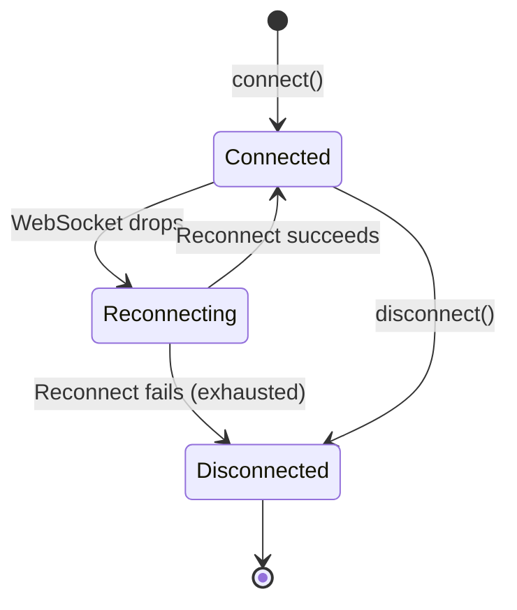

> ## Documentation Index
> Fetch the complete documentation index at: https://developers.telnyx.com/llms.txt
> Use this file to discover all available pages before exploring further.

# Reconnection & Call Recovery

> How the Telnyx WebRTC JS SDK handles reconnection, when calls survive network interruptions, and how to configure recovery behavior.

# Reconnection & Call Recovery

Network interruptions happen — Wi-Fi drops, VPNs reconnect, laptops sleep. The Telnyx WebRTC JS SDK automatically handles reconnection so your users experience minimal disruption.

***

## How Reconnection Works



When the WebSocket connection to `rtc.telnyx.com` drops:

1. **SDK detects the disconnect** via WebSocket `close` or `error` event, or via active-call signaling health checks when the socket is half-dead
2. **SDK attempts reconnection** after a randomized 2-6 second delay
3. **On successful reconnect**, the SDK re-authenticates and re-attaches to existing calls
4. **If reconnection fails** after `maxReconnectAttempts` attempts (default: 10), the `RECONNECTION_EXHAUSTED` error is emitted

**No manual intervention required.** The SDK handles this automatically.

***

## When Calls Survive Reconnection

Calls can survive a brief WebSocket disconnect if:

| Condition                                    | Required |
| -------------------------------------------- | -------- |
| Call was in `active` state                   |          |
| `keepConnectionAliveOnSocketClose` is `true` |          |
| PeerConnection is still alive                |          |
| Reconnect happens within timeout             |          |

**Configuration:**

```javascript theme={null}
const client = new TelnyxRTC({
 login_token: jwt,
 keepConnectionAliveOnSocketClose: true, // Keep PeerConnection alive
});
```

When `keepConnectionAliveOnSocketClose` is enabled:

* The PeerConnection (WebRTC media) stays alive even when the WebSocket (signaling) drops
* Audio continues flowing during the reconnection attempt
* On reconnect, the SDK re-attaches the existing call to the new WebSocket
* The call ID may change — use `recoveredCallId` to correlate

### `recoveredCallId`

After a successful reconnection, the call may have a new ID. The previous ID is available as `recoveredCallId`:

```javascript theme={null}
client.on('telnyx.notification', (notification) => {
 if (notification.type === 'callUpdate') {
 const call = notification.call;

 if (call.recoveredCallId) {
 console.log(`Call ${call.recoveredCallId} recovered as ${call.id}`);
 }
 }
});
```

***

## When Calls Don't Survive

| Scenario                                                | Why                                |
| ------------------------------------------------------- | ---------------------------------- |
| Call was in `ringing` or `requesting` state             | Not yet fully established          |
| `keepConnectionAliveOnSocketClose` is `false` (default) | PeerConnection closed immediately  |
| Reconnect took too long                                 | PeerConnection timed out           |
| Network changed completely                              | DTLS fingerprint no longer matches |

When a call doesn't survive reconnection, the SDK emits a `hangup` state for that call.

***

## Handling Reconnection in Your UI

### Show reconnection status

```javascript theme={null}
let isReconnecting = false;

client.on('telnyx.socket.close', () => {
 isReconnecting = true;
 showReconnectingBanner();
});

client.on('telnyx.ready', () => {
 if (isReconnecting) {
 isReconnecting = false;
 hideReconnectingBanner();
 }
});

client.on('telnyx.error', (error) => {
 if (error.code === TELNYX_ERROR_CODES.RECONNECTION_EXHAUSTED) {
 showDisconnectedMessage();
 }
});
```

### Handle recovered calls

```javascript theme={null}
client.on('telnyx.notification', (notification) => {
 if (notification.type === 'callUpdate') {
 const call = notification.call;

 if (call.recoveredCallId) {
 // Update your UI state to use the new call ID
 updateCallInUI(call.recoveredCallId, call.id);
 }
 }
});
```

### Handle signaling and media recovery warnings

During an active call, the SDK monitors WebSocket signaling liveness and media flow. If the browser reports the WebSocket as open but signaling stops flowing, the SDK emits `telnyx.warning` and force-closes the socket to trigger reconnect + call reattach. If signaling is healthy but media is unhealthy, the SDK emits a media recovery warning and attempts ICE restart instead.

```javascript theme={null}
import { SwEvent, TELNYX_WARNING_CODES } from '@telnyx/webrtc';

client.on(SwEvent.Warning, ({ warning, callId, reason, source }) => {
  switch (warning.code) {
    case TELNYX_WARNING_CODES.SIGNALING_HEALTH_PROBE_TIMEOUT:
    case TELNYX_WARNING_CODES.SIGNALING_REQUEST_TIMEOUT:
    case TELNYX_WARNING_CODES.SIGNALING_RECOVERY_REQUIRED:
      showReconnectingBanner({ reason, source });
      break;

    case TELNYX_WARNING_CODES.MEDIA_RECOVERY_REQUIRED:
      showMediaReconnectingIndicator(callId);
      break;
  }
});
```

For these warnings, keep the current call UI active. Wait for `telnyx.ready`, a recovered `callUpdate`, or a final `hangup` before cleaning up the call.

***

## Inbound Calls After Reconnection

After a WebSocket reconnect, the browser may need to re-acquire microphone permissions to receive inbound calls. This is a browser security requirement, not an SDK limitation.

### `mediaPermissionsRecovery`

Handle microphone permission failures for inbound calls with a recoverable error pattern. When enabled and `getUserMedia` fails while answering, the SDK emits a recoverable `telnyx.error` event with `resume()` and `reject()` callbacks so your app can prompt the user to fix permissions before the call fails:

```javascript theme={null}
import { TelnyxRTC, isMediaRecoveryErrorEvent } from '@telnyx/webrtc';

const client = new TelnyxRTC({
 login_token: jwt,
 mediaPermissionsRecovery: {
 enabled: true,
 timeout: 20000, // Wait up to 20s for user to fix permissions
 onSuccess: () => console.log('Media recovered'),
 onError: (err) => console.error('Recovery failed', err),
 },
});

client.on('telnyx.error', (event) => {
 if (isMediaRecoveryErrorEvent(event)) {
 showPermissionDialog({
 onContinue: () => event.resume(),
 onCancel: () => event.reject?.(),
 });
 }
});
```

**How it works:**

1. An inbound call arrives and the user tries to answer
2. `getUserMedia()` fails (permission denied, device busy, etc.)
3. Instead of immediately failing the call, SDK emits a recoverable error with `resume()` and `reject()` callbacks
4. Your app shows a UI prompting the user to grant permissions
5. If the user fixes permissions and you call `resume()`, the SDK retries `getUserMedia()`
6. If the user declines or `timeout` expires, the call is terminated

<Callout type="info">
  `mediaPermissionsRecovery` only works for inbound calls. Recovery is attempted only when the initial `getUserMedia` call fails while answering.
</Callout>

***

## Explicit Disconnect

When a user intentionally disconnects (e.g., signs out), you want to prevent automatic reconnection:

```javascript theme={null}
// Bad — may auto-reconnect
client.disconnect();

// Good — prevent auto-reconnect
client.clearReconnectToken();
client.disconnect();
```

`clearReconnectToken()` removes the session token that the SDK uses for automatic reconnection. After calling it, the SDK will not attempt to reconnect.

***

## Common Issues

### Rapid reconnection loops

**Symptom:** WebSocket connects and immediately disconnects, repeating rapidly.

**Cause:** Usually an authentication issue — the JWT has expired or the credential has been revoked.

**Fix:**

1. Check that the JWT is still valid
2. Verify the credential still exists in the Telnyx Portal
3. Check for `telnyx.error` events with `AUTH_FAILED` code

### `RECONNECTION_EXHAUSTED`

**Symptom:** SDK stops trying to reconnect after multiple failures.

**Cause:** Automatic reconnect reached `maxReconnectAttempts` (default: 10). The SDK uses a randomized 2-6 second delay between attempts; set `maxReconnectAttempts: 0` only if your app should retry indefinitely.

**Fix:**

1. Check network connectivity
2. Verify `rtc.telnyx.com` is reachable
3. Offer a manual "Reconnect" button in the UI:

```javascript theme={null}
client.on('telnyx.error', (error) => {
  if (error.code === TELNYX_ERROR_CODES.RECONNECTION_EXHAUSTED) {
    showManualReconnectButton();
  }
});

// Manual reconnect
reconnectButton.addEventListener('click', () => {
  client.connect();
});
```

### Calls die after network change (Wi-Fi → Cellular)

**Symptom:** Call drops when switching networks, even with `keepConnectionAliveOnSocketClose`.

**Cause:** The PeerConnection's ICE candidates are tied to the old network. The new network has different candidates that weren't part of the original negotiation.

**Fix:** This is a WebRTC limitation. The SDK attempts ICE restart, but it may not always succeed. The user will need to place a new call.

***

## Configuration Summary

| Option                             | Location         | Default | Description                                                                                      |
| ---------------------------------- | ---------------- | ------- | ------------------------------------------------------------------------------------------------ |
| `keepConnectionAliveOnSocketClose` | IClientOptions   | `false` | Keep PeerConnection alive during WebSocket reconnect                                             |
| `maxReconnectAttempts`             | IClientOptions   | `10`    | Maximum automatic reconnect attempts after unexpected disconnect; set `0` for unlimited attempts |
| `mediaPermissionsRecovery`         | IClientOptions   | —       | Auto-recover media permissions for inbound calls                                                 |
| `clearReconnectToken()`            | TelnyxRTC method | —       | Prevent auto-reconnection on disconnect                                                          |

***

## See Also

* [TelnyxRTC Class](/development/webrtc/js-sdk/classes/telnyxrtc) — Client configuration and methods
* [IClientOptions](/development/webrtc/js-sdk/interfaces/iclientoptions) — Full configuration reference
* [Error Handling](/development/webrtc/js-sdk/how-to/error-handling) — Error codes including reconnection errors
* [Best Practices](/development/webrtc/js-sdk/how-to/production-best-practices#reconnection--recovery) — Production reconnection guidance
