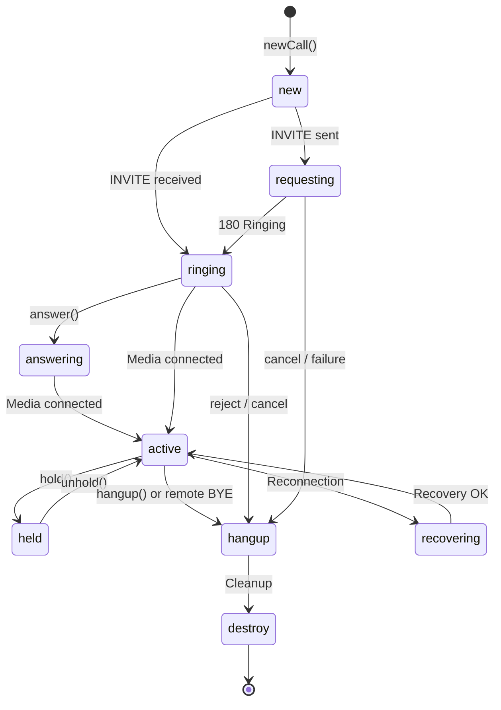

> ## Documentation Index
> Fetch the complete documentation index at: https://developers.telnyx.com/llms.txt
> Use this file to discover all available pages before exploring further.

# Call Class

> The Call object represents an active voice call — make, answer, hang up, mute, and hold.

# Call Class

The `Call` object represents a voice call. It's created by `client.newCall()` (outbound) or received via `telnyx.notification` (inbound).

***

## Getting a Call Object

### Outbound call

```javascript theme={null}
const call = client.newCall({
  destinationNumber: '+12345678900',
  audio: true,
});
```

### Inbound call

```javascript theme={null}
client.on('telnyx.notification', (notification) => {
  if (notification.type === 'callUpdate' && notification.call.state === 'ringing') {
    const call = notification.call;
    call.answer();
  }
});
```

***

## Properties

| Property            | Type                      | Description                                                    |
| ------------------- | ------------------------- | -------------------------------------------------------------- |
| `id`                | `string`                  | Unique call identifier                                         |
| `state`             | `CallState`               | Current call state (see [Call States](#call-states))           |
| `direction`         | `'inbound' \| 'outbound'` | Call direction                                                 |
| `remotePartyNumber` | `string`                  | Remote party's phone number                                    |
| `remotePartyName`   | `string`                  | Remote party's display name (if available)                     |
| `localPartyNumber`  | `string`                  | Local party's phone number                                     |
| `active`            | `boolean`                 | Whether the call is currently active                           |
| `recoveredCallId`   | `string`                  | Previous call ID if this call was recovered after reconnection |
| `peerConnection`    | `RTCPeerConnection`       | Underlying WebRTC PeerConnection (for advanced use)            |

***

## Call States



| State        | Description                                        |
| ------------ | -------------------------------------------------- |
| `new`        | Call object created, not yet dialed                |
| `requesting` | Outbound INVITE sent to server                     |
| `ringing`    | Inbound: INVITE received. Outbound: remote ringing |
| `answering`  | Inbound call being answered (media negotiation)    |
| `active`     | Call connected — media flowing                     |
| `held`       | Call on hold                                       |
| `hangup`     | Call ended (local or remote hangup)                |
| `destroy`    | Call object cleaned up                             |
| `recovering` | Call being recovered after reconnection            |

***

## Methods

### `answer()`

Answer an incoming call.

```javascript theme={null}
client.on('telnyx.notification', (notification) => {
  if (notification.type === 'callUpdate' && notification.call.state === 'ringing') {
    notification.call.answer();
  }
});
```

<Callout type="warning">
  Only call `answer()` when the call state is `ringing`. Calling `answer()` on an already-active call creates a duplicate PeerConnection, which causes one-way audio issues.
</Callout>

### `hangup()`

End the call.

```javascript theme={null}
// SDK 2.25.x — synchronous
call.hangup();

// SDK 2.26.x — async (returns Promise)
await call.hangup();
```

See [Migration Guide](/development/webrtc/js-sdk/migration-guide) for upgrading from 2.25.x.

### `muteAudio()` / `unmuteAudio()`

Toggle the microphone.

```javascript theme={null}
call.muteAudio();    // Mute
call.unmuteAudio();  // Unmute
```

### `hold()` / `unhold()`

Put the call on hold or resume it.

```javascript theme={null}
call.hold();    // Put on hold (remote hears hold music)
call.unhold();  // Resume
```

### `dtmf(digit)`

Send a DTMF tone (0-9, \*, #).

```javascript theme={null}
call.dtmf('1');
call.dtmf('*');
call.dtmf('#');
```

### `sendDigits(digits)`

Send a sequence of DTMF digits.

```javascript theme={null}
call.sendDigits('1');
```

***

## Events

Register event listeners using `call.on(eventName, handler)`:

### Call State Events

| Event                 | Payload                                                             | Description                      |
| --------------------- | ------------------------------------------------------------------- | -------------------------------- |
| `telnyx.notification` | [INotification](/development/webrtc/js-sdk/reference/inotification) | Call state updates, media events |

```javascript theme={null}
const call = client.newCall({
  destinationNumber: '+12345678900',
  audio: true,
});

call.on('telnyx.notification', (notification) => {
  switch (notification.call.state) {
    case 'active':
      console.log('Call connected');
      break;
    case 'hangup':
      console.log('Call ended');
      break;
  }
});
```

***

## Advanced

### Access the PeerConnection

For custom WebRTC monitoring or manipulation:

```javascript theme={null}
const pc = call.peerConnection;

// Get current ICE connection state
console.log('ICE state:', pc.iceConnectionState);

// Get current DTLS state
console.log('DTLS state:', pc.connectionState);

// Get stats
const stats = await pc.getStats();
stats.forEach((report) => {
  if (report.type === 'candidate-pair' && report.nominated) {
    console.log('Nominated pair:', report);
  }
});
```

<Callout type="warning">
  Direct PeerConnection access is for advanced use cases only. The SDK manages the PeerConnection lifecycle — calling methods like `close()` or `setRemoteDescription()` directly may break the call.
</Callout>

### Custom headers

Add SIP headers to the INVITE for server-side correlation:

```javascript theme={null}
const call = client.newCall({
  destinationNumber: '+12345678900',
  audio: true,
  customHeaders: [
    { name: 'X-Call-Session', value: sessionUuid },
    { name: 'X-Agent-ID', value: agentId },
  ],
});
```

***

## Common Patterns

### Simple outbound call with state handling

```javascript theme={null}
const call = client.newCall({
  destinationNumber: '+12345678900',
  audio: true,
});

call.on('telnyx.notification', (notification) => {
  switch (notification.call.state) {
    case 'requesting':
      showDialingUI();
      break;
    case 'ringing':
      showRingingUI();
      break;
    case 'active':
      showActiveCallUI();
      break;
    case 'hangup':
      cleanupCallUI();
      break;
  }
});

// Cancel the call if not yet connected
cancelButton.addEventListener('click', () => {
  call.hangup();
});
```

### Inbound call with accept/reject UI

```javascript theme={null}
client.on('telnyx.notification', (notification) => {
  if (notification.type === 'callUpdate' && notification.call.state === 'ringing') {
    const call = notification.call;

    showIncomingCallUI({
      from: call.remotePartyNumber,
      onAccept: () => call.answer(),
      onReject: () => call.hangup(),
    });
  }
});
```

### Hold and resume

```javascript theme={null}
// Put call on hold
holdButton.addEventListener('click', () => {
  call.hold();
});

// Resume the call
resumeButton.addEventListener('click', () => {
  call.unhold();
});
```

***

## See Also

* [ICallOptions](/development/webrtc/js-sdk/reference/icalloptions) — Call configuration options
* [INotification](/development/webrtc/js-sdk/reference/inotification) — Notification types and payloads
* [TelnyxRTC Class](/development/webrtc/js-sdk/reference/telnyxrtc) — Client methods and events
* [SDK Commonalities](/development/webrtc/js-sdk/explanation/call-state-lifecycle) — Call states across all SDK platforms
* [Best Practices](/development/webrtc/js-sdk/how-to/production-best-practices) — Production call management guide
