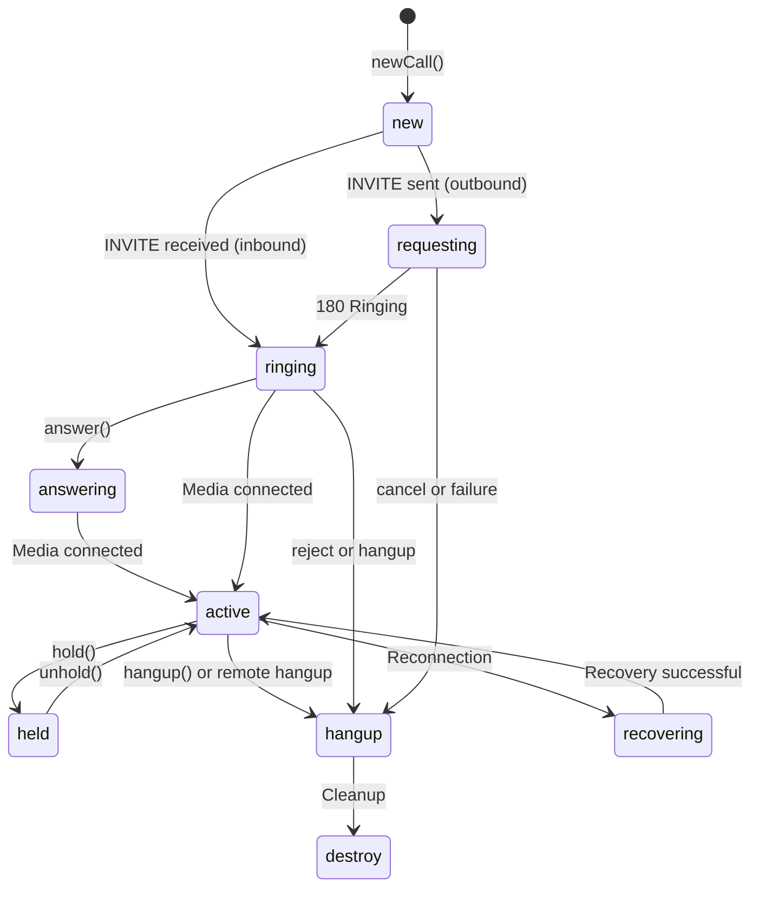

> ## Documentation Index
> Fetch the complete documentation index at: https://developers.telnyx.com/llms.txt
> Use this file to discover all available pages before exploring further.

# INotification

> Notification object emitted by the Telnyx WebRTC JS SDK for call updates, media events, and SDK notifications.

# INotification

The `INotification` object is emitted via the `telnyx.notification` event. It contains information about call state changes, media events, and SDK notifications.

***

## Properties

| Property    | Type                                            | Description                                                  |
| ----------- | ----------------------------------------------- | ------------------------------------------------------------ |
| `type`      | `string`                                        | Notification type (see below)                                |
| `call`      | [Call](/development/webrtc/js-sdk/classes/call) | The call object this notification relates to (if applicable) |
| `timestamp` | `number`                                        | Unix timestamp of the notification                           |

***

## Notification Types

| Type                        | Description                     | When It Fires                                |
| --------------------------- | ------------------------------- | -------------------------------------------- |
| `callUpdate`                | Call state changed              | Call rings, connects, hangs up, etc.         |
| `userMediaError`            | Media access failed             | Browser denied microphone/camera permissions |
| `peerConnectionFailedError` | ICE/DTLS connection failed      | Media could not be established               |
| `signalingStateClosed`      | PeerConnection signaling closed | SIP signaling terminated unexpectedly        |
| `vertoClientReady`          | Client is ready                 | Initial connection established               |

***

## Type: `callUpdate`

The most common notification type. Fired whenever a call's state changes.

```javascript theme={null}
client.on('telnyx.notification', (notification) => {
  if (notification.type === 'callUpdate') {
    const call = notification.call;

    switch (call.state) {
      case 'new':
        // Call object created (before dialing)
        break;
      case 'requesting':
        // Outbound call: INVITE sent to server
        break;
      case 'ringing':
        // Inbound call: received INVITE
        // Outbound call: remote party is ringing
        break;
      case 'answering':
        // Inbound call: answering in progress
        break;
      case 'active':
        // Call connected — media flowing
        break;
      case 'held':
        // Call on hold
        break;
      case 'hangup':
        // Call ended
        break;
      case 'destroy':
        // Call object cleaned up
        break;
      case 'recovering':
        // Call being recovered after reconnection
        break;
    }
  }
});
```

### Call State Diagram



***

## Type: `userMediaError`

Fired when the browser denies or fails to access media devices (microphone/camera).

```javascript theme={null}
client.on('telnyx.notification', (notification) => {
  if (notification.type === 'userMediaError') {
    console.error('Media error:', notification.call.state);
    // Common causes:
    // - User denied microphone permission
    // - No microphone available
    // - Another app is using the microphone
    showPermissionErrorUI();
  }
});
```

**Common causes:**

* User clicked "Block" on the permission prompt
* No microphone/camera detected
* Another application is using the device
* System-level permission denied (OS settings)

**Recommended response:** Show a clear message asking the user to grant microphone access, with a link to browser settings.

***

## Type: `peerConnectionFailedError`

Fired when the WebRTC PeerConnection fails to establish media. This usually means ICE negotiation or DTLS handshake failed.

```javascript theme={null}
client.on('telnyx.notification', (notification) => {
  if (notification.type === 'peerConnectionFailedError') {
    console.error('Peer connection failed');
    // Common causes:
    // - Firewall blocking TURN servers
    // - Symmetric NAT without TURN
    // - DTLS fingerprint mismatch
    showConnectionErrorUI();
  }
});
```

**Common causes:**

* Firewall blocks UDP to TURN servers
* Symmetric NAT prevents direct connectivity
* VPN interfering with ICE
* Docker/container network issues

**Recommended response:** Suggest the user check their network connection. See [Network Requirements](/development/webrtc/js-sdk/how-to/configure-network-firewall).

***

## Type: `signalingStateClosed`

Fired when the PeerConnection's signaling state becomes `closed`, indicating the SIP signaling channel has terminated.

```javascript theme={null}
client.on('telnyx.notification', (notification) => {
  if (notification.type === 'signalingStateClosed') {
    console.warn('Signaling state closed for call:', notification.call.id);
    // The call will transition to hangup state shortly
  }
});
```

This is usually followed by a `callUpdate` with state `hangup`.

***

## Type: `vertoClientReady`

Fired when the client has successfully connected and authenticated with the Telnyx signaling server. This is equivalent to the `telnyx.ready` event but delivered as a notification.

```javascript theme={null}
client.on('telnyx.notification', (notification) => {
  if (notification.type === 'vertoClientReady') {
    console.log('Client ready for calls');
  }
});
```

***

## Listening to Notifications

### On the Client

```javascript theme={null}
client.on('telnyx.notification', (notification) => {
  switch (notification.type) {
    case 'callUpdate':
      handleCallUpdate(notification.call);
      break;
    case 'userMediaError':
      handleMediaError(notification.call);
      break;
    case 'peerConnectionFailedError':
      handleConnectionError(notification.call);
      break;
  }
});
```

### On a Call

You can also listen on individual call objects:

```javascript theme={null}
const call = client.newCall({
  destinationNumber: '+12345678900',
  audio: true,
});

call.on('telnyx.notification', (notification) => {
  // Only notifications for this specific call
  if (notification.call.state === 'active') {
    console.log('Call connected!');
  }
});
```

<Callout type="info">
  Listening on the client gives you notifications for ALL calls. Listening on a specific call gives you notifications for that call only. Choose based on your app's architecture.
</Callout>

***

## See Also

* [Call Class](/development/webrtc/js-sdk/classes/call) — Call state and control methods
* [TelnyxRTC Class](/development/webrtc/js-sdk/classes/telnyxrtc) — Client-level events
* [Error Handling](/development/webrtc/js-sdk/error-handling) — Error and warning codes
* [SDK Commonalities](/development/webrtc/js-sdk/explanation/call-state-lifecycle) — Call states across all SDK platforms
