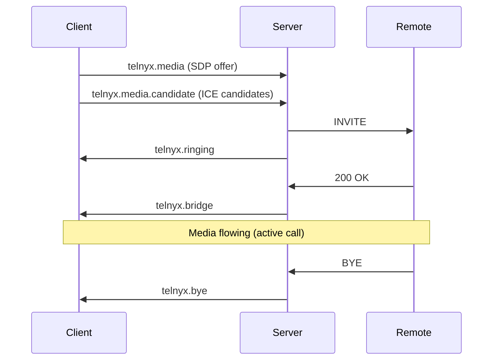
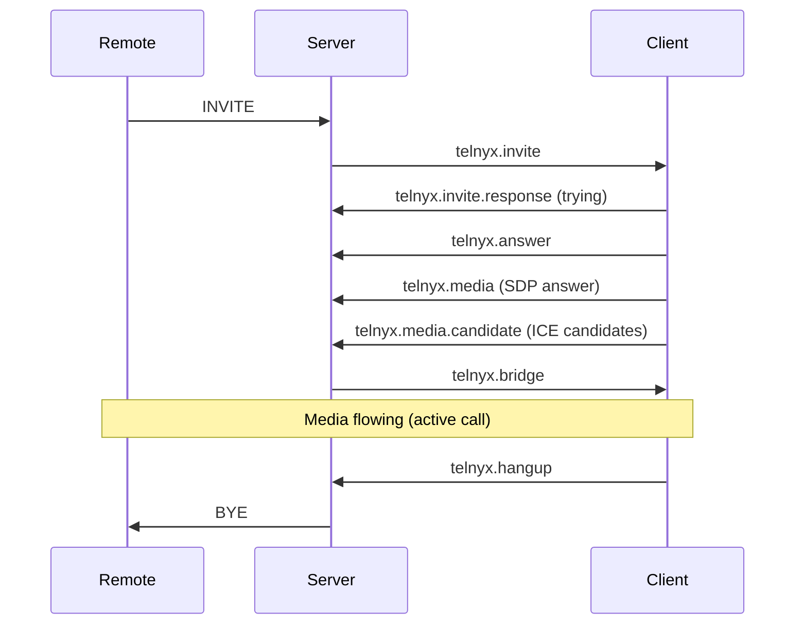

> ## Documentation Index
> Fetch the complete documentation index at: https://developers.telnyx.com/llms.txt
> Use this file to discover all available pages before exploring further.

# Switch/Server Events

> Events emitted by the Telnyx signaling server during the WebRTC call lifecycle — login, invite, answer, bye, and more.

# Switch/Server Events

The Telnyx signaling server sends events over the WebSocket connection during the call lifecycle. These are the raw server-side events — most applications should use the higher-level `telnyx.notification` event instead. See [INotification](/development/webrtc/js-sdk/interfaces/inotification) for the recommended approach.

<Callout type="info">
  **Most developers don't need to handle these events directly.** The SDK translates them into [INotification](/development/webrtc/js-sdk/interfaces/inotification) objects. Use `telnyx.notification` unless you need low-level signaling details.
</Callout>

***

## Event Reference

### Client Lifecycle

| Event                  | Direction       | Description                                                |
| ---------------------- | --------------- | ---------------------------------------------------------- |
| `telnyx.login`         | Client → Server | Authentication request (login + password or login\_token)  |
| `telnyx.login.success` | Server → Client | Authentication successful                                  |
| `telnyx.login.error`   | Server → Client | Authentication failed (invalid credentials, expired token) |
| `telnyx.logout`        | Client → Server | Client disconnecting                                       |

### Call Lifecycle

| Event                    | Direction       | Description                                         |
| ------------------------ | --------------- | --------------------------------------------------- |
| `telnyx.invite`          | Server → Client | Incoming call (INVITE)                              |
| `telnyx.invite.response` | Client → Server | Response to incoming call (trying, ringing, answer) |
| `telnyx.answer`          | Client → Server | Accept incoming call                                |
| `telnyx.ringing`         | Server → Client | Remote party is ringing (outbound call)             |
| `telnyx.bridge`          | Server → Client | Call bridged (both parties connected)               |
| `telnyx.bye`             | Server → Client | Remote party hung up                                |
| `telnyx.hangup`          | Client → Server | Local hangup                                        |

### Media

| Event                    | Direction       | Description                 |
| ------------------------ | --------------- | --------------------------- |
| `telnyx.media`           | Client → Server | SDP offer/answer exchange   |
| `telnyx.media.candidate` | Client → Server | ICE candidate (trickle ICE) |

### Call Control

| Event             | Direction       | Description         |
| ----------------- | --------------- | ------------------- |
| `telnyx.hold`     | Client → Server | Put call on hold    |
| `telnyx.unhold`   | Client → Server | Take call off hold  |
| `telnyx.dtmf`     | Client → Server | Send DTMF tone      |
| `telnyx.transfer` | Client → Server | Transfer call       |
| `telnyx.fax`      | Server → Client | Fax detection event |

### Presence & Registration

| Event                  | Direction       | Description                        |
| ---------------------- | --------------- | ---------------------------------- |
| `telnyx.register`      | Client → Server | SIP REGISTER (credential-based)    |
| `telnyx.unregister`    | Client → Server | SIP UNREGISTER                     |
| `telnyx.gateway.state` | Server → Client | Gateway connection state (up/down) |

***

## Event Flow: Outbound Call



***

## Event Flow: Inbound Call



***

## Listening to Server Events

For advanced use cases, you can listen to raw server events by enabling debug mode and parsing the WebSocket messages:

```javascript theme={null}
const client = new TelnyxRTC({
 login_token: jwt,
 debug: true,
 debugOutput: 'socket',
});
```

Or intercept WebSocket messages directly:

```javascript theme={null}
// Low-level: intercept raw WebSocket messages
const originalSend = client.connection.socket.send.bind(client.connection.socket);
client.connection.socket.send = function(data) {
 const parsed = JSON.parse(data);
 console.log('→ Server:', parsed.method);
 return originalSend(data);
};
```

<Callout type="warning">
  Listening to raw WebSocket messages is **not a supported API**. The message format may change between SDK versions. Use `telnyx.notification` for stable event handling.
</Callout>

***

## Server Events vs INotification

| Aspect         | Server Events                       | INotification              |
| -------------- | ----------------------------------- | -------------------------- |
| **Level**      | Low-level signaling                 | High-level SDK abstraction |
| **Stability**  | May change between versions         | Stable across versions     |
| **Payload**    | Raw SIP/Verto format                | Structured call object     |
| **Use case**   | Debugging, low-level control        | Application development    |
| **Event name** | `telnyx.invite`, `telnyx.bye`, etc. | `telnyx.notification`      |

**Use `telnyx.notification` (INotification) for application code:**

```javascript theme={null}
// Recommended — high-level, stable
client.on('telnyx.notification', (notification) => {
 if (notification.type === 'callUpdate') {
 const call = notification.call;
 // Handle call state changes
 }
});

// Not recommended — low-level, may change
// (No public API for this — would require intercepting WebSocket)
```

***

## Gateway State Events

The `telnyx.gateway.state` event indicates when the WebSocket connection to the gateway goes up or down:

```javascript theme={null}
// Listen via notification
client.on('telnyx.notification', (notification) => {
 if (notification.type === 'gatewayStateUpdate') {
 console.log('Gateway state:', notification.state);
 // 'up' = connected, 'down' = disconnected
 }
});
```

**Gateway DOWN** can indicate:

* Network interruption
* Server-side maintenance
* Credential revoked
* WebSocket timeout

The SDK automatically attempts reconnection. See [Reconnection & Recovery](/development/webrtc/js-sdk/how-to/handle-reconnection).

***

## See Also

* [INotification](/development/webrtc/js-sdk/interfaces/inotification) — High-level notification types (recommended)
* [Call Class](/development/webrtc/js-sdk/classes/call) — Call state and control methods
* [TelnyxRTC Class](/development/webrtc/js-sdk/classes/telnyxrtc) — Client events
* [Error Handling](/development/webrtc/js-sdk/error-handling) — Error and warning codes
* [Architecture](/development/webrtc/js-sdk/explanation/sdk-architecture) — How signaling and media flows work
