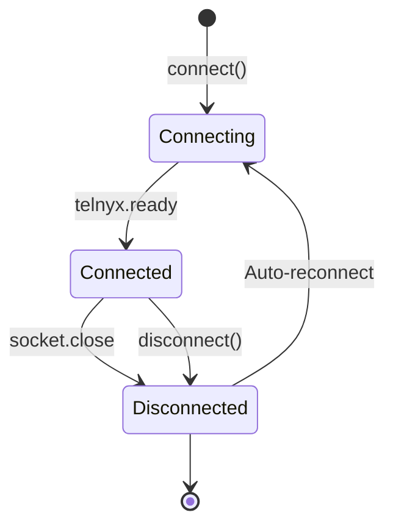

> ## Documentation Index
> Fetch the complete documentation index at: https://developers.telnyx.com/llms.txt
> Use this file to discover all available pages before exploring further.

# TelnyxRTC Class

> Main entry point for the Telnyx WebRTC JS SDK. Connect, disconnect, and manage calls.

# TelnyxRTC

The `TelnyxRTC` class is the main entry point for the Telnyx WebRTC JS SDK. It manages the WebSocket connection to Telnyx's signaling server and provides methods to create calls, handle events, and control the client lifecycle.

## Constructor

```typescript theme={null}
new TelnyxRTC(options: IClientOptions)
```

Creates a new client instance. Does **not** connect automatically — call `connect()` to establish the WebSocket connection.

**Parameters:**

| Parameter | Type                                                                   | Required | Description          |
| --------- | ---------------------------------------------------------------------- | -------- | -------------------- |
| `options` | [IClientOptions](/development/webrtc/js-sdk/interfaces/iclientoptions) | Yes      | Client configuration |

**Example:**

```javascript theme={null}
import { TelnyxRTC } from '@telnyx/webrtc';

const client = new TelnyxRTC({
  login_token: 'YOUR_JWT_TOKEN',
  // Optional: see IClientOptions for all options
  debug: false,
  enableCallReports: true,
});
```

***

## Methods

### `connect()`

Opens a WebSocket connection to `rtc.telnyx.com` and authenticates using the configured credentials.

```javascript theme={null}
client.connect();
```

Fires `telnyx.ready` on success or `telnyx.error` on failure.

### `disconnect()`

Closes the WebSocket connection and cleans up all active calls.

```javascript theme={null}
client.disconnect();
```

<Callout type="info">
  Always call `disconnect()` when the user leaves your app to avoid zombie WebSocket connections. See [Best Practices → Connection Lifecycle](/development/webrtc/js-sdk/how-to/production-best-practices#connection-lifecycle).
</Callout>

### `newCall(options)`

Creates and places a new outbound call.

```javascript theme={null}
const call = client.newCall({
  destinationNumber: '+12345678900',
  audio: true,
});
```

**Parameters:**

| Parameter | Type                                                               | Required | Description        |
| --------- | ------------------------------------------------------------------ | -------- | ------------------ |
| `options` | [ICallOptions](/development/webrtc/js-sdk/interfaces/icalloptions) | Yes      | Call configuration |

**Returns:** [Call](/development/webrtc/js-sdk/classes/call)

See [ICallOptions](/development/webrtc/js-sdk/interfaces/icalloptions) for all available options including custom headers, ICE configuration, and media settings.

### `off(event, handler)`

Removes an event listener.

```javascript theme={null}
const onReady = () => { /* ... */ };
client.on('telnyx.ready', onReady);
// Later:
client.off('telnyx.ready', onReady);
```

### `removeAllListeners()`

Removes all event listeners from the client.

```javascript theme={null}
client.removeAllListeners();
```

***

## Properties

### `connection`

Provides helpers to check the current connection state.

```javascript theme={null}
client.connection.connecting  // true during WebSocket handshake
client.connection.connected   // true when WebSocket is open and authenticated
client.connection.closed      // true when WebSocket is closed
client.connection.isAlive     // true if connection is active
```

| Property     | Type      | Description                       |
| ------------ | --------- | --------------------------------- |
| `connecting` | `boolean` | True during WebSocket handshake   |
| `connected`  | `boolean` | True when authenticated and ready |
| `closed`     | `boolean` | True when disconnected            |
| `isAlive`    | `boolean` | True if connection is active      |

### `calls`

An array of all active [Call](/development/webrtc/js-sdk/classes/call) objects.

```javascript theme={null}
// Check if any calls are active
if (client.calls.length > 0) {
  console.log(`Active calls: ${client.calls.length}`);
}

// Hang up all calls
client.calls.forEach(call => call.hangup());
```

***

## Events

Register event listeners using `client.on(eventName, handler)`:

```javascript theme={null}
client.on('telnyx.ready', () => { /* ... */ });
client.on('telnyx.error', (error) => { /* ... */ });
```

### Connection Events

| Event                 | Payload              | Description                                                                                                                                  |
| --------------------- | -------------------- | -------------------------------------------------------------------------------------------------------------------------------------------- |
| `telnyx.ready`        | —                    | Client connected and authenticated. **Wait for this before making calls.**                                                                   |
| `telnyx.error`        | `ClientErrorEvent`   | Connection or authentication error. See [Error Handling](/development/webrtc/js-sdk/error-handling).                                         |
| `telnyx.warning`      | `ClientWarningEvent` | Non-fatal warning (e.g., token expiring, quality degradation). See [Warning Codes](/development/webrtc/js-sdk/error-handling#warning-codes). |
| `telnyx.socket.close` | `CloseEvent`         | WebSocket closed. SDK will attempt reconnection automatically.                                                                               |
| `telnyx.socket.error` | `Event`              | WebSocket error.                                                                                                                             |

### Call Events

| Event                 | Payload                                                              | Description                                                                                                         |
| --------------------- | -------------------------------------------------------------------- | ------------------------------------------------------------------------------------------------------------------- |
| `telnyx.notification` | [INotification](/development/webrtc/js-sdk/interfaces/inotification) | Call state updates, media events, and SDK notifications. This is the **primary event** for handling call lifecycle. |

### Stats Events

| Event                 | Payload       | Description                                                                              |
| --------------------- | ------------- | ---------------------------------------------------------------------------------------- |
| `telnyx.stats.frame`  | `StatsFrame`  | Periodic WebRTC stats (RTT, jitter, packet loss). Emitted every `callReportInterval` ms. |
| `telnyx.stats.report` | `StatsReport` | End-of-call summary report. Emitted when a call ends.                                    |

***

## Typical Usage

```javascript theme={null}
import { TelnyxRTC } from '@telnyx/webrtc';

// 1. Create client with JWT
const client = new TelnyxRTC({
  login_token: 'YOUR_JWT_TOKEN',
  enableCallReports: true,
});

// 2. Register event handlers BEFORE connecting
client.on('telnyx.ready', () => {
  console.log('Connected! Ready to make calls.');
});

client.on('telnyx.error', (error) => {
  console.error('Error:', error.code, error.message);
});

client.on('telnyx.notification', (notification) => {
  if (notification.type === 'callUpdate') {
    const call = notification.call;
    switch (call.state) {
      case 'ringing':
        // Incoming call — show UI
        break;
      case 'active':
        // Call connected
        break;
      case 'hangup':
        // Call ended
        break;
    }
  }
});

client.on('telnyx.warning', (warning) => {
  console.warn('Warning:', warning.code, warning.message);
});

// 3. Connect
client.connect();

// 4. Make a call (after ready)
function makeCall(destination) {
  if (!client.connection.connected) {
    console.error('Not connected yet!');
    return;
  }
  const call = client.newCall({
    destinationNumber: destination,
    audio: true,
  });
}

// 5. Disconnect on cleanup
window.addEventListener('beforeunload', () => {
  client.disconnect();
});
```

***

## Reconnection

The SDK automatically reconnects when the WebSocket drops. You don't need to handle this manually in most cases.



For advanced reconnection handling, see [Reconnection & Recovery](/development/webrtc/js-sdk/how-to/handle-reconnection).

**Key configuration:**

| Option                             | Default | Description                                      |
| ---------------------------------- | ------- | ------------------------------------------------ |
| `keepConnectionAliveOnSocketClose` | `false` | Keep PeerConnection alive during reconnect       |
| `mediaPermissionsRecovery`         | —       | Auto-recover media permissions for inbound calls |

***

## See Also

* [IClientOptions](/development/webrtc/js-sdk/interfaces/iclientoptions) — Full configuration reference
* [Call Class](/development/webrtc/js-sdk/classes/call) — Call control methods
* [Error Handling](/development/webrtc/js-sdk/error-handling) — Error and warning codes
* [Best Practices](/development/webrtc/js-sdk/how-to/production-best-practices) — Production deployment guide
* [Authentication](/development/webrtc/js-sdk/how-to/authenticating-your-app) — JWT generation and token refresh
