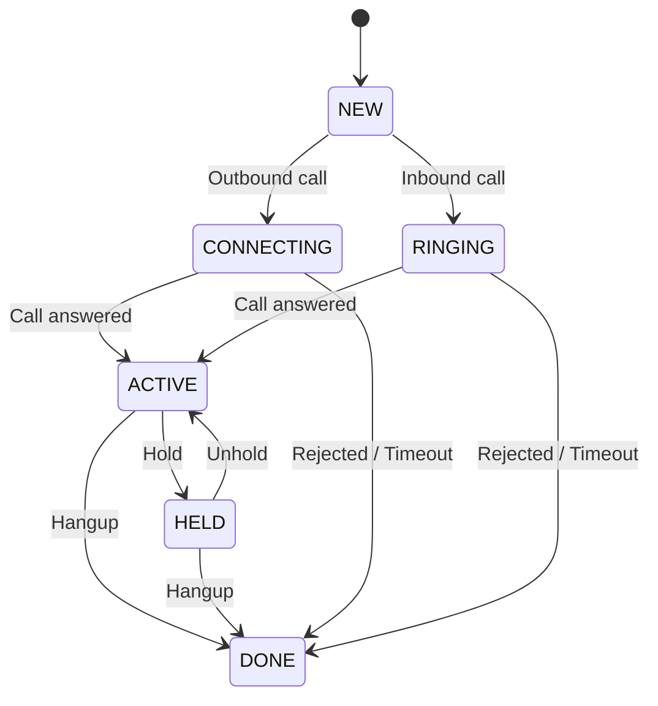

> ## Documentation Index
> Fetch the complete documentation index at: https://developers.telnyx.com/llms.txt
> Use this file to discover all available pages before exploring further.

# WebRTC Voice SDKs Commonalities

> Concepts shared across the Telnyx Voice WebRTC SDKs (JS, iOS, Android, Flutter) — clients, calls, events, push, and authentication flows in one place.

## Classes, Methods, and Events

***Broadly speaking***, across all the SDKs —

There are two main classes —

* The Client class that represents the session. This session encapsulates the websocket connection which is used for signaling and the active call.
* The Call class that represents a webRTC media connection

The Client class offers methods to

* Instantiate an outbound call
* Un/Register callback handlers for events
* Control input and output devices

The Call class offers methods to perform actions on a call, e.g.

* Answer or hang up
* Emit DTMF digits

There are three categories of events exposed —

* On changes to the websocket, e.g. connected or disconnected
* On changes to the client, e.g. ready to make and receive calls
* On changes to the call, e.g. answered

## Call States

Every SDK exposes a set of call states that describe where a call is in its lifecycle. The diagram below shows the common state machine shared across all WebRTC SDKs:

<Callout type="info">
  Some platforms define additional states beyond the common set. iOS and Android add **RECONNECTING** and **DROPPED** (with an associated reason) for network-recovery scenarios. Flutter and Android add an **ERROR** state for unrecoverable failures.
</Callout>

## Authentication

A Client instance needs to be properly authenticated before a call can be made or received.

The following means of authentications are offered

* [Basic credential based SIP connection](https://developers.telnyx.com/docs/voice/webrtc/auth/credential-connections)
* [Telephony credential](https://developers.telnyx.com/docs/voice/webrtc/auth/telephony-credentials)
* [JWT](https://developers.telnyx.com/docs/voice/webrtc/auth/jwt)

Consult the linked guides on to the specific how-to guides.

## Dialing Registered Clients

<table class="table">
  <tbody>
    <tr>
      <td>
        <strong>Method of Authentication</strong>
      </td>

      <td>
        <strong>Dialing registered clients with  </strong>
      </td>

      <td>
        <strong>Examples</strong>
      </td>
    </tr>

    <tr>
      <td>Basic credential based SIP connection</td>
      <td>SIP user name on the connection object</td>
      <td><code>[john1234@sip.telnyx.com](mailto:john1234@sip.telnyx.com)</code></td>
    </tr>

    <tr>
      <td>Basic credential based SIP connection</td>
      <td>Phone number on the connection (\* See notes below.)</td>
      <td><code>+13128889999</code></td>
    </tr>

    <tr>
      <td>Telephony credential</td>
      <td>SIP user name on the telephony credential object</td>
      <td><code>[gencredXXXYYY@sip.telnyx.com](mailto:gencredXXXYYY@sip.telnyx.com)</code></td>
    </tr>

    <tr>
      <td>JWT</td>
      <td>SIP user name on the parent telephony credential object</td>
      <td><code>[gencredxXxYyY@sip.telnyx.com](mailto:gencredxXxYyY@sip.telnyx.com)</code></td>
    </tr>
  </tbody>
</table>

<Callout type="warning">
  Dialing registered client using phone number on the connection requires "Destination Number Format" to be set as "SIP Username" on the "Inbound" setting of the same connection.
</Callout>

## Multi-client Registration Behavior

It’s recommended that the user sticks to one method of authentication and not mix and match unless there is a compelling use case for it.

Here is an example to illustrate —

Credential based SIP connection with SIP username `john1234`. Attached to this connections are:

* Telephony credential, `gencred1`
  * JWT, `token1_1`
* Telephony credential, `gencred2`
  * JWT, `token2_1`
  * JWT, `token2_2`

Respective registrations are:

* `client_a` is registered with `john1234`
* `client_b` is registered with `gencred1`
* `client_c` is registered with `token1_1`
* `client_d` is registered with `gencred2`
* `client_e` is registered with `token2_1`
* `client_f` is registered with `token2_2`

<table class="table">
  <tbody>
    <tr>
      <td>
        <strong>Dialing…</strong>
      </td>

      <td>
        <strong>Which client gets rung… </strong>
      </td>
    </tr>

    <tr>
      <td><code>[john1234@sip.telnyx.com](mailto:john1234@sip.telnyx.com)</code></td>
      <td><code>client\_a</code></td>
    </tr>

    <tr>
      <td><code>[gencred1@sip.telnyx.com](mailto:gencred1@sip.telnyx.com)</code></td>
      <td>Indeterminate; the last client to register between <code>client\_b</code> and <code>client\_c.</code></td>
    </tr>

    <tr>
      <td><code>[gencred2@sip.telnyx.com](mailto:gencred2@sip.telnyx.com)</code></td>
      <td>Indeterminate; the last client to register between <code>client\_d</code>, <code>client\_e</code> and <code>client\_f</code>.</td>
    </tr>
  </tbody>
</table>

## Common Usage Patterns

Two common primitive patterns are presented below. They can be augmented or used in combination with each other to achieve the user’s desired call flows.

### Pattern 1

This pattern is driven by the client-end application.

* A client-end application (Web or Mobile App) initiates a call.
* The call is temporarily parked by Telnyx.
* Telnyx issues a webhook event to the user’s backend service.
* User’s backend service performs additional processing using Telnyx Voice API, TeXML or Conferencing API.
* Depending on user’s business logic,
  * a second call leg may be initiated by the user’s backend and bridged to the initial call leg, or
  * the initial call leg be put into a queue or conference until bridged to another call leg.

### Pattern 2

This pattern is driven by a call from outside the Telnyx network.

* Telnyx receives a call from outside the Telnyx network, e.g. PSTN.
* Telnyx processes the call via TeXML instruction or Voice API commands
* That call leg is placed into a queue or conference room
* User’s backend service initiates a second call leg toward a client-end application
* The two call legs are eventually joined via bridge command or conference join

## Costs

WebRTC call legs are billed at \$0.002/minute.

Other voice legs and add on features are charged separately and independently according to the user’s price plan.
