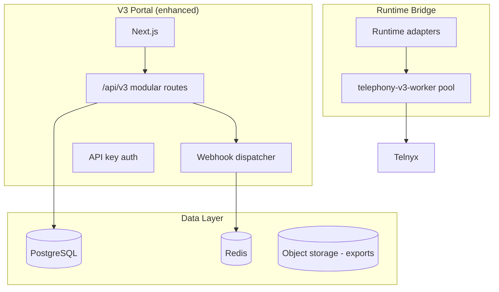
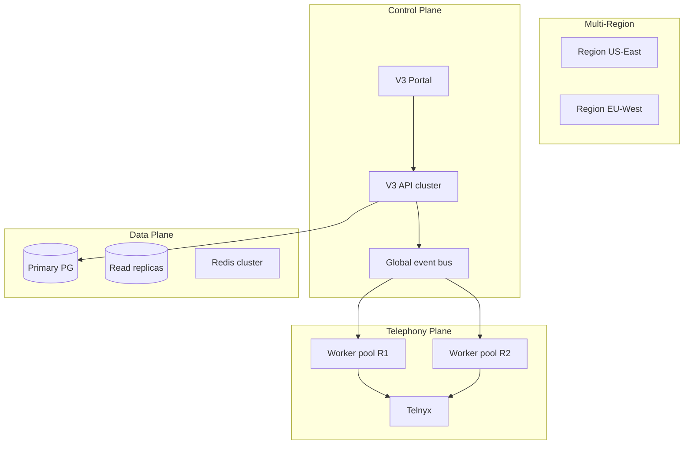

# V3 Architecture Vision (2026–2029)

**Version:** Planning document  
**Horizon:** 2–3 years post-GA  
**Constraint:** Backward compatibility with V3.0 API and data model

---

## Vision Statement

Evolve Tenant Portal V3 from a **configuration and operations layer** into an **enterprise-grade PBX control plane** that orchestrates multi-tenant telephony at scale — while keeping legacy Call Control as a stable fallback path until full runtime migration is proven.

---

## Current State (V3.0)

```
┌─────────────────────────────────────────┐
│  V3 Portal (config + ops)               │
│  ─────────────────────────────────────  │
│  Optional → Runtime Sync → Worker       │
└─────────────────────────────────────────┘
                    ║
                    ▼
┌─────────────────────────────────────────┐
│  Legacy Call Control (production calls) │
└─────────────────────────────────────────┘
```

---

## Year 1 (V3.1 – V3.2): Production Bridge

### Goals
- Runtime sync validated at scale
- Integrator-ready APIs (OpenAPI, webhooks, API keys)
- SSO for enterprise tenants
- Performance baseline for 500+ extension tenants

### Architecture Changes



**Compatibility:** V3.0 JWT clients unchanged; new API key auth additive.

---

## Year 2 (V3.3 – V3.4): Enterprise Control Plane

### Goals
- Multi-tenant ops at scale (1000+ tenants)
- SCIM + advanced RBAC
- CRM and Teams integrations
- AI-assisted operations

### Architecture Additions

| Component | Purpose |
|-----------|---------|
| Event bus (Redis streams) | V3 domain events for webhooks + AI |
| Read replicas | Analytics and reporting queries |
| CDN + tenant branding | White-label portal |
| SIEM audit pipeline | Compliance export |
| AI inference gateway | Existing Phase 5 AI foundation |

```
Portal API ──► Event Bus ──► Webhooks / AI / Analytics
                    │
                    └──► Audit stream ──► SIEM
```

**Compatibility:** V3.0 REST paths maintained; v2 API prefix optional for new features.

---

## Year 3 (V3.5+): Distributed PBX Platform

### Goals
- Multi-region deployment
- Active-passive or active-active HA
- Full V3 telephony path as default (legacy CC deprecated)
- Real-time ops at scale

### Target Architecture



**Compatibility:** Tenant data region-pinned; cross-region APIs rejected by default.

---

## Backward Compatibility Principles

| Principle | Implementation |
|-----------|----------------|
| API versioning | `/api/v3` frozen; `/api/v4` for breaking changes only |
| Schema migrations | Forward-only; nullable new columns |
| Feature flags | New behavior off by default |
| Runtime fallback | Legacy CC callable until explicit tenant cutover |
| Export format | V3.0 JSON export/import supported in v4 |
| JWT claims | Existing claims preserved; new claims optional |

---

## Migration Path: Legacy → V3 Telephony

| Phase | Tenants | Call path |
|-------|---------|-----------|
| V3.0 GA | All | Legacy CC |
| V3.1 | Canary 1→10 | V3 worker (opt-in) |
| V3.2 | 50%+ | V3 worker default, legacy fallback |
| V3.5 | 95%+ | V3 worker primary |
| V4.0 | All | Legacy CC removed (major version) |

---

## Technology Evolution

| Layer | V3.0 | V3.3+ |
|-------|------|-------|
| API | Express monolith routes | Modular routers + optional tRPC internal |
| Frontend | Next.js App Router | Same + real-time (SSE/WebSocket) |
| Jobs | Redis outbox | Dedicated job queue (BullMQ) |
| Metrics | Basic endpoint | Prometheus + Grafana |
| AI | Not in portal | Inference gateway integration |
| Auth | JWT | JWT + OIDC + API keys + SCIM |

---

## Risks to Vision

| Risk | Mitigation |
|------|------------|
| Telephony regression on V3 path | Extended canary, automated smoke, instant rollback |
| Schema sprawl | Domain-bounded tables, regular consolidation reviews |
| Monolith scaling limits | Extract webhook worker first; API split last |
| Enterprise feature creep | Strict roadmap prioritization per release |

---

## Related

- `ROADMAP.md`
- `docs/architecture/system-architecture.md`
- `docs/vsp/roadmap/10-enterprise-roadmap.md`
