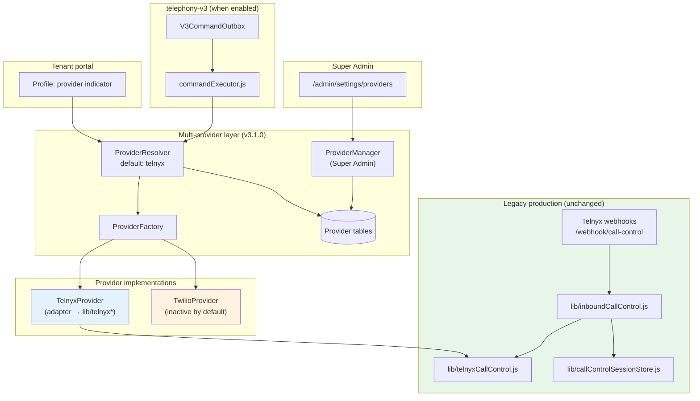

# VSP Phone v3.1.0 — Release Notes

**Release:** v3.1.0  
**Date:** 2026-07-04  
**Git tag:** `v3.1.0` (apply on `main` after merge)  
**Baseline:** v3.0.0-rc1 (Tenant Portal V3 RC1)  
**Audience:** Engineering, operations, Super Admin, GitHub Releases

---

## Summary

VSP Phone v3.1.0 introduces a **multi-provider telephony architecture** (Telnyx + Twilio), production deployment hardening, and QA reliability fixes. **All existing Telnyx production call flows remain unchanged.** Twilio is implemented but **disabled by default** until a Super Admin explicitly activates it and assigns tenants.

This release is **additive and backward compatible**. No existing API routes, database columns, or Telnyx Call Control behavior were removed or rewritten.

---

## 1. Features

### Multi-provider telephony (headline)

| Component | Description |
|-----------|-------------|
| **ProviderInterface** | Generic contract for voice, SIP, numbers, messaging, webhooks, and call control |
| **ProviderFactory** | Lazy-loaded provider singletons (`telnyx`, `twilio`) |
| **ProviderResolver** | Maps `tenantId` → provider key; **defaults to Telnyx** on missing row or any error |
| **ProviderManager** | Super Admin lifecycle: credentials, health, tenant mapping, audit logs |
| **TelnyxProvider** | Adapter over existing `lib/telnyx*.js` modules — no duplication |
| **TwilioProvider** | Programmable Voice, SIP Domains, phone numbers, TwiML, Voice Access Tokens, X-Twilio-Signature verification |

### Super Admin UI

- New **Admin → Settings → Providers** page (`/admin/settings/providers`)
- Provider health checks, credential management (masked secrets), tenant provider assignment
- Telnyx tenant detail page: telephony provider selector (Super Admin only)

### Tenant portal (read-only)

- Profile page shows current telephony provider name (read-only indicator)
- `GET /api/tenant/telephony-provider` — tenants cannot change provider

### Telephony-v3 integration

- `commandExecutor.js` routes V3 outbox commands through `ProviderResolver` when not in test-injection mode
- Tenants without a `TenantProvider` row continue on Telnyx (behavior-neutral)

### Deployment & QA hardening

- `scripts/post-deploy-healthcheck.sh` — automated post-deploy verification (13 checks)
- `npm run healthcheck:post-deploy` — npm alias
- `deploy/deploy-api.sh` — runs healthcheck after API deploy (non-fatal)
- `GET /ready` — new informational `providers` block (does not affect `ready` gate)
- `npm run qa:full` — exit code 0 verified (985+ tests, telephony regression scripts)
- Dev/QA rate-limit relaxation (production limits unchanged)
- Messaging attachment signing aligned with auth JWT fallback in dev

### Scripts & tooling

| Script | Purpose |
|--------|---------|
| `npm run seed:providers` | Idempotent backfill of `TenantProvider` rows (Telnyx per tenant) |
| `npm run verify:twilio-provider` | End-to-end Twilio provider dry-run (mocked HTTP, no live cost) |

### Inherited from v3.0.x branch (portal & telephony)

- Tenant Portal V3 promoted to default routes (V2 retired)
- Grandstream zero-touch desk provisioning (MAC-only path)
- Telnyx production config verifier and startup auto-repair tooling
- V3 desk calling fixes, Test Lab, Migration Wizard, Operations Center

---

## 2. Database changes

**Migration:** `20260704000000_multi_provider_telephony`  
**Type:** Purely additive — no drops, renames, or breaking alters  
**Rollback SQL:** `prisma/migrations/20260704000000_multi_provider_telephony/rollback.sql` (manual, optional)

### New enum

- `ProviderCredentialScope`: `VOICE`, `MESSAGING`, `SIP`

### New tables

| Table | Purpose |
|-------|---------|
| `Provider` | Registered telephony providers (`telnyx`, `twilio`) |
| `TenantProvider` | Per-tenant primary provider mapping |
| `ProviderCredential` | Encrypted provider secrets (platform or per-tenant) |
| `ProviderNumber` | Provider-scoped external number IDs |
| `ProviderEndpoint` | Provider-scoped SIP endpoint credentials |

### Altered tables

| Table | Change |
|-------|--------|
| `PlatformSettings` | Added nullable `defaultProviderId` (no FK constraint) |

### Indexes & constraints

- `Provider.key` — unique
- `TenantProvider(tenantId, providerId)` — unique
- `TenantProvider(tenantId, isPrimary)` — index
- `ProviderCredential(providerId, scope)` — index
- `ProviderNumber.phoneNumberId` — unique
- FKs: cascade on tenant/user/extension/number; restrict on provider delete

### Seed data

- Migration seeds `Provider` row for Telnyx (`ON CONFLICT DO NOTHING`)
- Post-deploy: run `npm run seed:providers` to backfill `TenantProvider` for existing tenants (idempotent)

### Untouched (legacy source of truth)

All `telnyx*`-prefixed columns on `User`, `Extension`, `PhoneNumber`, `PlatformSettings`, and related tables remain unchanged and continue to serve live Telnyx traffic.

---

## 3. API changes

### New — Super Admin only (`SUPER_ADMIN` role required)

Base path: `/api/admin/providers`  
Mounted by `routes/admin.js` → `routes/adminProviders.js`

| Method | Path | Description |
|--------|------|-------------|
| `GET` | `/api/admin/providers` | List providers, default key, registered factory keys |
| `PATCH` | `/api/admin/providers/:key` | Toggle provider `isActive` |
| `GET` | `/api/admin/providers/:key/health` | Runtime health check |
| `GET` | `/api/admin/providers/:key/logs` | Provider event log (Telnyx: dedup table; Twilio: deferred) |
| `GET` | `/api/admin/providers/credentials` | List credentials (secrets masked) |
| `PUT` | `/api/admin/providers/credentials` | Upsert encrypted credential |
| `GET` | `/api/admin/providers/default` | Platform default provider |
| `PUT` | `/api/admin/providers/default` | Set platform default provider |
| `GET` | `/api/admin/providers/tenant/:tenantId` | Tenant provider mapping |
| `PUT` | `/api/admin/providers/tenant/:tenantId` | Assign tenant to provider |

All routes return **401** without JWT, **403** for non–Super Admin.

### New — Tenant (read-only)

| Method | Path | Auth | Description |
|--------|------|------|-------------|
| `GET` | `/api/tenant/telephony-provider` | JWT | Returns `{ key, displayName }`; defaults to Telnyx on error |

### Enhanced — Health

| Method | Path | Change |
|--------|------|--------|
| `GET` | `/ready` | Added informational `providers` object (manager, resolver, registered keys, provider rows). **Does not affect `ready: true` gate.** |

### Unchanged

- All legacy Telnyx routes (`/webhook/call-control`, `/api/softphone/*`, `/api/admin/numbers/*`, etc.)
- `/api/admin/platform-settings`, `/api/admin/telnyx/status`
- V3 portal API surface (`/api/v3/*`)

---

## 4. Breaking changes

**None.**

| Area | Status |
|------|--------|
| Existing REST APIs | Unchanged signatures and behavior |
| Database schema | Additive only; old code ignores new tables |
| Telnyx Call Control FSM | Untouched |
| WebRTC softphone | Untouched |
| JWT auth | Unchanged |
| Default tenant routing | Telnyx (same as before v3.1.0) |
| Environment variables | No new **required** vars for Telnyx-only deploy |

### Non-breaking behavior notes

- Twilio credentials are **optional** — missing Twilio config never prevents API startup
- Super Admin Providers UI is additive; existing Carrier settings page unchanged
- V3 command executor uses `ProviderResolver` but resolves to Telnyx for all pre-existing tenants

---

## 5. Deployment steps

Follow the standard pipeline: `feature/*` → `development/v2` → `release/v3.1.0` → `main` → EC2.

### Pre-deploy

```bash
# On developer machine
git checkout main && git pull
npm run qa:full                    # Must exit 0
git tag v3.1.0 && git push origin v3.1.0
```

```bash
# On EC2 — backup first if first multi-provider deploy
cd /opt/vsp-voip
docker compose exec postgres pg_dump -U vsp vsp_voip > backup-pre-v3.1.0-$(date +%Y%m%d).sql
```

### Deploy order

1. **Git** — checkout tagged commit on `main`
2. **API** — migrations run automatically via `scripts/docker-entrypoint.sh`

```bash
cd /opt/vsp-voip
git fetch origin main && git checkout v3.1.0
bash deploy/deploy-api.sh
```

3. **Seed provider tables** (recommended, idempotent)

```bash
docker compose exec api node scripts/seed-provider-tables.js
# Or: npm run seed:providers (on host with DATABASE_URL)
```

4. **V3 worker** (if V3 telephony flags enabled)

```bash
bash deploy/deploy-v3-worker.sh
```

5. **Frontend**

```bash
bash deploy/deploy-web.sh
```

6. **Post-deploy verification**

```bash
bash scripts/post-deploy-healthcheck.sh
# Remote:
API_URL=https://api.vspphone.com bash scripts/post-deploy-healthcheck.sh
```

7. **Confirm provider state** (Super Admin)

- Visit `https://admin.vspphone.com/admin/settings/providers`
- Telnyx: **Active**
- Twilio: **Inactive** (do not activate until deliberately tested)

### Do NOT do on first v3.1.0 deploy

- Do not activate Twilio platform-wide
- Do not assign tenants to Twilio
- Do not enter Twilio credentials unless staging a Twilio pilot

---

## 6. Rollback steps

### Application rollback (recommended — no DB teardown needed)

New tables are harmless to older code. Roll back git + Docker only:

```bash
cd /opt/vsp-voip
git checkout v3.0.0          # or last known-good tag
bash deploy/deploy-api.sh
bash deploy/deploy-web.sh
bash scripts/post-deploy-healthcheck.sh
```

Verify:

- `GET /ready` → `ready: true`
- Inbound + outbound Telnyx test call
- `build.gitCommit` matches rolled-back commit

### Database rollback (only if abandoning multi-provider entirely)

```bash
docker compose stop api
docker compose exec -T postgres psql -U vsp -d vsp_voip \
  < prisma/migrations/20260704000000_multi_provider_telephony/rollback.sql
docker compose up -d api
```

Or restore from pre-deploy backup:

```bash
docker compose exec -T postgres psql -U vsp -d vsp_voip < backup-pre-v3.1.0-YYYYMMDD.sql
```

### Partial rollback — disable Twilio only

No git rollback required:

1. Super Admin → Providers → set Twilio **Inactive**
2. Reassign any Twilio tenants back to Telnyx (if any were piloted)
3. `ProviderResolver` cache clears on mapping change (30s TTL max)

---

## 7. Smoke-test checklist

Run within 30 minutes of deploy on production (or staging first).

### Infrastructure

- [ ] `curl -s https://api.vspphone.com/health` → 200
- [ ] `curl -s https://api.vspphone.com/ready` → `ready: true`
- [ ] `build.gitCommit` matches deployed tag
- [ ] `bash scripts/post-deploy-healthcheck.sh` → 13/13 PASS

### Auth & portal

- [ ] Login at `https://app.vspphone.com`
- [ ] Super Admin login at `https://admin.vspphone.com`
- [ ] `GET /api/auth/me` returns `tenantId` for tenant user

### Telnyx telephony (unchanged path)

- [ ] Softphone registers (WebRTC)
- [ ] Inbound call to tenant DID → rings extension
- [ ] Outbound call → two-way audio
- [ ] Voicemail, call history, recordings load
- [ ] Blind transfer (if used in production)

### Multi-provider (v3.1.0 specific)

- [ ] Super Admin → Providers page loads
- [ ] Telnyx health → `ok: true`
- [ ] Twilio health → `ok: false` (expected without credentials)
- [ ] Tenant profile shows "Telephony provider: Telnyx"
- [ ] `GET /api/admin/providers` without token → 401 (not 404)

### Regression scripts (optional on EC2)

```bash
npm run qa:full
npm run verify:twilio-provider    # dry-run, no live Twilio cost
```

---

## 8. Provider architecture diagram



**Routing rule:** `ProviderResolver.resolve(tenantId)` checks `TenantProvider` (primary + active) and `Provider.isActive`. If anything is missing or errors, it returns **Telnyx**.

---

## 9. Twilio integration summary

| Capability | Implementation |
|------------|----------------|
| SIP registration | Twilio SIP Domains + Credential Lists |
| Call control | Programmable Voice (Calls REST API + TwiML) |
| Phone numbers | Incoming Phone Numbers API |
| WebRTC | Voice Access Tokens (JWT, manual construction) |
| Webhooks | `X-Twilio-Signature` HMAC-SHA1 (+ JSON body SHA256 variant) |
| Messaging | Twilio Messaging API (basic send/receive hooks) |
| Admin setup | Super Admin Providers UI + credential encryption (AES-256-GCM) |

### Activation workflow (manual, post-deploy)

1. Super Admin → Providers → enter Twilio credentials (Account SID, Auth Token, API Key)
2. Health check → confirm `ok: true`
3. Create SIP Domain + credential (via admin tooling or verify script)
4. Assign **pilot tenant only** via tenant provider mapping
5. Run live verification: `npm run verify:twilio-provider -- --live`

### Default state at deploy

- Twilio `Provider` row exists with `isActive: false`
- No tenant has Twilio as primary provider
- No Twilio credentials required for API `/ready`

---

## 10. Telnyx compatibility statement

**v3.1.0 is fully backward compatible with existing Telnyx production deployments.**

| Guarantee | Detail |
|-----------|--------|
| Legacy call path | `inboundCallControl.js`, `telnyxCallControl.js`, `callControlSessionStore.js` — **not modified** by multi-provider commit |
| Default routing | All tenants without explicit `TenantProvider` row → Telnyx |
| Fail-open | DB errors, missing provider rows, unknown keys → Telnyx |
| Data model | All `telnyx*` columns remain source of truth for live traffic |
| Webhooks | Telnyx webhook URLs unchanged |
| WebRTC softphone | Telnyx SDK login token path unchanged |
| `/ready` gate | Still requires Telnyx API key only; Twilio not required |

`TelnyxProvider` is a thin adapter — it delegates to the same `lib/telnyx*.js` modules already in production. It exists so the V3 command engine can route through a generic interface without forking Telnyx logic.

---

## 11. Known limitations

| Limitation | Impact | Planned |
|------------|--------|---------|
| Twilio disabled by default | No Twilio traffic until Super Admin activates | By design |
| Twilio event logging | Returns empty list with explanatory note | Phase 5+ |
| `PlatformSettings.defaultProviderId` | No DB FK to `Provider` | Future migration |
| V3 engine provider routing | Only active when `TELEPHONY_V3_*` flags enabled | Existing V3 rollout |
| Twilio not on legacy call path | Legacy CC always Telnyx-direct | By design |
| Super Admin only provider mgmt | Tenants cannot self-select carrier | By design |
| Single primary provider per tenant | No multi-carrier failover yet | Future |
| Provider webhook ingress for Twilio | Not wired to legacy CC handler | Twilio pilot scope |
| Redis optional in dev | Rate limits use in-memory fallback | Dev only |

---

## 12. Production validation checklist

Complete before announcing v3.1.0 live to customers.

### Git & release

- [ ] Tag `v3.1.0` on `main`
- [ ] GitHub Release published with this document
- [ ] EC2 `git rev-parse HEAD` matches tag
- [ ] `/ready` → `build.gitCommit` matches tag

### Database

- [ ] `npx prisma migrate status` → up to date
- [ ] `npm run seed:providers` executed (or verified rows exist)
- [ ] Pre-deploy backup retained 30+ days

### QA gates (pre-merge)

- [ ] `npm run qa:full` → exit code 0
- [ ] `reports/qa-report-latest.html` reviewed
- [ ] Telephony validates pass: blind-transfer, rapid-accept-stress, extension-did
- [ ] `npm run verify:twilio-provider` → dry-run PASS

### API & security

- [ ] `/api/admin/providers/*` → 403 for tenant admin, 401 without token
- [ ] Provider credentials never returned unmasked to frontend
- [ ] Twilio inactive; Telnyx active in Providers UI

### Telnyx production (mandatory)

- [ ] Inbound call test
- [ ] Outbound call test
- [ ] Two-way audio confirmed
- [ ] WebRTC diagnostics: ICE connected
- [ ] Telnyx Mission Control webhooks unchanged

### Post-deploy automation

- [ ] `bash scripts/post-deploy-healthcheck.sh` → PASS
- [ ] `deploy/deploy-api.sh` completed without error
- [ ] `deploy/deploy-web.sh` + PM2 `vsp-web` online
- [ ] Hard refresh / incognito tested (no stale JS)

### Sign-off

| Role | Name | Date | OK |
|------|------|------|-----|
| Engineering | | | |
| Operations | | | |
| Product | | | |

---

## Quick reference

| Item | Command / URL |
|------|---------------|
| Post-deploy healthcheck | `bash scripts/post-deploy-healthcheck.sh` |
| Full QA | `npm run qa:full` |
| Seed tenants → Telnyx | `npm run seed:providers` |
| Twilio dry-run | `npm run verify:twilio-provider` |
| Super Admin Providers | `https://admin.vspphone.com/admin/settings/providers` |
| Internal architecture | `docs/v3.1/ARCHITECTURE_VISION.md` |
| EC2 deploy runbook | `docs/vsp/deployment/02-ec2-deployment.md` |
| Rollback runbook | `docs/vsp/deployment/08-rollback.md` |

---

*VSP Phone v3.1.0 — Multi-provider telephony foundation. Telnyx remains the production default.*
