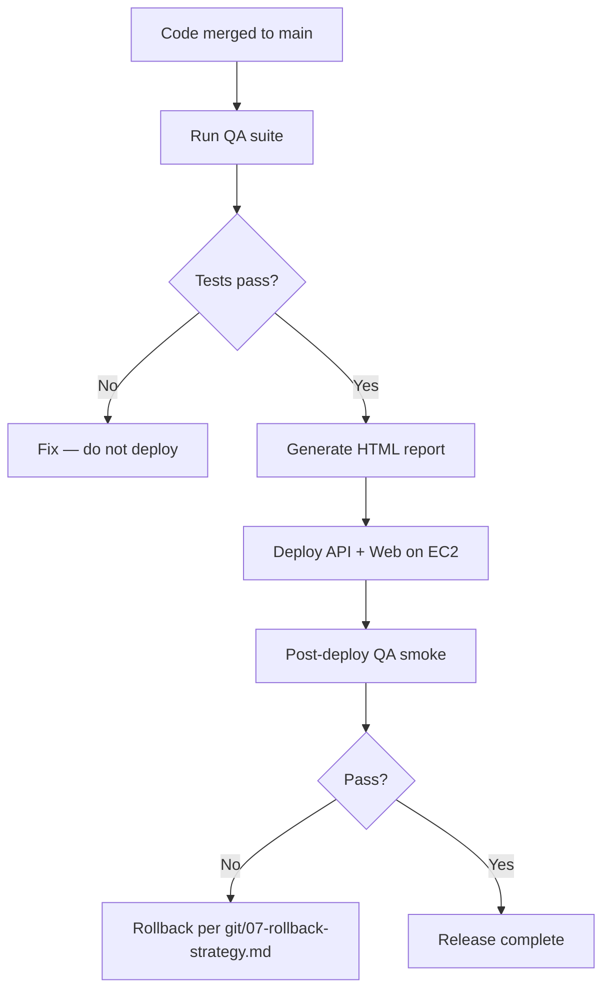

# QA & Regression (Deployment Gate)

Run automated QA **before and after** every production deployment from `main`.

---

## Deployment gate



---

## Pre-deploy (workstation or CI)

```bash
# Minimum gate
API_BASE=https://api.vspphone.com \
QA_EMAIL=your@tenant.com \
QA_PASSWORD='...' \
npm run qa

# Protected telephony changes
npm run qa:full
```

Review: `reports/qa-report-latest.html`

**Deploy only if tests pass.**

---

## Post-deploy (EC2 or remote)

After `deploy/deploy-api.sh` and `deploy/deploy-web.sh`:

```bash
API_BASE=https://api.vspphone.com \
WEB_BASE=https://app.vspphone.com \
QA_EMAIL=... QA_PASSWORD=... \
npm run qa
```

Optional browser layer:

```bash
QA_BROWSER_TESTS=true npm run test:browser
```

---

## What the QA suite runs

| Layer | Command | Purpose |
|-------|---------|---------|
| Vitest telephony | `tests/telephony/*.test.ts` | API smoke per domain |
| Vitest API | `tests/api/*.test.ts` | Auth, softphone, DID |
| Regression | `tests/regression/deploy-regression.test.ts` | Deploy checklist |
| P0 validator | `validate:p0` | Readiness / env |
| Full telephony | `qa:full` | blind-transfer, bridge stress, extension-did |
| Playwright | `test:browser` (optional) | Portal UI |
| Report | `reports/qa-report-latest.html` | Pass/fail/duration |

---

## Live call validation

Automated tests use API smoke by default. For true call verification:

```bash
QA_LIVE_CALLS=true QA_LIVE_WEBRTC=true npm run test:telephony
```

Also run manual checklist: [14-telephony-validation.md](./14-telephony-validation.md)

---

## Performance (staging only)

```bash
npm run qa:perf:100
API_BASE=https://staging.api.example.com npm run qa:perf:500
```

Do not run 1000/5000 k6 scripts against production without approval.

---

## CI integration

GitHub Actions: `.github/workflows/qa.yml` runs Vitest + framework validation on PRs.

---

## Related

- [tests/README.md](../../tests/README.md)
- [tests/VALIDATION.md](../../tests/VALIDATION.md)
- [../git/06-release-checklist.md](../git/06-release-checklist.md)
- [.cursor/rules/qa-first.mdc](../../../.cursor/rules/qa-first.mdc)
