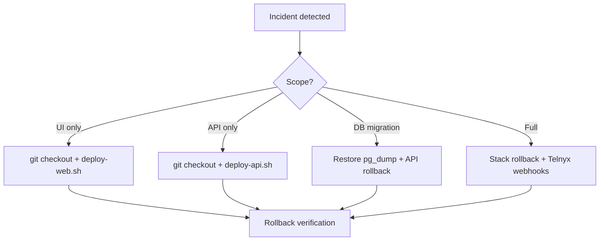

# Deployment Knowledge Base — Validation Report

Generated as part of the VSP Phone Deployment & Operations KB. Re-run checks with:

```bash
node scripts/validate-deployment-docs.js
```

---

## Documents created

| # | File | Status |
|---|------|--------|
| 01 | [01-local-development.md](./01-local-development.md) | Required |
| 02 | [02-ec2-deployment.md](./02-ec2-deployment.md) | Required |
| 03 | [03-docker.md](./03-docker.md) | Required |
| 04 | [04-pm2.md](./04-pm2.md) | Required |
| 05 | [05-nginx.md](./05-nginx.md) | Required |
| 06 | [06-database-migrations.md](./06-database-migrations.md) | Required |
| 07 | [07-prisma.md](./07-prisma.md) | Required |
| 08 | [08-rollback.md](./08-rollback.md) | Required |
| 09 | [09-release-process.md](./09-release-process.md) | Required |
| 10 | [10-production-checklist.md](./10-production-checklist.md) | Required |
| 11 | [11-known-issues.md](./11-known-issues.md) | Required |
| 12 | [12-disaster-recovery.md](./12-disaster-recovery.md) | Required |
| 13 | [13-monitoring.md](./13-monitoring.md) | Required |
| 14 | [14-telephony-validation.md](./14-telephony-validation.md) | Required |

Cursor rule: [.cursor/rules/deployment-safety.mdc](../../../.cursor/rules/deployment-safety.mdc)

---

## Internal links

Each doc links forward/back to related deployment topics. Hub entry points:

- [docs/vsp/index.md](../index.md) — Step 1 search root
- [02-ec2-deployment.md](./02-ec2-deployment.md) — primary production runbook
- [10-production-checklist.md](./10-production-checklist.md) — pre/post deploy
- [08-rollback.md](./08-rollback.md) — rollback runbook

Repo script references (documented, not modified):

- `deploy/deploy-api.sh`
- `deploy/deploy-web.sh`
- `deploy/pm2.ecosystem.config.js`
- `deploy/nginx/vspphone.conf`
- `scripts/production-deployment-report.js`
- `scripts/diagnose-did-sync.js`
- `scripts/office-webrtc-capture-checklist.md`

---

## Deployment flow (documented)

```mermaid
flowchart TD
  A[Pre-deploy checklist] --> B{Schema change?}
  B -->|Yes| C[pg_dump backup]
  B -->|No| D[Deploy API]
  C --> D
  D --> E[docker compose up --build api]
  E --> F[/ready + route probes]
  F --> G{Frontend changed?}
  G -->|Yes| H[deploy-web.sh]
  G -->|No| I[Verify]
  H --> I
  I --> J[Telephony validation]
  J --> K[Sign-off]
```

Order: **Git confirm → DB backup if needed → API → Web → Verify → Telephony**

---

## Rollback flow (documented)



See [08-rollback.md](./08-rollback.md) for commands.

---

## Production checklist completeness

[10-production-checklist.md](./10-production-checklist.md) includes all requested items:

| Category | Items covered |
|----------|---------------|
| Git | status clean, branch, commit |
| Infrastructure | docker images, prisma migrations |
| Health | API, frontend, websocket |
| Telephony | Telnyx login, mic, inbound, outbound |
| Product | voicemail, recording, transfer |
| Admin | DID sync, assignment, extension |
| Auth/config | JWT, Telnyx key, origins |

Telephony detail expanded in [14-telephony-validation.md](./14-telephony-validation.md).

---

## Known issues coverage

[11-known-issues.md](./11-known-issues.md) includes all requested topics:

- Frontend updated / API not rebuilt
- API updated / frontend stale
- Browser cache
- Docker cache
- Prisma migration missing
- PM2 restart forgotten
- Incorrect environment variables
- Missing Telnyx API key
- Incorrect JWT secret
- Nginx proxy mismatch

---

## Application code

**No application source code was modified** for this knowledge base. Only:

- `docs/vsp/deployment/*`
- `docs/vsp/index.md` (hub links)
- `.cursor/rules/deployment-safety.mdc`
- `scripts/validate-deployment-docs.js` (doc validation)

---

## Maintenance

When deploy scripts or architecture change, update:

1. Matching doc in `docs/vsp/deployment/`
2. This VALIDATION.md if doc list changes
3. Re-run `node scripts/validate-deployment-docs.js`
