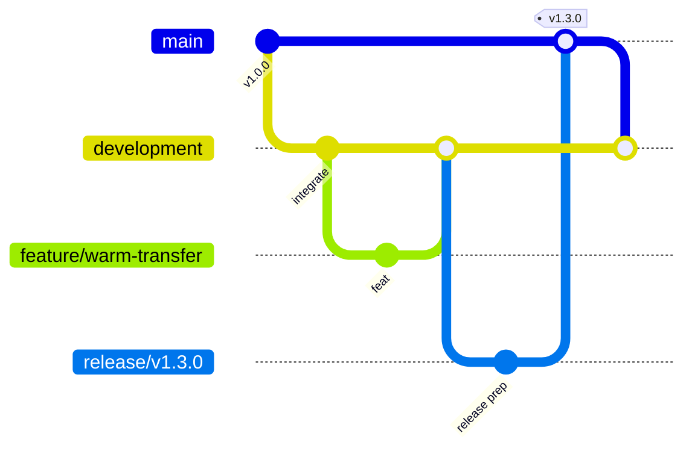

# Branch Strategy

VSP Phone uses a **protected `main`** branch for production and long-lived integration branches for feature work.

---

## Branch diagram



---

## Long-lived branches

### `main`

| Property | Value |
|----------|-------|
| Purpose | **Production only** |
| Deployable | Always — every commit must be deployable |
| Direct commits | **Forbidden** — merge via PR/release only |
| EC2 deploy source | **Only branch** used for production deployment |

Production EC2: `git pull origin main` → `deploy/deploy-api.sh` / `deploy/deploy-web.sh`

### `development`

| Property | Value |
|----------|-------|
| Purpose | **Integration branch** |
| Merge target | All completed `feature/*` branches merge here first |
| Deployable | Staging / internal QA — **not production** |
| Sync | Regularly merge `main` back after releases |

**Note:** If the repo still uses `development/v2`, treat it as the integration branch until renamed to `development`:

```bash
git branch -m development/v2 development
git push origin -u development
```

---

## Short-lived branches

### `feature/*`

One feature per branch. Branch from **`development`**, not `main`.

| Example | Feature |
|---------|---------|
| `feature/warm-transfer` | Attended transfer Phase 2 |
| `feature/conference` | Conference calls |
| `feature/queues` | ACD / call queues |
| `feature/flutter` | Mobile enhancements |
| `feature/ivr` | Multi-level IVR |

Create:

```bash
bash scripts/git-new-feature.sh warm-transfer
# → feature/warm-transfer from development
```

### `hotfix/*`

Production bug fixes only. Branch from **`main`** (production state).

| Example | Use |
|---------|-----|
| `hotfix/bridge-grace-race` | Critical telephony fix |
| `hotfix/jwt-cors` | Auth production break |

Flow: `hotfix/*` → `main` (deploy) → merge `main` back into `development`

### `release/*`

Release preparation and final QA before production.

| Example | Use |
|---------|-----|
| `release/v1.3.0` | Warm transfer release candidate |
| `release/v1.2.0` | Multi-tenant DID release |

Only bugfixes and release notes on this branch — no new features.

---

## Current repository state

As of documentation creation, remote branches include:

- `main` — production
- `development/v2` — integration (align to `development` naming)
- `feature/call-transfer` — feature branch example

Existing tags:

- `v1.0`
- `v1.0-telephony-stable`

See [04-tagging.md](./04-tagging.md) for SemVer going forward.

---

## Related docs

- [02-git-rules.md](./02-git-rules.md)
- [03-release-workflow.md](./03-release-workflow.md)
