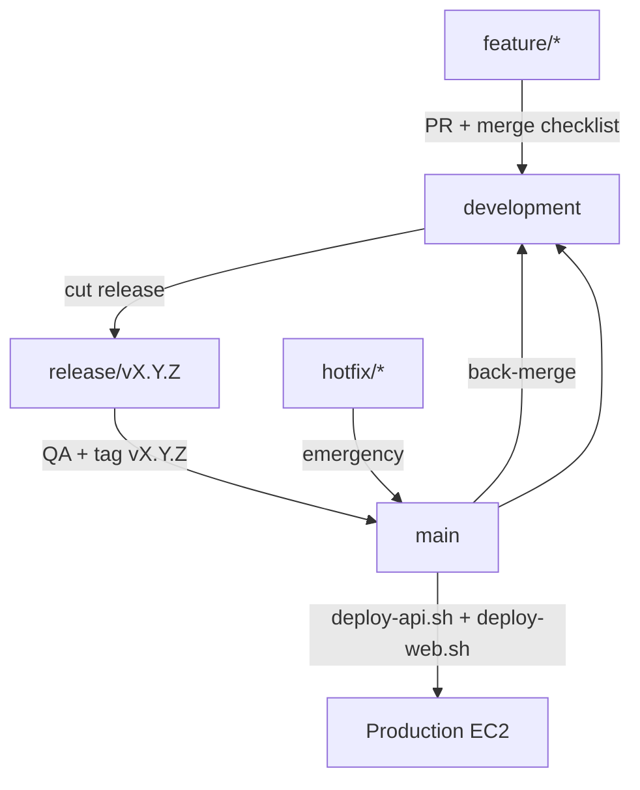

# Release Workflow

End-to-end path from feature development to production deployment.

---

## Flow diagram

```
feature/*
    ↓  PR + merge checklist
development
    ↓  cut release branch
release/vX.Y.Z
    ↓  QA + release checklist + tag
main
    ↓  deploy scripts on EC2
Production
```



---

## Step 1 — Feature development

```bash
git fetch origin
git checkout development
git pull origin development
bash scripts/git-new-feature.sh warm-transfer
# develop, commit, push
git push -u origin feature/warm-transfer
```

Open PR: `feature/*` → `development`

Run [05-merge-checklist.md](./05-merge-checklist.md) before merge.

---

## Step 2 — Integration on development

After feature PR merges:

```bash
git checkout development
git pull origin development
bash scripts/git-pre-merge-check.sh   # optional automated validators
```

QA on staging (non-production) against `development` build.

---

## Step 3 — Cut release branch

When `development` is release-ready:

```bash
git checkout development
git pull origin development
git checkout -b release/v1.3.0
git push -u origin release/v1.3.0
```

On `release/v1.3.0`:

- Version bumps / release notes only
- Bugfixes discovered in QA (no new features)
- Run full [06-release-checklist.md](./06-release-checklist.md)

---

## Step 4 — Merge to main and tag

```bash
git checkout main
git pull origin main
git merge --no-ff release/v1.3.0 -m "Release v1.3.0: warm transfer"
git tag -a v1.3.0 -m "v1.3.0 Warm Transfer"
git push origin main
git push origin v1.3.0
```

Delete release branch after successful deploy:

```bash
git branch -d release/v1.3.0
git push origin --delete release/v1.3.0
```

---

## Step 5 — Production deploy

SSH to EC2 `/opt/vsp-voip`:

```bash
git fetch origin
git checkout main
git pull origin main
git describe --tags    # confirm v1.3.0

# If schema changed:
docker compose exec postgres pg_dump -U vsp vsp_voip > backup-pre-v1.3.0.sql

bash deploy/deploy-api.sh
bash deploy/deploy-web.sh
```

Verify: [../deployment/10-production-checklist.md](../deployment/10-production-checklist.md)

---

## Step 6 — Back-merge to development

```bash
git checkout development
git pull origin development
git merge main
git push origin development
```

Keeps `development` in sync with production hotfixes and release state.

---

## Hotfix path (bypasses development first)

For production emergencies:

```bash
git checkout main
git pull origin main
git checkout -b hotfix/critical-fix
# fix, commit
git checkout main
git merge --no-ff hotfix/critical-fix
git tag -a v1.2.1 -m "v1.2.1 hotfix"
git push origin main --tags
# deploy immediately
git checkout development && git merge main && git push
```

---

## Related docs

- [04-tagging.md](./04-tagging.md)
- [06-release-checklist.md](./06-release-checklist.md)
- [../deployment/09-release-process.md](../deployment/09-release-process.md)
