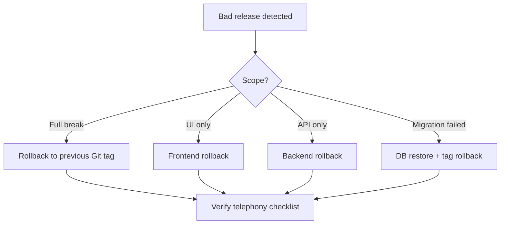

# Rollback Strategy

How to roll back a bad release using Git tags, scoped deploys, and database recovery.

**Rule:** Roll back to the **previous Git tag** on `main` unless a narrower scope (frontend-only) is sufficient.

---

## Decision tree



---

## Rollback to previous Git tag (full stack)

When: telephony broken, both API and web affected, or unknown scope.

```bash
cd /opt/vsp-voip
git fetch origin --tags
git tag -l 'v*' --sort=-v:refname | head -5    # find previous tag
PREV=v1.1.0                                     # example

git checkout main
git reset --hard $PREV                          # EC2 only — coordinate with team
# Or safer: git checkout $PREV (detached) then deploy

cp .env .env.backup-$(date +%Y%m%d)
bash deploy/deploy-api.sh
bash deploy/deploy-web.sh
curl -s http://127.0.0.1:3000/ready | jq .
```

**Important:** If `main` was already pushed with bad commit, fix forward on a developer machine:

```bash
git revert <bad-merge-commit>   # preferred over force-push
git tag -a v1.2.1 -m "Revert bad release"
git push origin main --tags
```

Never force-push `main` without team approval.

---

## Rollback frontend only

When: bad Next.js build, wrong `NEXT_PUBLIC_*`, PM2 issue — API and calls work.

```bash
cd /opt/vsp-voip
git checkout main
git checkout v1.1.0 -- .    # optional: only if full checkout not desired
git checkout v1.1.0           # or specific good tag
bash deploy/deploy-web.sh
pm2 status vsp-web
```

Verify in incognito (browser cache).

See [../deployment/08-rollback.md](../deployment/08-rollback.md#frontend-only)

---

## Rollback backend only

When: API regression, webhooks broken — frontend unchanged.

```bash
cd /opt/vsp-voip
git checkout v1.1.0
export GIT_COMMIT="$(git rev-parse HEAD)"
docker compose build --no-cache api
docker compose up -d api
docker compose logs api --tail=50
curl -s http://127.0.0.1:3000/ready | jq .
```

Or: `bash deploy/deploy-api.sh` after checkout.

---

## Rollback Docker image

When: container has stale layers or wrong `GIT_COMMIT`.

```bash
git checkout <good-tag-or-commit>
export GIT_COMMIT="$(git rev-parse HEAD)"
docker compose down api
docker compose build --no-cache api
docker compose up -d api
docker compose ps
```

---

## Rollback Prisma migration

When: migration corrupted data or failed mid-apply.

```bash
docker compose stop api
docker compose exec -T postgres psql -U vsp -d vsp_voip < backup-pre-release.sql
git checkout <pre-migration-tag>
bash deploy/deploy-api.sh
docker compose exec api npx prisma migrate status
```

Pair Git tag with database backup taken before release ([06-release-checklist.md](./06-release-checklist.md)).

---

## Rollback deployment (operational)

Without Git change — restart services:

| Layer | Command |
|-------|---------|
| PM2 | `pm2 restart vsp-web` |
| Docker | `docker compose restart api` |
| Nginx | `sudo systemctl reload nginx` |

Use when deploy script succeeded but process crashed — not for bad code.

---

## Rollback verification

After any rollback:

- [ ] `git describe --tags` documents deployed version
- [ ] `/ready` healthy
- [ ] Inbound + outbound + two-way audio
- [ ] Recording, voicemail, transfer (if applicable)
- [ ] Telnyx debugger shows normal webhook flow

[../deployment/14-telephony-validation.md](../deployment/14-telephony-validation.md)

---

## Tag registry discipline

Maintain a release log:

| Tag | Date | Deployed by | Notes |
|-----|------|-------------|-------|
| v1.2.0 | | | Multi-tenant DID |
| v1.1.0 | | | Blind transfer |

Previous tag is always the first rollback target.

---

## Related docs

- [04-tagging.md](./04-tagging.md)
- [../deployment/08-rollback.md](../deployment/08-rollback.md)
- [../deployment/12-disaster-recovery.md](../deployment/12-disaster-recovery.md)
