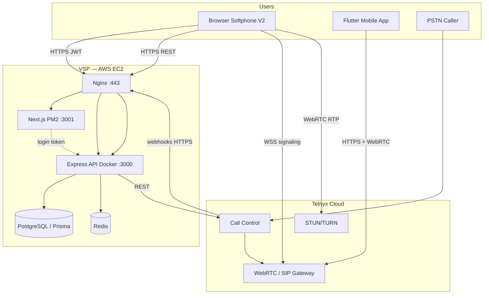
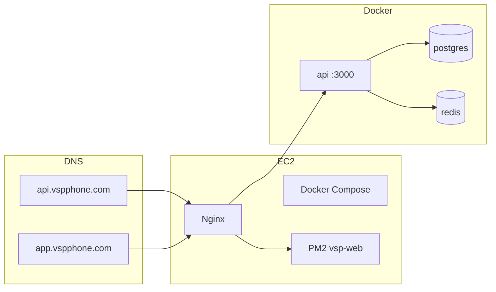
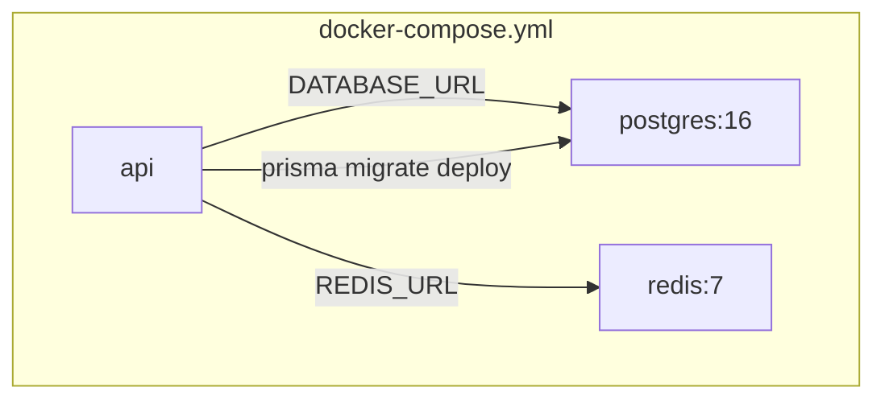

# System Architecture

VSP Phone is a multi-tenant cloud PBX built on **Telnyx Call Control** (server-side call orchestration) and the **Telnyx WebRTC JS SDK** (browser/mobile agent media). VSP does not terminate RTP — media flows browser ↔ Telnyx ↔ PSTN/SIP.

---

## System diagram

---

## Component roles

| Component | Role | Key paths |
|-----------|------|-----------|
| **Next.js portal** | Tenant UI, Softphone V2, admin | `web/src/app/(app)/` |
| **Express API** | Auth, webhooks, Call Control commands, CDR | `server.js`, `routes/`, `lib/` |
| **PostgreSQL** | Tenants, DIDs, extensions, CDR, VM, recordings | `prisma/schema.prisma` |
| **Redis** | Call Control session state, bridge grace, transfer index | `lib/callControlSessionStore.js` |
| **Nginx** | TLS, reverse proxy to API and web | `deploy/nginx/vspphone.conf` |
| **Docker** | API container | `docker-compose.yml` |
| **PM2** | Next.js production process | `deploy/pm2.ecosystem.config.js` |
| **Telnyx** | PSTN, SIP, WebRTC, recording, voicemail capture | Mission Control + SDK |

---

## Deployment architecture

See [../deployment/02-ec2-deployment.md](../deployment/02-ec2-deployment.md).

---

## Docker services

Entrypoint: `scripts/docker-entrypoint.sh` applies migrations on API start.

---

## Softphone lifecycle (summary)

1. User logs into portal (JWT)
2. `GET /api/softphone/config` — numbers, flags, diagnostics
3. `POST /api/softphone/token` — Telnyx telephony credential JWT
4. `TelnyxRTC` connects (WebSocket to Telnyx)
5. Presence heartbeat → `POST /api/softphone/presence`
6. Inbound: SDK notification → answer with mic → `POST /api/softphone/call-accepted`
7. Outbound: `client.newCall({ destinationNumber, callerNumber })`
8. Hangup / transfer via SDK + API as needed

Detail: [02-call-flow.md](./02-call-flow.md), [03-websocket-lifecycle.md](./03-websocket-lifecycle.md), [04-webrtc-media.md](./04-webrtc-media.md)

---

## Call orchestration split

| Concern | Where it runs |
|---------|---------------|
| DID → tenant routing | VSP API (`lib/inboundCallControl.js`) |
| Ring / bridge / VM / IVR | VSP API + Telnyx Call Control REST |
| Agent media (mic/speaker) | Browser ↔ Telnyx WebRTC |
| Blind transfer | VSP API + Call Control `transfer` on PSTN leg |
| CDR / history | VSP API → Prisma `CallLog` |

---

## Protected components

Changes to telephony core require regression analysis:

- `lib/inboundCallControl.js`
- `lib/telnyxCallControl.js`
- `lib/callControlSessionStore.js`
- `web/src/lib/webrtc-audio.ts`
- `web/src/lib/telnyx-softphone-session.ts`
- `web/src/app/(app)/softphone-v2/page.tsx`

---

## Related docs

- [02-call-flow.md](./02-call-flow.md)
- [05-call-control.md](./05-call-control.md)
- [06-session-management.md](./06-session-management.md)
- [../architecture-decisions/](../architecture-decisions/)
- [../../telnyx/architecture.md](../../telnyx/architecture.md)
