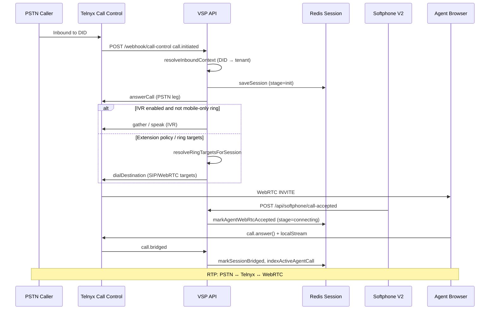
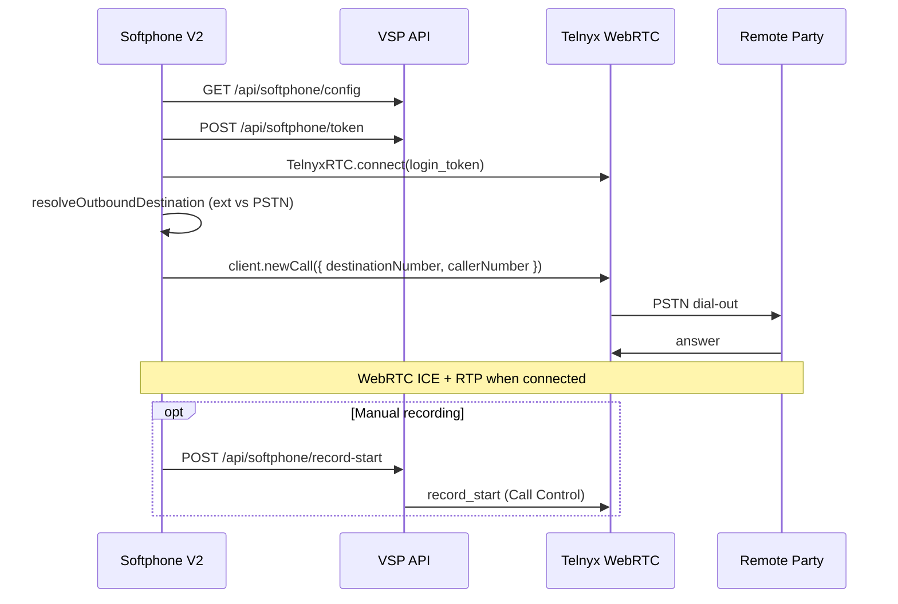
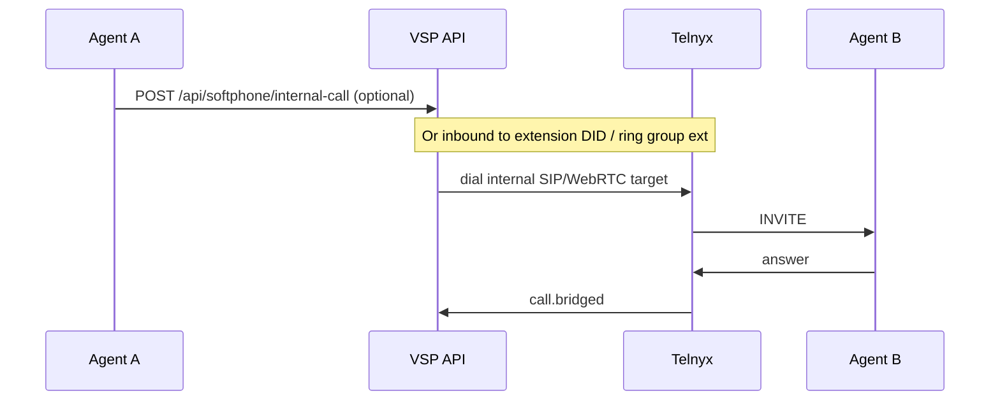
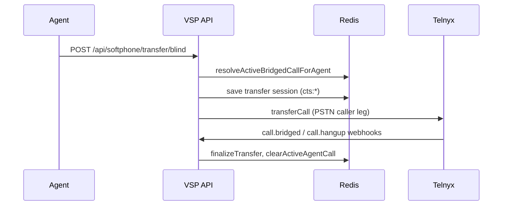
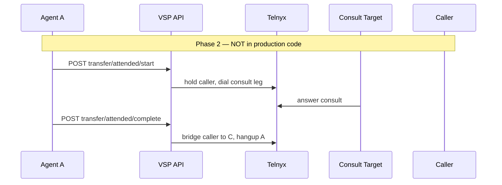
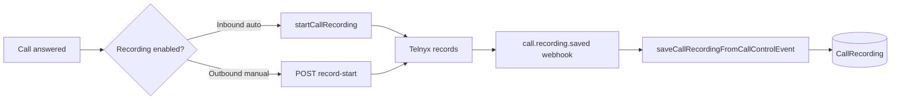
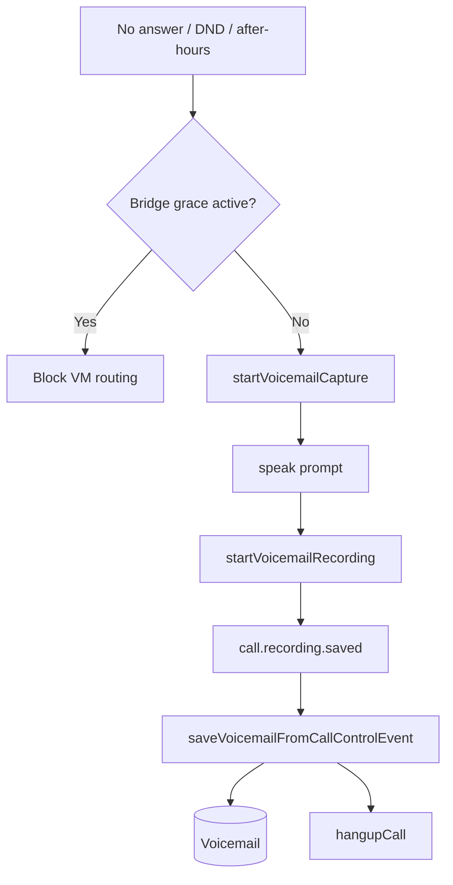

# Call Flow

Overview of inbound, outbound, and internal call paths in the current VSP Phone implementation.

---

## Inbound call flow

PSTN caller dials a tenant DID assigned to Telnyx Call Control.

**Primary handler:** `handleInboundCallControlEvent` → `handleCallInitiated` in `lib/inboundCallControl.js`

**Legacy path:** TeXML webhook `GET/POST /webhook` via `lib/callRouting.js` — still active for some PSTN-only configs; app routing may trigger Call Control migration.

---

## Outbound call flow

Agent places call from Softphone V2.

**Frontend:** `web/src/app/(app)/softphone-v2/page.tsx` — `onCallWithDestination`  
**Dial normalization:** `web/src/lib/softphone-dial.ts` — `resolveOutboundDestination`  
**Token:** `lib/softphone.js` — `createSoftphoneLoginToken`

---

## Internal extension call

Extension-to-extension via Call Control (API-initiated or dial by extension number).

**Handler:** `lib/internalExtensionDial.js` — `initiateInternalCallFromApi`, `handleInternalExtensionCallInitiated`

---

## Blind transfer flow

See [15-blind-transfer.md](./15-blind-transfer.md).

---

## Future warm transfer (planned)

Not implemented. Planned sequence in [16-attended-transfer.md](./16-attended-transfer.md).

---

## Recording lifecycle (summary)

See [13-call-recording.md](./13-call-recording.md).

---

## Voicemail lifecycle (summary)

See [14-voicemail.md](./14-voicemail.md).

---

## Dual webhook entry points

| Webhook | Handler | Use |
|---------|---------|-----|
| `POST /webhook/call-control` | `handleInboundCallControlEvent` | Primary — WebRTC inbound, transfer, VM |
| `GET/POST /webhook` | TeXML / `lib/callRouting.js` | Legacy PSTN routing |

Routing migration: `lib/inboundRouting.js` — `requiresCallControlRouting`

---

## Related docs

- [05-call-control.md](./05-call-control.md)
- [08-did-routing.md](./08-did-routing.md)
- [09-extension-routing.md](./09-extension-routing.md)
- [21-event-sequence.md](./21-event-sequence.md)
