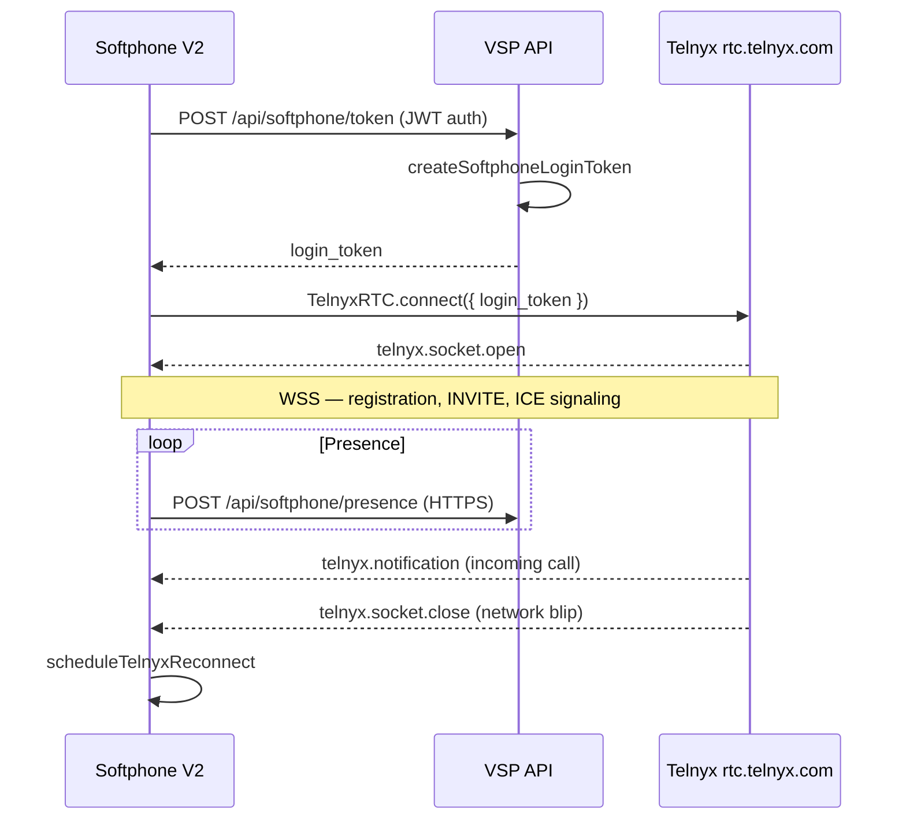

# WebSocket Lifecycle

VSP Phone uses **Telnyx SDK WebSocket signaling** (browser ↔ Telnyx). There is **no VSP-owned WebSocket server** for call media or Call Control events in the current implementation.

---

## TelnyxRTC signaling WebSocket

After portal login, Softphone V2 obtains a telephony credential JWT and connects `TelnyxRTC` to Telnyx.

---

## SDK events (Softphone V2)

Handled in `web/src/app/(app)/softphone-v2/page.tsx`:

| Event | Meaning |
|-------|---------|
| `telnyx.socket.open` | Signaling connected — softphone registered |
| `telnyx.socket.close` | Signaling dropped — reconnect scheduled |
| `telnyx.notification` | Incoming call, call state updates |
| `telnyx.ready` | Client ready for calls |

Reconnect logic: `scheduleTelnyxReconnect` in `web/src/lib/telnyx-softphone-session.ts`

---

## Token flow

| Step | Endpoint / function |
|------|---------------------|
| Portal auth | JWT from `/api/auth/login` |
| Softphone config | `GET /api/softphone/config` |
| WebRTC login token | `POST /api/softphone/token` → `createSoftphoneLoginToken` (`lib/softphone.js`) |
| SDK connect | `buildTelnyxClientOptions` — `login_token`, `trickleIce`, `prefetchIceCandidates` |

Telnyx REST API key stays server-side only — never sent to browser.

---

## VSP API transport

All VSP ↔ client communication for PBX features uses **HTTPS REST**:

- Call accept hint: `POST /api/softphone/call-accepted`
- Blind transfer: `POST /api/softphone/transfer/blind`
- Recording: `POST /api/softphone/record-start`
- CDR sync: `POST /api/softphone/call-log`
- Presence: `POST /api/softphone/presence`

Telnyx → VSP uses **HTTPS webhooks** (not WebSocket):

- `POST /webhook/call-control`
- `POST /webhook/call-recording`
- `POST /webhook/voice`

---

## Bridge grace coordination

WebSocket/SDK events alone do not protect against race conditions. When agent accepts inbound WebRTC:

1. Client calls `POST /api/softphone/call-accepted` **before** `call.answer()`
2. API sets session `stage=connecting` (`markAgentWebRtcAccepted`)
3. Blocks premature voicemail / no-answer teardown during bridge window

This couples HTTPS API state (Redis) with Telnyx WSS call progression.

See [../architecture-decisions/bridge-grace.md](../architecture-decisions/bridge-grace.md)

---

## Admin WebSocket (future)

`web/src/app/(app)/admin/operations/page.tsx` notes **Phase 2** real-time dashboard via WebSocket — **not implemented**.

---

## Nginx WebSocket proxy

Nginx config passes `Upgrade` headers for app and API hosts — supports Next.js and any future API WebSocket endpoints. Telnyx WSS connects directly from browser to Telnyx, not through Nginx.

---

## Related docs

- [04-webrtc-media.md](./04-webrtc-media.md)
- [06-session-management.md](./06-session-management.md)
- [20-api-reference.md](./20-api-reference.md)
- [docs/telnyx/javascript-sdk/](../../telnyx/javascript-sdk/)
