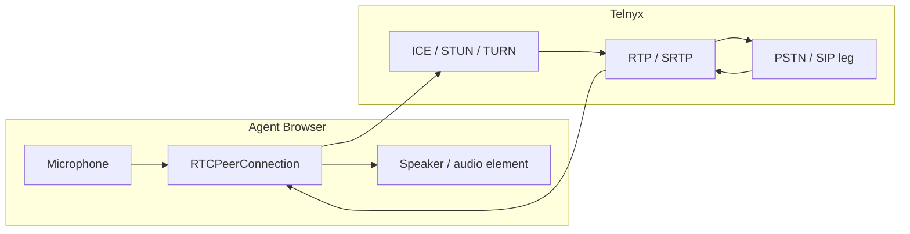
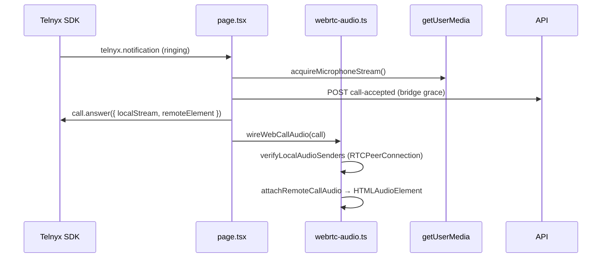
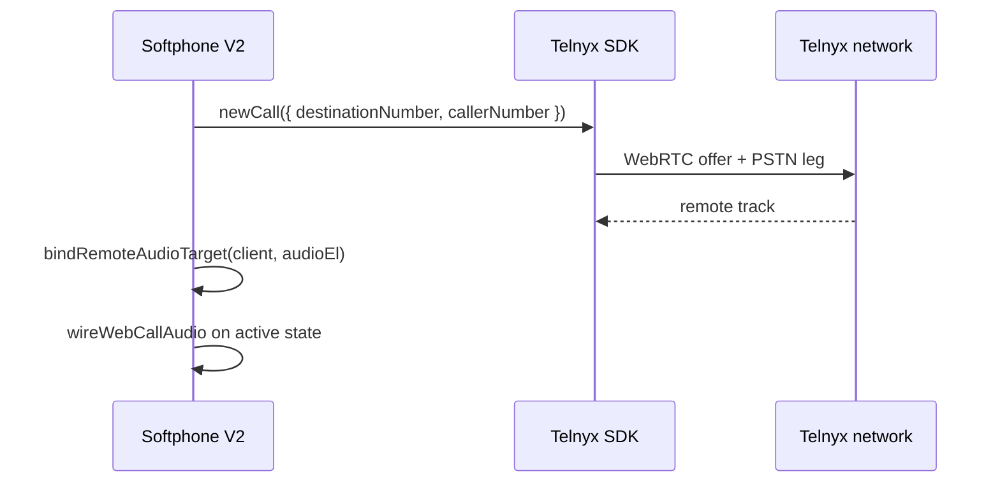

# WebRTC Media

VSP Phone does **not** terminate RTP. Media flows **browser ↔ Telnyx ↔ PSTN/SIP peer**. VSP API handles auth, webhooks, and Call Control — not media relay.

---

## Media path diagram

---

## ICE / STUN / TURN

| Component | Provider | Notes |
|-----------|----------|-------|
| STUN | `stun.telnyx.com:3478` | Host/srflx candidates |
| TURN | `turn.telnyx.com:3478/443` | Relay for strict NAT / corporate firewalls |
| ICE | Telnyx SDK + token | `trickleIce`, `prefetchIceCandidates` in client options |

Configured via Telnyx telephony credential JWT — not custom VSP TURN servers.

Diagnostics: `/softphone-v2/diagnostics` — ICE states, candidate counts, RTP stats.

See [../architecture-decisions/webrtc.md](../architecture-decisions/webrtc.md)

---

## Key frontend modules

| Module | Role |
|--------|------|
| `web/src/lib/telnyx-softphone-session.ts` | Client options, `remoteElement`, reconnect |
| `web/src/lib/webrtc-audio.ts` | `wireWebCallAudio`, mic senders, remote stream attach |
| `web/src/lib/softphone-call-trace.ts` | Deep trace, `peer.instance` resolution |
| `web/src/app/(app)/softphone-v2/page.tsx` | Answer/outbound, `attachCallMedia` |

---

## Inbound media sequence

**Telnyx SDK 2.27.1:** RTCPeerConnection on `call.peer.instance` (also check `peer.peerConnection`).

---

## Outbound media sequence

Softphone V1 passes `audio: true`, `localStream`, `remoteElement` on `newCall` — V2 should align for reliable outbound send path.

---

## Remote audio binding

`bindRemoteAudioTarget(client, element)` sets `client.remoteElement` before connect.

Remote element ID: `softphone-remote-audio` (hidden `<audio autoplay>`).

`collectRemoteStream` aggregates `RTCRtpReceiver` tracks when `call.remoteStream` is absent.

---

## SDP / RTP responsibilities

| Layer | Owner |
|-------|-------|
| SDP offer/answer | Telnyx SDK |
| Codec negotiation | Telnyx (typically Opus/G711) |
| DTLS-SRTP | Browser ↔ Telnyx |
| RTP counters | Browser `getStats()` — diagnostics page |

VSP never parses SDP in application code for Softphone V2.

---

## Common media failures

| Symptom | Likely cause |
|---------|--------------|
| Hear remote, remote can't hear you | Mic not attached to PC; outbound `packetsSent=0` |
| One-way at office only | Firewall blocking UDP/TURN |
| `media.peer-timeout` | PC not found on call object |
| No remote audio | `remoteElement` not bound; autoplay policy |

Capture: [scripts/office-webrtc-capture-checklist.md](../../../scripts/office-webrtc-capture-checklist.md)

---

## Related docs

- [03-websocket-lifecycle.md](./03-websocket-lifecycle.md)
- [02-call-flow.md](./02-call-flow.md)
- [../architecture-decisions/webrtc.md](../architecture-decisions/webrtc.md)
- [../architecture-decisions/diagnostics.md](../architecture-decisions/diagnostics.md)
- [docs/telnyx/webrtc/](../../telnyx/webrtc/)
