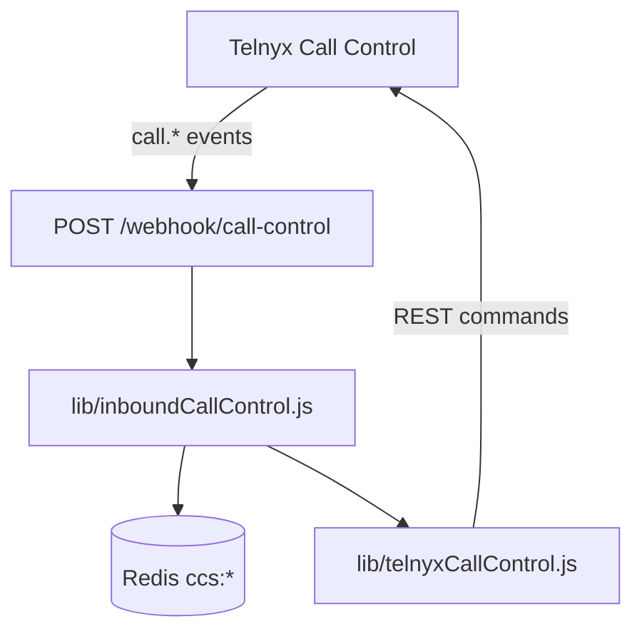

# Call Control

Telnyx **Call Control API** is the server-side call state machine for inbound PSTN, bridging, IVR, voicemail capture, recording, and blind transfer. VSP wraps it in `lib/telnyxCallControl.js` and orchestrates from `lib/inboundCallControl.js`.

---

## Architecture

---

## Webhook dispatcher

`handleInboundCallControlEvent(prisma, body)` routes by event type:

| Event | Handler |
|-------|---------|
| `call.initiated` (incoming) | `handleCallInitiated` |
| `call.initiated` (outgoing) | Transfer or internal dial handlers |
| `call.answered` | `handleCallAnswered` |
| `call.bridged` | `handleCallBridged` |
| `call.hangup` | `handleHangup` |
| `call.dial.ended` | `handleDialEnded` |
| `call.dial.answered` | `handleDialAnswered` |
| `call.speak.ended` | `handleSpeakEnded` (IVR, VM prompt) |
| `call.gather.ended` | `handleGatherEnded` (IVR, screening) |
| `call.recording.saved` | `handleCallControlRecordingWebhook` |

Transfer events delegated to `handleTransferCallControlEvent` (`lib/callTransferControl.js`).

---

## REST command wrapper

Key functions in `lib/telnyxCallControl.js`:

| Function | Telnyx action |
|----------|---------------|
| `answerCall` | Answer inbound PSTN leg |
| `dialDestination` | Dial SIP/WebRTC target (`bridge_on_answer`) |
| `bridgeCalls` | Bridge two legs |
| `hangupCall` | End leg |
| `transferCall` | Blind transfer PSTN caller |
| `speakCall` | TTS prompt |
| `gatherUsingSpeak` | IVR / screening gather |
| `startCallRecording` | Inbound/outbound recording |
| `startVoicemailRecording` | VM beep + record |
| `formatWebRtcDialTo` | `sip:{username}@sip.telnyx.com` |

---

## Session stages

Inbound session `stage` field (Redis JSON):

`init` → `ivr` | `screening` | `closed` | `preamble` → `connect` → `ringing` → `connecting` → `bridged` → `voicemail_*` | `transferred` | `hangup_pending`

Stage transitions drive which webhook handlers are allowed (e.g. block VM during `connecting`).

---

## Bridge-on-answer dialing

Ring targets resolved by `lib/inboundRouting.js` → `startRinging`:

- **Simultaneous:** `dialAllTargetsSimultaneously` with `bridge_on_answer: true`
- **Sequential:** `dialNextTarget` one leg at a time
- **Winner:** `claimConnectedLeg` — Redis `SET NX` on `ccs:winner:{inboundId}`

---

## TeXML legacy path

Some numbers may still hit `GET/POST /webhook` (TeXML). `requiresCallControlRouting()` can trigger migration to Call Control app assignment.

**Do not duplicate** TeXML logic when extending inbound — extend Call Control path first.

---

## Related docs

- [06-session-management.md](./06-session-management.md)
- [15-blind-transfer.md](./15-blind-transfer.md)
- [../architecture-decisions/call-control.md](../architecture-decisions/call-control.md)
- [docs/telnyx/call-control/](../../telnyx/call-control/)
