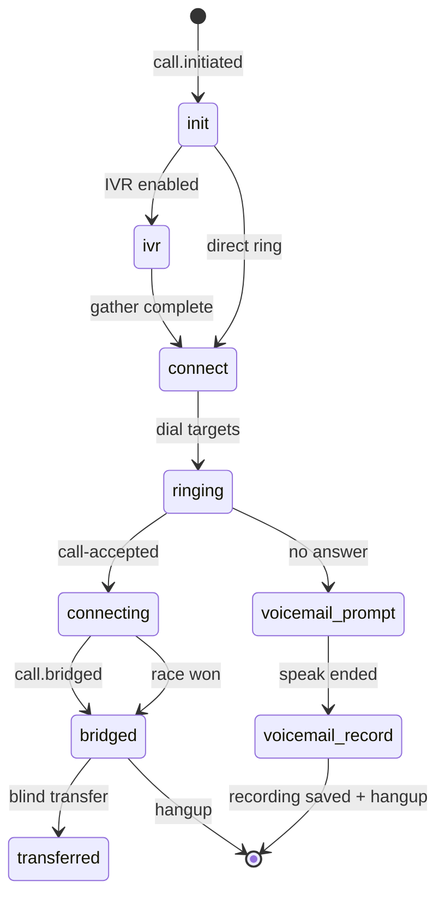

# Session Management

Call Control state is stored in **Redis** (production) with in-memory fallback. Module: `lib/callControlSessionStore.js` (re-exported from `lib/callControlSession.js`).

**TTL:** 3600 seconds for all keys.

---

## Redis session lifecycle

---

## Inbound session keys

| Redis key | Purpose |
|-----------|---------|
| `ccs:{callControlId}` | Full session JSON (tenant, greeting, targets, stage, legs) |
| `ccs:winner:{inboundId}` | Atomic winning leg ID (`claimConnectedLeg`) |
| `ccs:leg:{legId}` | Outbound leg → inbound ID index |
| `ccs:answerfx:{inboundId}:{legId}` | Answer side-effects dedup (recording start once) |
| `ccs:agent:{sipUsername}` | Pending app ring while INVITE in flight |
| `ccs:active:{sipUsername}` | Active bridged call — blind transfer lookup |

---

## Transfer session keys

Module: `lib/callTransferControl.js`

| Key | Purpose |
|-----|---------|
| `cts:{transferId}` | Transfer FSM session (`mode: 'blind'`) |
| `cts:inbound:{inboundId}` | Inbound → active transfer index |

---

## Key exports

| Function | Role |
|----------|------|
| `getSession` / `saveSession` / `deleteSession` | CRUD |
| `findSession` | Lookup by leg or criteria |
| `claimConnectedLeg` | Winner race (SET NX) |
| `claimAnswerSideEffects` | Idempotent recording start |
| `indexOutboundLeg` | Leg index |
| `indexPendingAgentRing` / `resolvePendingAgentRing` | Agent ring tracking |
| `indexActiveAgentCall` / `resolveActiveAgentCall` | Active call for transfer |
| `clearActiveAgentCall` | Post-transfer cleanup |
| `markAgentWebRtcAccepted` | Bridge grace (`stage=connecting`) |
| `markSessionBridged` | Post-bridge state |

---

## Fallback behavior

If Redis unavailable:

- Sessions stored in process memory `Map`
- **Not safe for multi-instance API** — production requires Redis
- `/ready` reports Redis connectivity

See [../architecture-decisions/redis.md](../architecture-decisions/redis.md)

---

## Rules for new features

1. **Never duplicate** session stores — extend `callControlSessionStore.js`
2. **Never bypass** tenant ID on session JSON — always set from `resolveInboundContext`
3. **Use atomic claims** for races (winner, answer side-effects)
4. **Separate transfer sessions** from inbound routing sessions (`cts:*` vs `ccs:*`)
5. **Do not rewrite** bridge-grace logic — extend after `stage === 'bridged'` for transfer

---

## Related docs

- [05-call-control.md](./05-call-control.md)
- [15-blind-transfer.md](./15-blind-transfer.md)
- [../architecture-decisions/bridge-grace.md](../architecture-decisions/bridge-grace.md)
- [../architecture-decisions/redis.md](../architecture-decisions/redis.md)
