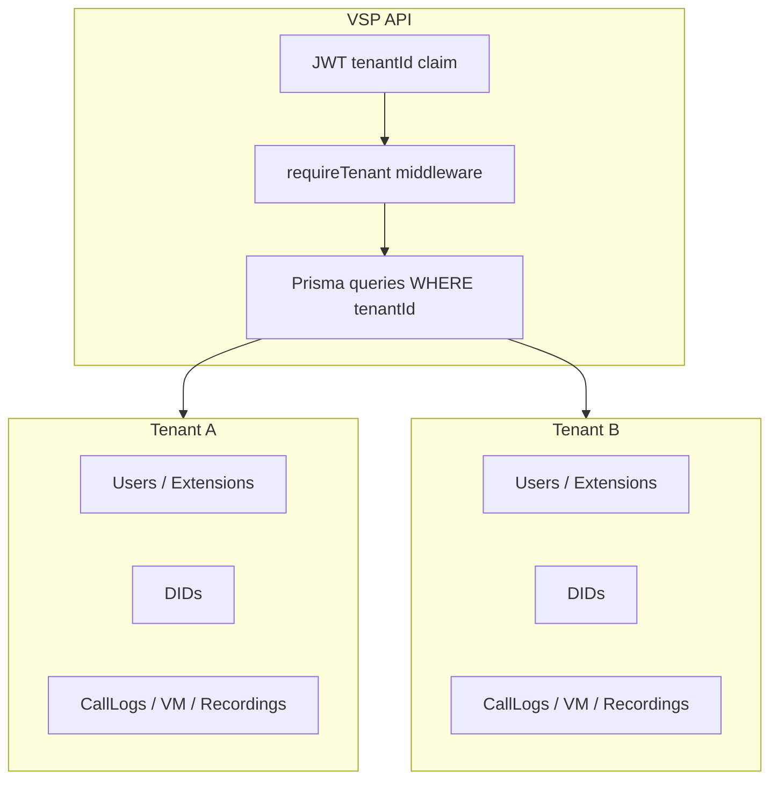

# Multitenancy

Every telephony operation is scoped to a **tenant**. Cross-tenant access is blocked at API middleware and query level.

---

## Tenant isolation diagram

---

## Resolution paths

| Flow | Tenant resolution |
|------|-------------------|
| Portal API | JWT `tenantId` on authenticated user |
| Inbound DID | `PhoneNumber.number` → `tenantId` in `resolveInboundContext` |
| Webhook | Derived from call session after DID lookup |
| Super admin | Explicit `tenantId` param with `SUPER_ADMIN` role |

---

## Prisma scoping

Telephony models include `tenantId`:

- `PhoneNumber`, `Extension`, `RingGroup`, `Greeting`
- `CallLog`, `CallRecording`, `Voicemail`
- `User` (belongs to tenant)

API routes use `req.user.tenantId` — never trust client-supplied tenant ID without admin role.

---

## Telnyx resources

Per-tenant or platform-level Telnyx assets:

- DIDs assigned via admin sync → `PhoneNumber` rows
- SIP usernames on `User.telnyxSipUsername` / `Extension`
- Call Control app is typically **platform-level**; tenant isolation is in VSP routing logic

---

## Redis sessions

Inbound session JSON includes `tenantId` from DID resolution. Transfer and recording handlers verify tenant ownership before persistence.

---

## DID assignment history

`DidAssignmentHistory` audits DID moves between tenants — see [08-did-routing.md](./08-did-routing.md).

---

## Related docs

- [08-did-routing.md](./08-did-routing.md)
- [../architecture-decisions/tenant-scoped-extensions.md](../architecture-decisions/tenant-scoped-extensions.md)
- [../architecture-decisions/did-assignment.md](../architecture-decisions/did-assignment.md)
- [22-security.md](./22-security.md)
