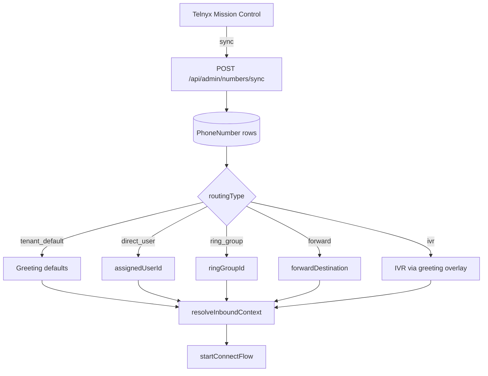

# DID Routing

Direct Inward Dial (DID) numbers map PSTN callers to tenant routing policies via `PhoneNumber` records and Call Control.

---

## DID assignment flow



---

## PhoneNumber model

Key fields (`prisma/schema.prisma`):

| Field | Purpose |
|-------|---------|
| `number` | E.164 DID |
| `tenantId` | Owning tenant |
| `routingType` | `tenant_default`, `forward`, `ring_group`, `ivr`, `direct_user` |
| `extensionId` | Optional direct extension |
| `ringGroupId` | Ring group target |
| `assignedUserId` | Direct user app target |
| `forwardDestination` | PSTN/SIP forward |

---

## Routing overlay

`lib/numberRouting.js` — `applyNumberRoutingToGreeting`:

Merges DID-specific settings onto tenant `Greeting` (hours, IVR, recording flags).

Admin assignment: `PUT /api/numbers/:id` (portal/admin routes).

---

## Inbound resolution

`resolveInboundContext` in `lib/inboundCallControl.js`:

1. Lookup `PhoneNumber` by called number
2. Load tenant `Greeting`
3. Apply number routing overlay
4. Build session with tenant + greeting + DID metadata

---

## Target priority

`lib/inboundRouting.js` — `resolveRingTargets` order:

1. Entity ring group (`ringGroupId` on DID)
2. Extension on DID (`extensionId`)
3. Assigned user app target
4. Legacy greeting ring group JSON
5. Forward destination

---

## Admin sync

```bash
API_URL=https://api.vspphone.com node scripts/diagnose-did-sync.js
```

Scripts: `scripts/diagnose-did-sync.js`, `npm run validate:extension-did`

---

## Related docs

- [09-extension-routing.md](./09-extension-routing.md)
- [10-ring-groups.md](./10-ring-groups.md)
- [12-ivr.md](./12-ivr.md)
- [../architecture-decisions/did-assignment.md](../architecture-decisions/did-assignment.md)
