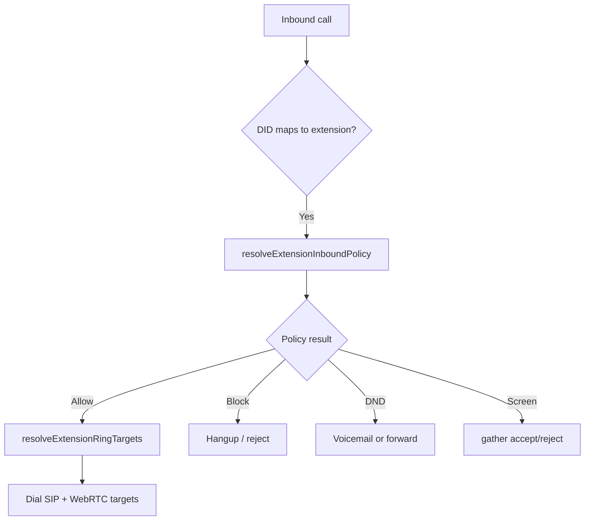

# Extension Routing

Extensions are tenant-scoped PBX endpoints identified by extension numbers (e.g. `102`). They can receive calls via WebRTC app, desk SIP, forwarding rules, and ring groups.

---

## Extension entities

| Model | Purpose |
|-------|---------|
| `Extension` | Number, DND, screening, WebRTC/SIP flags |
| `ExtensionForwarding` | Always / busy / no-answer / schedule rules |
| `ExtensionSecurity` | Whitelist, blacklist, recording policy |
| `ExtensionVoicemailSettings` | Per-extension VM greeting |
| `ExtensionDevice` | Desk phone registration |

Routes: `routes/extensions.js` → `/api/tenant/extensions/*`

---

## Inbound to extension

**Module:** `lib/extensionInbound.js`

---

## Ring targets

`resolveExtensionRingTargets` (`lib/inboundRouting.js`):

- Desk SIP credentials on extension
- App user WebRTC: `sip:{telnyxSipUsername}@sip.telnyx.com`
- Simultaneous dial when multiple devices

---

## Outbound from extension

Softphone dial normalization: `resolveOutboundDestination` (`web/src/lib/softphone-dial.ts`)

- Short codes → internal extension dial via Telnyx
- External → PSTN with caller ID from assigned DID

**Gap:** Extension `ExtensionSecurity` calling permissions stored but **not fully enforced** at outbound dial time (audit item).

---

## Internal extension dial

`lib/internalExtensionDial.js`:

- `initiateInternalCallFromApi` — `POST /api/softphone/internal-call`
- `handleInternalExtensionCallInitiated` — webhook path
- Shares `startConnectFlow` with PSTN inbound

---

## Extension fallback

On no-answer/busy: `applyExtensionFallback` — forward chain or voicemail per extension settings.

---

## Related docs

- [08-did-routing.md](./08-did-routing.md)
- [10-ring-groups.md](./10-ring-groups.md)
- [14-voicemail.md](./14-voicemail.md)
- [../architecture-decisions/tenant-scoped-extensions.md](../architecture-decisions/tenant-scoped-extensions.md)
