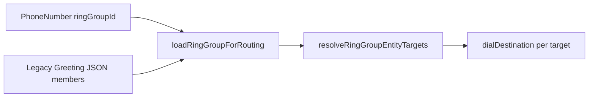

# Ring Groups

Ring groups distribute inbound calls to multiple extensions using configurable strategies. **Implemented** in VSP Phone.

---

## Data model

| Model | Fields |
|-------|--------|
| `RingGroup` | Name, `extensionNumber`, strategy, timeout, VM/recording flags |
| `RingGroupMember` | `extensionId`, priority, `lastRungAt`, `lastAnsweredAt` |

Modules: `lib/ringGroups.js`, `lib/ringGroupRouter.js`  
Routes: `routes/ringGroups.js` → `/api/tenant/ring-groups/*`

---

## Routing integration

Priority in `resolveRingTargets` (`lib/inboundRouting.js`):

1. DID-assigned ring group (entity)
2. Extension direct
3. Legacy greeting JSON ring group (migration path)

---

## Strategies

| Strategy | Behavior |
|----------|----------|
| `SIMULTANEOUS` | `dialAllTargetsSimultaneously`, first answer wins |
| Sequential (default engine) | `dialNextTarget` one at a time |
| `ROUND_ROBIN` / `LONGEST_IDLE` | Member ordering — still uses sequential dial engine for non-SIMULTANEOUS |

---

## Direct dial by ring group extension

Ring groups may have `extensionNumber` — inbound internal dial hits `loadRingGroupByExtensionNumber`.

---

## Voicemail & recording

Ring group flags:

- `callRecordingEnabled` — checked in `applyAnswerSideEffectsOnce`
- Voicemail on no-answer → `Voicemail.ringGroupId`

Portal: `GET /api/tenant/ring-groups/:id/voicemails`

---

## Migration

Admin helper migrates legacy `Greeting.ringGroupMembers` JSON to `RingGroup` entities — see ring group routes `migrate` endpoint.

---

## Gaps

- Mobile app ring group UI incomplete vs web (audit)
- ROUND_ROBIN/LONGEST_IDLE ordering without true simultaneous ring for all strategies

---

## Related docs

- [08-did-routing.md](./08-did-routing.md)
- [14-voicemail.md](./14-voicemail.md)
- [13-call-recording.md](./13-call-recording.md)
