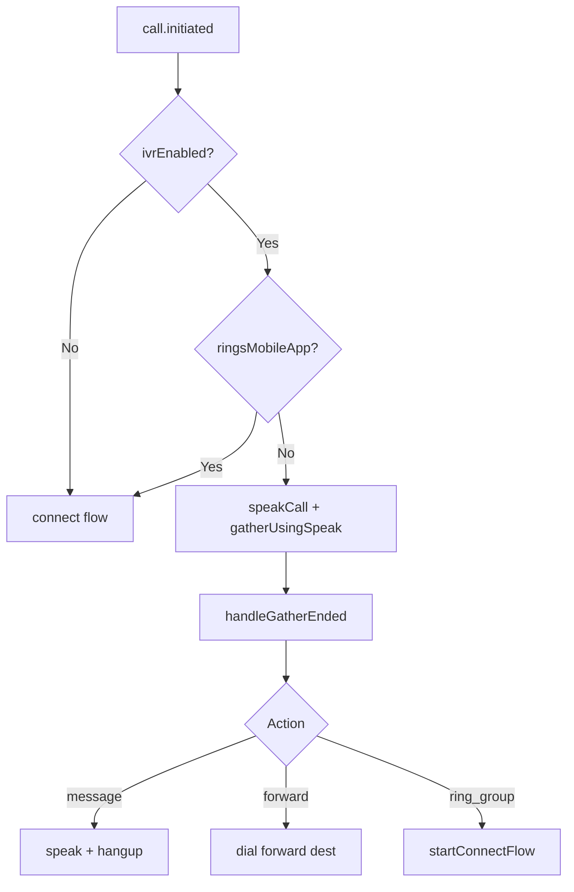

# IVR

Interactive Voice Response — **partially implemented** via Call Control gather/speak and TeXML legacy path.

---

## Implementation paths

| Path | Module | Status |
|------|--------|--------|
| Call Control IVR | `handleIvrSelection`, `handleGatherEnded` in `inboundCallControl.js` | ✅ Active |
| TeXML IVR | `lib/callRouting.js` | ✅ Legacy |
| DID `routingType=ivr` | `lib/numberRouting.js` | ✅ Overlay on greeting |

---

## Call Control IVR flow

**Important:** IVR is **skipped when mobile app ring targets are present** (`ivrEnabled && !ringsMobileApp`).

---

## Supported actions

| Action | Behavior |
|--------|----------|
| `message` | Play message, hang up |
| `forward` | Dial forward destination |
| `ring_group` | Enter ring group connect flow |

---

## NOT implemented

- Multi-level IVR menus
- AI gather (`gather_using_ai`)
- Visual IVR editor beyond greeting/call-routing pages
- Per-DID completely separate IVR trees (uses greeting overlay)

---

## Configuration UI

- `web/src/app/(app)/greeting/page.tsx`
- `web/src/app/(app)/call-routing/page.tsx`
- Tenant API: `GET/PUT /api/tenants/:tenantId/greeting`, `/call-routing`

---

## Related docs

- [08-did-routing.md](./08-did-routing.md)
- [05-call-control.md](./05-call-control.md)
- [docs/telnyx/call-control/](../../telnyx/call-control/)
