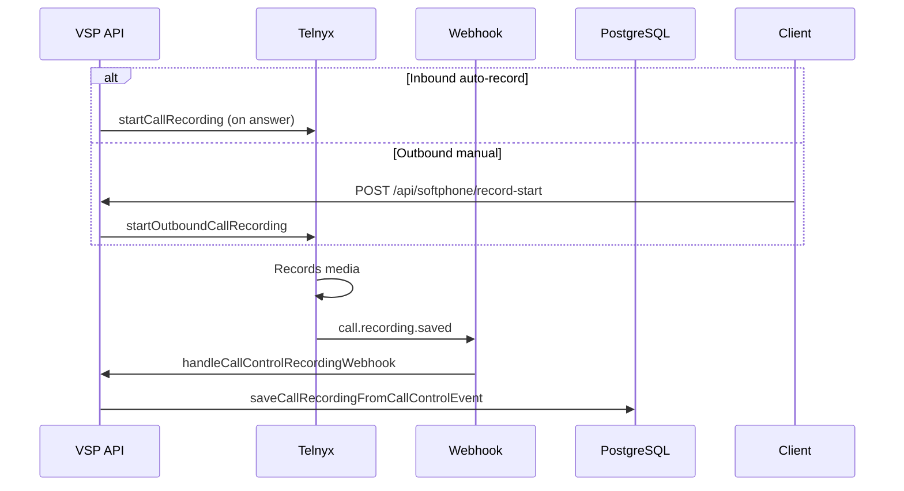

# Call Recording

Call recording uses Telnyx Call Control `record_start` with webhook completion persisted to `CallRecording` rows.

---

## Recording lifecycle

---

## Inbound (automatic)

Triggered in `applyAnswerSideEffectsOnce` — guarded by `claimAnswerSideEffects` (once per winning leg).

Enabled when:

- `greeting.callRecordingEnabled`
- Ring group `callRecordingEnabled`
- Extension security `recordingPolicy` allows

Optional preamble: `resolveRecordingNotice` spoken in `startConnectFlow` when `playCallRecordingNotice`.

**Module:** `lib/inboundCallControl.js`, `lib/telnyxCallControl.js`

---

## Outbound (manual)

1. Softphone calls `POST /api/softphone/record-start` with WebRTC `callControlId`
2. Validates tenant owns caller ID and greeting allows recording
3. `startOutboundCallRecording` (`lib/outboundRecording.js`)

---

## Webhook handlers

| Endpoint | Handler |
|----------|---------|
| `POST /webhook/call-control` | `call.recording.saved` |
| `POST /webhook/call-recording` | `handleTelnyxCallRecordingWebhook` |
| `POST /webhook/voice` | Recording events |

Persistence: `lib/callRecording.js` — `saveCallRecordingFromCallControlEvent`

Voicemail recordings routed separately — see [14-voicemail.md](./14-voicemail.md)

---

## Portal APIs

| Method | Path |
|--------|------|
| GET | `/api/tenant/recordings` |
| GET | `/api/tenant/recordings/:id/stream` |
| DELETE | `/api/tenant/recordings/:id` |
| GET | `/api/tenant/recordings/setup` |
| POST | `/api/tenant/recordings/sync` |

Sync: `lib/recordingSync.js`

---

## Prisma model

`CallRecording` — links to tenant, call metadata, Telnyx recording URL, duration.

---

## Related docs

- [../architecture-decisions/recordings.md](../architecture-decisions/recordings.md)
- [14-voicemail.md](./14-voicemail.md)
- [22-security.md](./22-security.md)
