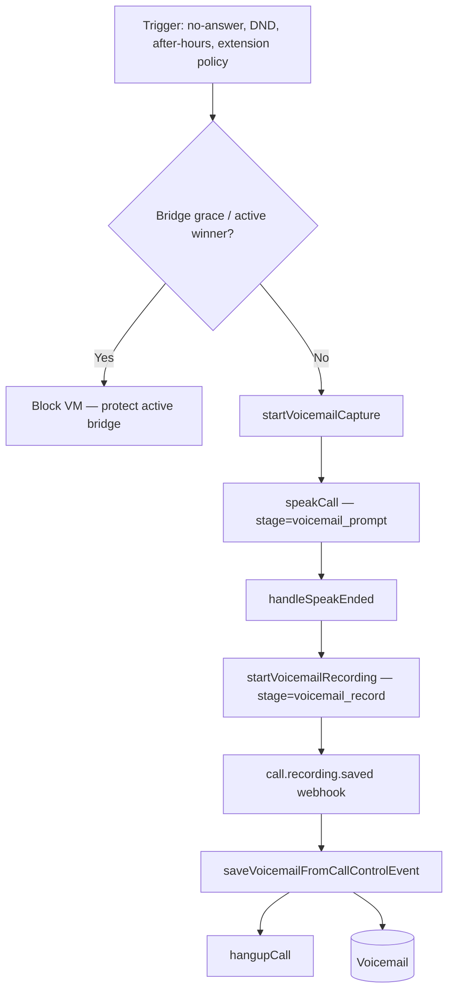

# Voicemail

Voicemail captures caller messages via Telnyx recording on the PSTN leg, persisted as `Voicemail` rows.

---

## Voicemail lifecycle

---

## Triggers

| Source | Handler |
|--------|---------|
| Ring timeout | `routeToVoicemailOrHangup` |
| Extension DND | `resolveExtensionInboundPolicy` |
| After-hours | Business hours check in `handleCallInitiated` |
| Ring group miss | Post-sequential dial exhaustion |
| Extension fallback | `applyExtensionFallback` |

**Guardrails:** `shouldBlockVoicemailRouting`, `hasActiveWinner`, bridge grace during `connecting`/`bridged`.

---

## Call Control path

1. `startVoicemailCapture` — prompt TTS
2. `handleSpeakEnded` → `startVoicemailRecording` with `buildVoicemailClientStateFromSession` (`lib/voicemail.js`)
3. Webhook → `saveVoicemailFromCallControlEvent`
4. `hangupCall`

---

## TeXML legacy

`/webhook/voicemail` → `saveVoicemailFromPayload` (RecordingUrl from TeXML).

---

## Portal APIs

| Method | Path |
|--------|------|
| GET | `/api/tenant/voicemails` |
| PATCH | `/api/tenant/voicemails/:id/read` |
| DELETE | `/api/tenant/voicemails/:id` |
| GET | `/api/tenant/voicemails/:id/stream` |
| GET | `/api/tenant/extensions/:id/voicemails` |
| GET | `/api/tenant/ring-groups/:id/voicemails` |

---

## Schema linkage

`Voicemail` may attach:

- `extensionId`
- `ringGroupId`
- `tenantId`

Per-extension settings: `ExtensionVoicemailSettings`

---

## Related docs

- [06-session-management.md](./06-session-management.md)
- [../architecture-decisions/voicemail.md](../architecture-decisions/voicemail.md)
- [../architecture-decisions/bridge-grace.md](../architecture-decisions/bridge-grace.md)
