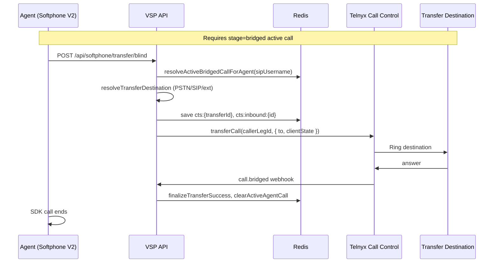

# Blind Transfer

Cold (blind) transfer moves the **PSTN caller leg** to a new destination while the agent leg hangs up. **Implemented — Phase 1.**

---

## Blind transfer flow



---

## Components

| Layer | File | Function |
|-------|------|----------|
| API route | `routes/portal.js` | `POST /api/softphone/transfer/blind` |
| Control | `lib/callTransferControl.js` | `initiateBlindTransfer`, `handleTransferCallControlEvent` |
| Telnyx | `lib/telnyxCallControl.js` | `transferCall` on **caller PSTN leg** |
| Client | `web/src/lib/softphone-call-log-client.ts` | `postBlindTransfer` |
| UI | `softphone-v2/page.tsx` | Transfer sheet |

---

## Active call lookup

`resolveActiveBridgedCallForAgent(sipUsername)` reads `ccs:active:{sip}` — indexed at bridge time via `indexActiveAgentCall`.

**Transfer only after bridge** — do not modify bridge-grace winner-claim logic.

---

## Destination resolution

`resolveTransferDestination`:

- E.164 PSTN
- SIP URI
- Extension → `resolveExtensionRingTargets`

---

## Transfer session (Redis)

| Key | TTL | Content |
|-----|-----|---------|
| `cts:{transferId}` | 3600s | FSM: `mode: 'blind'`, legs, status |
| `cts:inbound:{inboundId}` | 3600s | Index to active transfer |

Webhook stages: `finalizeTransferSuccess` / `finalizeTransferFailure`

Cleanup: `clearActiveAgentCall`, `clearPendingAgentRing`, `deleteSession`

---

## Validation

```bash
npm run validate:blind-transfer
npm run validate:call-transfer-session
npm run validate:rapid-accept-stress   # bridge grace regression
```

---

## Related docs

- [16-attended-transfer.md](./16-attended-transfer.md)
- [06-session-management.md](./06-session-management.md)
- [docs/call-transfer-implementation-plan.html](../../call-transfer-implementation-plan.html)
