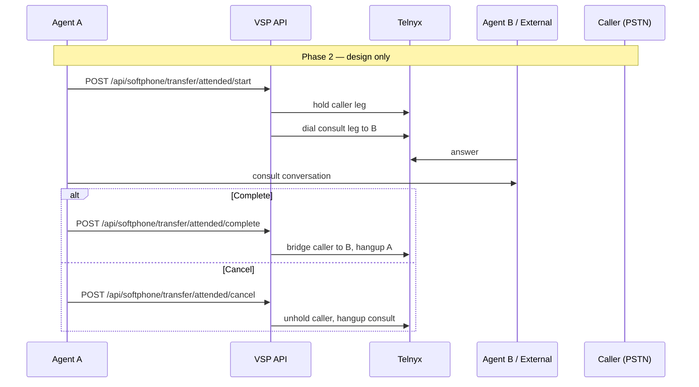

# Attended Transfer (Warm Transfer)

Consultative transfer — agent speaks to destination before completing transfer to caller. **NOT implemented** — planned Phase 2.

---

## Planned flow

---

## Current codebase

| Item | Status |
|------|--------|
| `POST /transfer/attended/*` routes | ❌ |
| Consult leg FSM in `callTransferControl.js` | ❌ (blind only) |
| Hold / unhold Call Control commands | ❌ |
| Softphone UI for consult | ❌ |

Blind transfer FSM (`cts:*` sessions) designed to **extend**, not replace.

---

## Design constraints (from implementation plan)

1. Separate transfer session from inbound routing session
2. Do **not** modify bridge-grace winner-claim logic
3. Transfer runs only when `stage === 'bridged'`
4. Reuse `resolveTransferDestination` for consult target
5. Telnyx conference API optional for 3-way consult — see [17-conference-calls.md](./17-conference-calls.md)

Reference: [docs/call-transfer-implementation-plan.html](../../call-transfer-implementation-plan.html)

---

## Related docs

- [15-blind-transfer.md](./15-blind-transfer.md)
- [17-conference-calls.md](./17-conference-calls.md)
- [24-future-roadmap.md](./24-future-roadmap.md)
