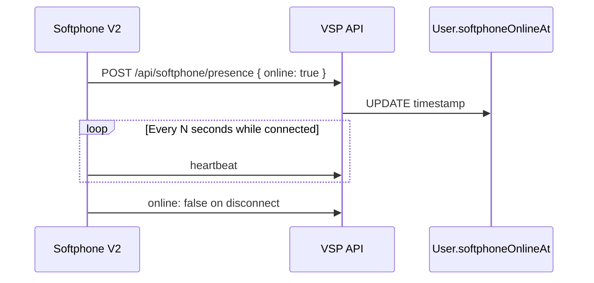

# Presence

Softphone online status is tracked but **not used for routing decisions** in the current implementation.

---

## What is implemented

| Component | Behavior |
|-----------|----------|
| `POST /api/softphone/presence` | Heartbeat from web/mobile |
| `setSoftphonePresence` (`lib/softphone.js`) | Writes `User.softphoneOnlineAt` |
| `web/src/lib/softphone-presence.ts` | `startSoftphonePresenceHeartbeat` |
| `isUserOnline` (`lib/inboundCallControl.js`) | Exported helper |

---

## Presence flow

---

## What is NOT implemented

| Feature | Status |
|---------|--------|
| Skip offline users in ring targets | ❌ `isUserOnline` unused in routing |
| Team presence dashboard | ❌ |
| Busy/away/DND beyond extension DND | ❌ |
| SIP OPTIONS presence | ❌ |

Ring targets dial configured SIP/WebRTC endpoints regardless of heartbeat.

---

## Extension DND

Separate from presence: `Extension` DND flag affects inbound policy via `resolveExtensionInboundPolicy` — routes to VM or forward.

---

## Future

Use `softphoneOnlineAt` + threshold in `resolveExtensionRingTargets` to skip app ring when offline (with fallback to desk SIP).

See [24-future-roadmap.md](./24-future-roadmap.md)

---

## Related docs

- [03-websocket-lifecycle.md](./03-websocket-lifecycle.md)
- [09-extension-routing.md](./09-extension-routing.md)
- [../features.md](../features.md)
