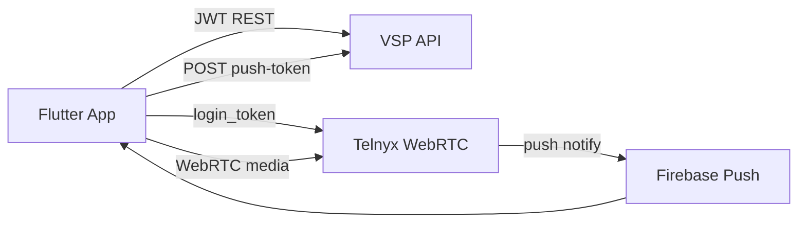

# Mobile App

Flutter Android app for VSP Phone — uses same API and Telnyx WebRTC as web, with platform-specific push and storage.

---

## Architecture



Code: `mobile/` — Flutter  
Config: `mobile/lib/config/api_config.dart` — default `https://api.vspphone.com`

---

## Shared PBX features (mobile)

| Feature | Status |
|---------|--------|
| Auth / JWT | ✅ |
| Inbound WebRTC | ✅ |
| Outbound WebRTC | ✅ |
| Push notifications (Android) | ✅ Partial — see Telnyx Flutter push docs |
| Call history sync | ✅ |
| Voicemail / recordings portal | ✅ Via API |
| Ring groups admin | ❌ Web only |
| Blind transfer | ❌ Incomplete vs web |
| WebRTC diagnostics page | ❌ Web only |

---

## API endpoints used

Same softphone routes as web — see [20-api-reference.md](./20-api-reference.md):

- `POST /api/softphone/token`
- `POST /api/softphone/presence`
- `POST /api/softphone/push-token`
- `POST /api/softphone/call-accepted`
- `POST /api/softphone/call-log`

---

## Build & deploy

```powershell
npm run build:mobile:android:release
# APK → landing /apk/ on EC2 (optional)
```

Docs: `mobile/docs/inbound-calling-setup.md`

Verify auth:

```bash
API_URL=https://api.vspphone.com EMAIL=... PASSWORD=... node scripts/verify-mobile-auth.js
```

---

## Inbound routing note

When mobile app is a ring target, **IVR is skipped** (`ivrEnabled && !ringsMobileApp`) — mobile rings directly.

---

## Related docs

- [04-webrtc-media.md](./04-webrtc-media.md)
- [19-mobile-app.md](./19-mobile-app.md) → [20-api-reference.md](./20-api-reference.md)
- [../features.md](../features.md)
- [docs/telnyx/javascript-sdk/flutter/](../../telnyx/javascript-sdk/flutter/)
