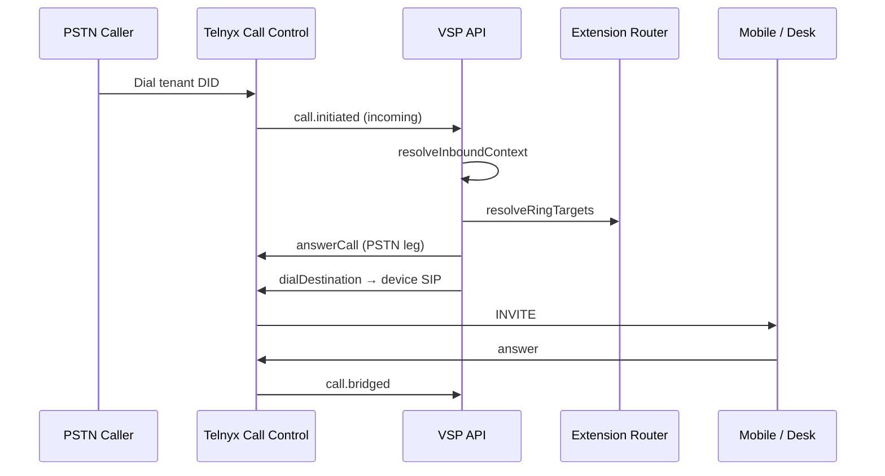
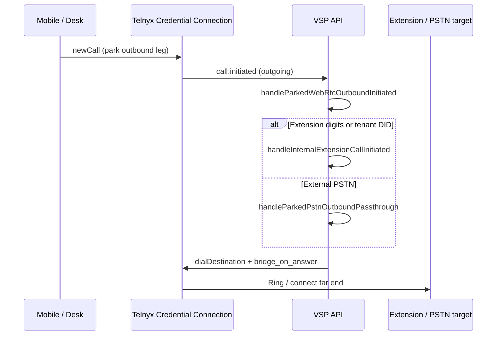

# Phase 2.1 — Architecture Freeze

**Status:** Approved and frozen (documentation only; no runtime changes in this phase).

Phase 2.1 locks the **target** telephony model and marks **current** duplicate paths as deprecated. Implementation happens in Phases 2.2–2.7.

---

## Vision

| Client | Role |
|--------|------|
| **Mobile app** (`mobile-rn`) | Sole telephony client (Phase 2.3+) |
| **Browser portal** | Administration and management only (Phase 2.2+) |
| **Desk phone** | SIP device on employee extension (Phase 2.6) |
| **Super Admin** | Number purchase, tenant assignment, Telnyx infrastructure |

Employees do **not** use the browser for calling during Phase 2.

---

## Target ownership model

```
Super Admin
  → Purchase DID
  → Assign DID to Tenant

Tenant Admin
  → Create Employee
  → Create Extension (one per employee)
  → Assign DID → Extension
  → Register Devices (Mobile, Desk)

Employee
  → One extension
  → One SIP identity (employee credential)
  → Mobile app + desk phone as devices on that extension
```

**Database intent (Phase 2.4):**

- Every active tenant DID has `phone_numbers.extensionId` set.
- Every active extension has exactly one `extensions.userId`.
- One Telnyx SIP credential per employee (`users.telnyxSipUsername`).

---

## Target call architecture (Telnyx Pattern 1)

All call types use **one** server pipeline:

```
PSTN or Client outbound (Credential Connection)
  → Telnyx Call Control Application
  → POST /webhook/call-control
  → Extension resolution
  → resolveRingTargets (extension devices only)
  → startConnectFlow
  → dialDestination(link_to, bridge_on_answer: true)
  → Mobile and/or Desk SIP URI
  → call.bridged → media
```

### Inbound PSTN



**Primary code:** `lib/inboundCallControl.js` → `lib/inboundRouting.js` → `lib/telnyxCallControl.js`

### Outbound PSTN / extension (mobile or desk)



**Primary code:** `lib/internalExtensionDial.js`

---

## Current state vs target (known gaps)

Documented here for Phase 2.4+ work. **Not fixed in Phase 2.1.**

| Gap | Current | Target (Phase 2.4) |
|-----|---------|---------------------|
| Dual SIP credentials | `users.telnyxSipUsername` (app) + `extensions.telnyxSipUsername` (desk) | One employee credential |
| Simultaneous dual URI ring | `resolveExtensionRingTargets` rings app + desk as separate SIP targets | One identity; multi-device policy explicit |
| DID linkage | `extensionId`, `assignedUserId`, greeting ring groups | DID → extension only |
| Inbound TeXML | `GET/POST /webhook` → `lib/callRouting.js` | Retire after all DIDs on Call Control |
| Duplicate webhook | `/webhook/voice` also dispatches `call.*` to Call Control handler | Voice webhook telemetry only |
| Internal originate | Client `newCall` + unused `POST /api/softphone/internal-call` | Single canonical path (mobile `newCall`) |
| Browser telephony | `web/.../softphone-v2` registers Telnyx | Disabled via flag (Phase 2.2) |
| Mobile clients | `mobile-rn` + `mobile/` (Flutter) | `mobile-rn` primary |

---

## Telnyx infrastructure (frozen)

| Resource | Purpose | Env / config |
|----------|---------|--------------|
| **Call Control Application** | All DIDs, inbound + parked outbound orchestration | `TELNYX_CALL_CONTROL_APP_ID` |
| **Credential Connection** | WebRTC + SIP registration (mobile, desk) | `TELNYX_CREDENTIAL_CONNECTION_ID` |
| **Webhook (primary)** | Inbound and outbound Call Control events | `{API_PUBLIC_URL}/webhook/call-control` |
| **Webhook (telemetry)** | MOS / hangup quality (optional duplicate) | `{API_PUBLIC_URL}/webhook/voice` |

All purchased DIDs must use the **same** Call Control Application `connection_id`. Sync on API startup: `lib/telnyxCallControlSetup.js` → `syncPhoneNumbersToCallControlApp`.

---

## Role boundaries

| Role | Telephony | Admin |
|------|-----------|-------|
| Super Admin | Configure Telnyx; no extension login | Purchase numbers, assign tenants, system health |
| Tenant Admin | None (mobile only for personal use if employee) | Employees, extensions, DIDs, devices, ring groups, routing |
| Employee | Mobile app only | Self-service via mobile where applicable |

Tenant Admins **cannot** purchase numbers (Super Admin only).

---

## Phase 2.1 scope

**In scope:**

- This document and [02-deprecated-modules.md](./02-deprecated-modules.md)
- [03-implementation-phases.md](./03-implementation-phases.md) checklist

**Out of scope (later phases):**

- Feature flags, UI changes, routing refactors, provisioning redesign

**Explicit freeze:**

- No new call features (transfer variants, queues, etc.)
- No new portal telephony UI
- No changes to PSTN outbound answer gate or parked outbound passthrough until Phase 2.4 planning completes

---

## Verification (unchanged behavior)

Phase 2.1 does not change runtime code. Existing validation still applies:

```bash
npm run test:telephony
cd web && npm run build
```

Production smoke: [deployment/14-telephony-validation.md](../deployment/14-telephony-validation.md)

---

## Approval record

| Decision | Choice |
|----------|--------|
| Pattern | Telnyx Call Control Pattern 1 (park + dial + bridge_on_answer) |
| Primary mobile client | React Native (`mobile-rn/`) |
| Browser calling | Disabled in Phase 2.2; code retained |
| Single SIP identity | Employee credential (Phase 2.4 implementation) |
| TeXML inbound | Deprecated; remove after migration verified (Phase 2.4) |

Next phase after approval: **Phase 2.2 — Browser becomes admin portal** ([03-implementation-phases.md](./03-implementation-phases.md)).
