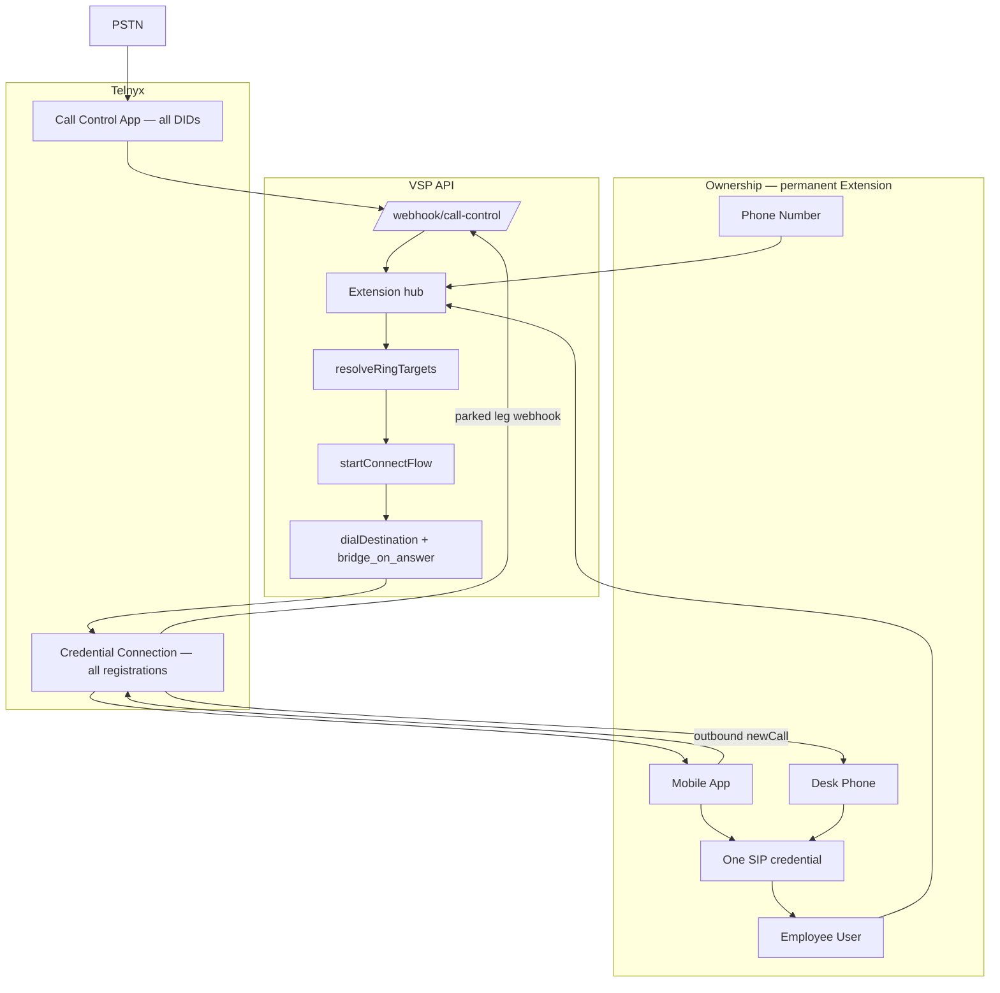

# Phase 2 — Architecture Review and Implementation Plan

**Status:** Planning only — no implementation until approved.  
**Prerequisite:** [Phase 2.1 architecture freeze](./01-architecture-freeze.md) (committed).

---

## 1. Executive summary

Core telephony is **partially stable** (PSTN outbound, mostly working inbound). Remaining failures trace to **extension architecture inconsistency**, not missing Call Control features:

- Two SIP credentials per extension (employee + desk)
- Multiple inbound routing entry points (Call Control + TeXML + duplicate webhooks)
- Browser, mobile, and desk each using different registration paths
- QR provisioning returns JWT + mixed credentials, not a single auto-SIP payload

**Phase 2 goal:** One Pattern 1 pipeline — **PSTN → Call Control → Extension → Employee → Devices** — with **mobile-only** client calling during stabilization.

---

## 2. Current vs target architecture

### 2.1 Target (approved)

```
PSTN
  → Telnyx Call Control Application
  → POST /webhook/call-control
  → resolveInboundContext (DID → phone_numbers → extension)
  → resolveRingTargets (extension devices)
  → startConnectFlow
  → dialDestination(link_to, bridge_on_answer)
  → sip:{employee_sip}@sip.telnyx.com
  → Mobile and/or Desk (same SIP identity)
```

### 2.2 Current (simplified)

| Layer | Current | Gap |
|-------|---------|-----|
| **Webhook entry** | `/webhook/call-control` + `/webhook/voice` + TeXML `/webhook` | Three inbound paths |
| **DID lookup** | `phone_numbers` by E.164; optional `extensionId` | Some DIDs use `assignedUserId` only |
| **Ring targets** | `resolveExtensionRingTargets` adds **app** (user SIP) + **sip** (extension SIP) | Two URIs → duplicate INVITEs |
| **Outbound** | Parked leg → `handleParkedWebRtcOutboundInitiated` | OK for Pattern 1; extension/PSTN split inside |
| **Browser** | `softphone-v2` → TelnyxRTC + user token | To disable Phase 2.2 |
| **Mobile** | `mobile-rn` → user token **or** extension SIP (admin) | Inconsistent identity |
| **Desk** | Extension `telnyxSipUsername` | Often misconfigured as ext number `101` |
| **QR** | Provisioning token → JWT login; SIP profile is extension-based | Not scan-to-SIP |

### 2.3 Architecture diagram (target)



---

## 3. Extension model (permanent telephony object)

### 3.1 Target schema semantics

| Object | Role | Reassign on employee change? |
|--------|------|------------------------------|
| **Extension** | Permanent PBX seat (number, policy, SIP, DID) | Keep extension; change `userId` |
| **Employee (User)** | Person login; one extension assignment | Unassign old, assign new |
| **PhoneNumber (DID)** | Optional; `extensionId` required for inbound | Re-point DID only if needed |
| **ExtensionDevice** | Mobile / desk registration records | Update on reprovision |

**Already in schema:** `extensions.userId` nullable; `extensions.status`; `primaryPhoneNumberId`; `phone_numbers.extensionId`.

**Phase 2.4 additions:**

- Admin action: **Assign employee** without creating new extension
- On reassignment: revoke/rotate SIP credential optional policy; clear old user device tokens
- Validation: one active extension per user per tenant (optional business rule)

### 3.2 Employee departure flow (target)

```
1. Tenant Admin → Extension → Assign Employee → (none / new user)
2. Optional: Reset SIP password (rotates employee credential)
3. Extension number, DID, desk config unchanged
4. Mobile QR reissued for new employee
```

---

## 4. SIP credentials — review and recommendation

### 4.1 Current implementation

| Credential | Created by | Stored on | Used by |
|------------|------------|-----------|---------|
| **Employee / app** | `lib/softphone.js` → `getOrCreateUserTelephonyCredential` | `users.telnyxSipUsername` | Browser WebRTC, mobile token login, inbound `type:app` dial |
| **Desk / extension** | `lib/extensionSip.js` → `ensureExtensionTelnyxCredential` | `extensions.telnyxSipUsername` | Desk SIP, inbound `type:sip` dial, extension SIP panel |

**Conflict:** `resolveExtensionRingTargets` (`lib/inboundRouting.js`) pushes **both** targets when `multiDeviceEnabled`, often **simultaneous** → two Call Control dial legs → duplicate INVITE / second incoming UI.

**Mobile inconsistency:** `mobile-rn/src/sip/service.ts` uses extension SIP for admins, user token for employees.

### 4.2 Recommended long-term model

**Adopt: One employee SIP credential per extension assignment.**

```
Extension (permanent)
  └── assigned Employee
        └── users.telnyxSipUsername (+ password / login token)
              ├── Mobile: WebRTC via login token (Credential Connection)
              └── Desk: SIP register same username/password (UDP/TLS)
```

**Rationale:**

- Matches enterprise PBX mental model (extension seat → person → devices)
- Single inbound dial URI per employee → eliminates duplicate bridge legs
- QR provisions one username/password for mobile; desk uses identical auth fields
- Employee reassignment = rotate user credential, extension record unchanged

**Extension-level credential (`extensions.telnyxSipUsername`):** Deprecate after migration (Phase 2.4/2.6). Desk provisioning UI reads **employee** credential via extension assignment.

### 4.3 Telnyx registration constraints (validate in staging before Phase 2.6)

| Topic | Guidance |
|-------|----------|
| **Credential Connection** | WebRTC (WSS) + SIP (UDP/TLS) on same connection — supported |
| **Same SIP username, mobile + desk** | Desk REGISTER + mobile WebRTC may compete; Telnyx often allows WebRTC + one SIP registration — **must test** simultaneous mobile online + desk registered |
| **Inbound Pattern 1** | Call Control dials `sip:username@sip.telnyx.com`; WebRTC client receives INVITE when SDK connected — desk does not need separate URI |
| **If simultaneous register fails** | Policy: **sequential ring** (mobile first, desk second) or **prefer mobile when online** — still **one URI**, one dial command |

**Do not implement desk+mobile as two Telnyx telephony credentials for the same extension** — that is the current bug class.

**Action before Phase 2.6:** Staging test with one credential, mobile connected + Grandstream registered; confirm inbound rings both or document sequential policy.

---

## 5. Extension management UI (gap analysis)

### 5.1 Current (`web/src/app/(app)/phone-system/extensions/page.tsx`)

**Already present:**

- Columns: Extension, Employee, DID, Mobile, WebRTC, SIP registration badges
- Drawer tabs: overview, employee, sip, qr, security, analytics
- `ExtensionSipPanel`, provisioning token API
- Actions: edit, delete, sync phone links, ownership validation

**Gaps vs enterprise PBX target:**

| Requirement | Status |
|-------------|--------|
| Extension / Employee / DID columns | ✅ Exists |
| Mobile + Desk status | ⚠️ Mobile + SIP yes; WebRTC column obsolete Phase 2.2 |
| Edit / Assign employee | ✅ Partial (drawer employee tab) |
| Configuration dialog (full SIP table) | ⚠️ SIP panel exists; needs unified “Configuration” modal with copy/download |
| QR for mobile auto-SIP | ⚠️ Token-based QR, not SIP payload |
| Reset SIP password | ✅ `resetExtensionSipCredentials` (extension cred today — move to user cred Phase 2.5) |

### 5.2 Phase 2.7 UI target (after backend stable)

Single **Extensions** table row actions:

- **Edit** — name, department, status
- **Configuration** — SIP server, proxy, username, auth ID, password, transport, port, codecs guidance, symmetric RTP, SRTP
- **QR Code** — mobile auto-provision
- **Reset SIP Password** — employee credential
- **Assign Employee** — reassign without new extension

Buttons: Copy Configuration, Download (.conf / JSON), Generate QR.

**Defer UI redesign until Phase 2.7** — Phase 2.2 only hides browser calling nav.

---

## 6. QR provisioning (gap analysis)

### 6.1 Current

| Component | Behavior |
|-----------|----------|
| `POST .../provisioning-token` | Short-lived token |
| `lib/extensionProvisioning.js` → `redeemProvisioningToken` | JWT + user telephony + **extension** SIP profile |
| `mobile-rn/.../qrLogin.ts` | Expects JSON with `token` / `accessToken` — **login QR**, not SIP QR |

### 6.2 Target (Phase 2.5)

QR payload (signed, short TTL):

```json
{
  "v": 1,
  "sipUsername": "gencred…",
  "sipPassword": "…",
  "sipDomain": "sip.telnyx.com",
  "displayName": "Jane Smith",
  "extension": "101",
  "transport": "UDP",
  "port": 5060
}
```

Mobile scan → store profile → register Telnyx SDK — **no manual SIP screens**.

---

## 7. Browser portal (Phase 2.2)

**Flag:** `NEXT_PUBLIC_BROWSER_CALLING_ENABLED=false` (production default)

| When false | Files touched (Phase 2.2) |
|------------|---------------------------|
| No TelnyxRTC init | `softphone-v2/page.tsx`, nav layout |
| No `/api/softphone/token` from web | softphone boot paths |
| Redirect `/softphone*` | middleware or page guard |
| Keep admin pages | unchanged |

**Do not delete** softphone code trees until Phase 2.7+.

---

## 8. Mobile primary client (Phase 2.3)

**Canonical client:** `mobile-rn/`

| Capability | Module | Backend path |
|------------|--------|--------------|
| Register | `calling/softphoneService.ts`, `TelnyxCallingProvider` | `/api/softphone/token` |
| PSTN outbound | `calling/callingController.ts` → `newCall` | Parked → passthrough |
| Inbound | SDK invite | Call Control → dial app URI |
| Extension dial | `dialNormalization.ts` | Parked → `handleInternalExtensionCallInitiated` |
| Hold / mute / transfer | Call UI + SDK | Client-side + future API |
| Voicemail | `voicemail/` | Portal API |
| QR login | `QrLoginScreen.tsx` | Provisioning API |

**Deprecate:** `mobile/` (Flutter) for telephony — document only Phase 2.3.

---

## 9. Files that must change (by phase)

### Phase 2.2 — Browser admin only

| File | Change |
|------|--------|
| `web/src/lib/softphone-config.ts` | Add `isBrowserCallingEnabled()` |
| `web/.env.example` | Document flag |
| `web/src/app/(app)/layout` or nav | Hide softphone links |
| `web/src/app/(app)/softphone-v2/page.tsx` | Early return / redirect when disabled |
| `deploy/deploy-web.sh` | `NEXT_PUBLIC_BROWSER_CALLING_ENABLED=false` |

### Phase 2.3 — Mobile primary

| File | Change |
|------|--------|
| `mobile-rn/src/sip/service.ts` | Always use employee credential path |
| `mobile-rn/docs/` | Test checklist |
| `docs/vsp/pbx/19-mobile-app.md` | Update primary client |

### Phase 2.4 — Extension routing

| File | Change |
|------|--------|
| `lib/inboundRouting.js` | Single URI; remove dual app+sip targets |
| `lib/extensionSip.js` | Deprecate separate desk credential creation |
| `lib/softphone.js` | Canonical employee credential |
| `lib/internalExtensionDial.js` | Single internal path review |
| `lib/inboundCallControl.js` | No logic change to PSTN outbound gate |
| `server.js` | Retire TeXML inbound; voice webhook telemetry only |
| `prisma/migrations/` | Enforce `extensionId` on active DIDs |
| `lib/pbxOwnership.js` | Stricter sync on assign |

### Phase 2.5 — QR

| File | Change |
|------|--------|
| `lib/extensionProvisioning.js` | SIP QR payload |
| `routes/extensions.js` or `portal.js` | QR generate endpoint |
| `mobile-rn/src/auth/qrLogin.ts` | Parse SIP QR |
| `web/src/components/extension-sip-panel.tsx` | QR display |

### Phase 2.6 — Desk phone

| File | Change |
|------|--------|
| `lib/extensionSip.js` / `telnyxSipProfile.js` | Profile from employee credential |
| `web/src/components/extension-sip-panel.tsx` | Configuration export |
| Grandstream provisioning template | New static template or generator |

### Phase 2.7 — Portal redesign

| File | Change |
|------|--------|
| `web/src/app/(app)/phone-system/extensions/page.tsx` | Enterprise table + Configuration modal |
| Remove duplicate settings pages | TBD audit |

---

## 10. Obsolete code (remove later — see [02-deprecated-modules.md](./02-deprecated-modules.md))

| Module | Remove after |
|--------|--------------|
| TeXML inbound (`lib/callRouting.js`, `/webhook`) | 2.4 verified |
| `extensions.telnyxSipUsername` desk credential path | 2.6 |
| `POST /api/softphone/internal-call` | 2.4 |
| Browser softphone routes (optional delete) | 2.7+ |
| Flutter `mobile/` telephony | 2.3 decision |
| Dual target simultaneous dial | 2.4 |

**Frozen (do not break):** `handleParkedPstnOutboundPassthrough`, PSTN answer gate in `telnyx-mapper.ts`.

---

## 11. Telnyx Pattern 1 risks and conflicts

| Risk | Mitigation |
|------|------------|
| DIDs not on Call Control app | `audit-telnyx-did-routing.js`; startup sync |
| Retiring TeXML before all DIDs migrated | Audit all numbers first |
| Single URI + desk offline, mobile online | Call Control dial reaches registered client |
| Same credential mobile+desk register conflict | Staging test; sequential ring policy |
| Removing duplicate `/webhook/voice` dispatch | Keep MOS telemetry on hangup only |
| Employee credential rotation breaks desk | Admin “Reset SIP” reprints profile + QR |
| PSTN outbound regression | No changes to passthrough until explicit 2.4 sub-task + regression test |

---

## 12. Phased implementation plan (deployable milestones)

| Phase | Scope | Deploy | Approval gate |
|-------|--------|--------|---------------|
| **2.1** ✅ | Docs freeze | Docs only | Done — `9a24203` |
| **2.2** | Browser calling flag off | Web rebuild | Admin portal usable; no WebRTC |
| **2.3** | Mobile primary checklist + RN fixes | Mobile release + API | PSTN/ext in/out on mobile |
| **2.4** | Single SIP identity + routing cleanup | API + migration | Both DIDs inbound; ext-ext; no duplicate legs |
| **2.5** | QR SIP auto-provision | API + mobile | Scan → registered without manual SIP |
| **2.6** | Desk profile from employee cred | API + docs | Grandstream auto-provision |
| **2.7** | Extension management UI + portal simplify | Web | Enterprise extension table |

**Each phase:** `npm run test:telephony` + `web build` (if web) + one commit + deploy + smoke test.

**Between phases:** Wait for explicit approval (per Phase 2 rules).

---

## 13. Immediate pre-work (no code)

Before approving **Phase 2.2**:

1. Run production DID audit: `+13136505581` vs `+13099880196` (Telnyx + ring targets).
2. Confirm Flutter app status (deprecate or maintain).
3. Schedule Telnyx staging test: one credential, mobile + desk registration behavior.

---

## 14. Approval checklist

- [ ] Target architecture accepted (Section 2)
- [ ] Single employee SIP identity accepted (Section 4.2)
- [ ] Extension permanent / employee reassignment accepted (Section 3)
- [ ] Phase order 2.2 → 2.7 accepted (Section 12)
- [ ] Proceed to **Phase 2.2** implementation

**Do not start Phase 2.2 until this checklist is confirmed.**
