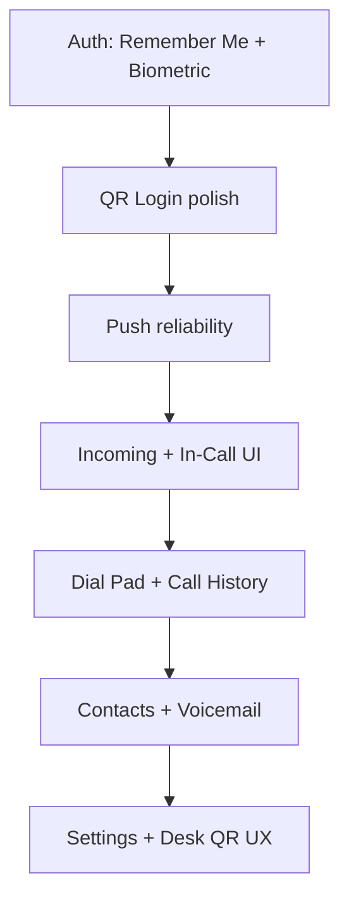

# Phase 4 — Mobile Feature Matrix

Implementation status for `mobile-rn/`. Update this document as features ship.

**Legend:** ✅ Done · 🔄 Partial · ❌ Not started · 🚫 Out of Phase 4 scope

---

## Authentication

| Feature | Status | Location / notes |
|---------|--------|------------------|
| Email + password login | ✅ | `src/screens/LoginScreen.tsx`, `src/store/authStore.ts` |
| QR Login (employee provision) | 🔄 | `src/screens/QrLoginScreen.tsx`, `src/auth/qrLogin.ts` — scan + redeem; polish error UX |
| Remember Me | ❌ | Tokens in SecureStore; no explicit “remember me” toggle or username persistence |
| Biometric Login | ❌ | Requires `expo-local-authentication` + unlock gate on cold start |
| Session refresh | ✅ | `src/auth/tokenStorage.ts`, API client interceptors |
| Session expired UI | ✅ | `src/components/SessionExpiredScreen.tsx` |

---

## Calling

| Feature | Status | Location / notes |
|---------|--------|------------------|
| Dial Pad | 🔄 | `src/screens/calls/DialPadScreen.tsx`, `VspDialPad` — verify PSTN + extension |
| Recent / Call History | 🔄 | `src/screens/calls/RecentCallsScreen.tsx`, `useRecentCalls` |
| Call detail | 🔄 | `src/screens/calls/CallDetailsScreen.tsx` |
| Incoming Call UI | 🔄 | `src/screens/calls/IncomingCallScreen.tsx` — native CallKit / ConnectionService TBD |
| In-Call Screen | 🔄 | `src/screens/calls/ActiveCallScreen.tsx` — mute, hold, hangup |
| Telnyx WebRTC / SIP | ✅ | `src/calling/telnyxVoip.ts`, `src/sip/service.ts` |
| Presence heartbeat | ✅ | Softphone presence via existing API |
| Blind transfer | 🚫 | Web-only in Phase 2; not Phase 4 unless explicitly added |

---

## Contacts

| Feature | Status | Location / notes |
|---------|--------|------------------|
| Tenant directory | 🔄 | `src/contacts/contactsService.ts`, `ContactsListScreen` |
| Contact detail + tap-to-call | 🔄 | `ContactDetailScreen.tsx` |
| Device contacts merge | ❌ | Optional enhancement |

---

## Voicemail

| Feature | Status | Location / notes |
|---------|--------|------------------|
| Voicemail list | 🔄 | `src/screens/voicemail/VoicemailListScreen.tsx` |
| Voicemail playback | 🔄 | `VoicemailDetailScreen.tsx` |
| Mark read / delete | 🔄 | Verify against portal API parity |

---

## Push notifications

| Feature | Status | Location / notes |
|---------|--------|------------------|
| FCM registration | 🔄 | `src/notifications/PushNotificationProvider.tsx` |
| Incoming call push | 🔄 | Telnyx + FCM; reliability testing required |
| Message push | 🔄 | `messageNotifications.ts` |
| iOS APNs | ❌ | Not shipped |

Setup: [mobile-rn/docs/ANDROID-FIREBASE-SETUP.md](../../../mobile-rn/docs/ANDROID-FIREBASE-SETUP.md)

---

## Settings

| Feature | Status | Location / notes |
|---------|--------|------------------|
| Settings hub | ✅ | `src/screens/settings/SettingsScreen.tsx` |
| Profile | ✅ | `ProfileScreen.tsx` |
| Theme (light/dark) | ✅ | `ThemeScreen.tsx` |
| Notification preferences | 🔄 | `NotificationsScreen.tsx` |
| SIP configuration / diagnostics | 🔄 | `SipConfigurationScreen.tsx` |
| About | ✅ | `AboutScreen.tsx` |

---

## Desk phone provisioning

| Feature | Status | Location / notes |
|---------|--------|------------------|
| Scan desk SIP QR | 🔄 | `SipConfigurationScreen.tsx` — `redeemDeskProvisioningQr` |
| Auto-fill SIP profile | 🔄 | `sip/provisioningProfile.ts` |
| Admin portal QR generation | ✅ | Phase 2 portal (backend frozen) |

Mobile work: improve discoverability, post-scan validation UX, and help text — **no backend API changes**.

---

## Explicitly out of Phase 4 primary scope

These exist in the app but are **not** Phase 4 deliverables unless reprioritized:

| Feature | Notes |
|---------|-------|
| SMS / Messaging tab | Implemented; maintain, do not expand scope |
| Dashboard tab | Implemented; polish only |
| You / org admin screens | Read-only employee views |

---

## Suggested implementation order



Auth and push unblock calling UX. Telephony screens depend on reliable registration and notifications.

---

## Test gate

```bash
npm run test:mobile
```

Manual QA: physical Android device + Telnyx debugger for inbound/outbound on production API.
