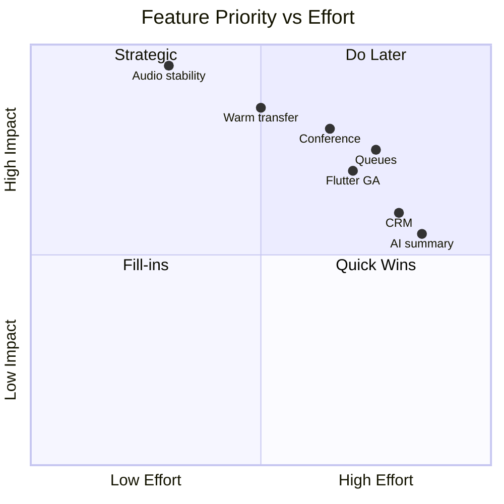

# Priority Roadmap

Feature priorities P0–P4 for VSP Phone. P0 must be stable before P1 ships to production.

---

## P0 — Critical (now)

Stabilize telephony and production confidence. **Block release if failing.**

| Item | Status | Owner focus |
|------|--------|-------------|
| Two-way audio stability | 🔄 Active | WebRTC send path, ICE/TURN, office networks |
| Production validation | 🔄 Active | `/ready`, deploy parity, commit match |
| Browser compatibility | 🔄 Ongoing | Chrome, Edge, Firefox; mic permissions |
| Telephony regression testing | 🔄 Active | Expand automated validators + manual checklist |
| Bridge grace integrity | ✅ Implemented | Maintain — `validate:rapid-accept-stress` |
| Deployment verification | ✅ Documented | [deployment-safety.mdc](../../../.cursor/rules/deployment-safety.mdc) |

**Exit criteria:** Stable inbound/outbound at home + office; merge checklist green; tagged release on `main`.

---

## P1 — High (next quarter)

Core PBX features for business customers. Depends on P0 stable.

| Feature | Status | Notes |
|---------|--------|-------|
| Warm transfer | 📋 Planned | Phase 2 — [call-transfer plan](../../call-transfer-implementation-plan.html) |
| Conference calling | 📋 Planned | Phase 3 — requires warm transfer patterns |
| Presence | 🔄 In Progress | Wire `softphoneOnlineAt` into ring routing |
| Call pickup | 📋 Planned | Requires presence + active call index |

**Dependencies:** [03-feature-dependencies.md](./03-feature-dependencies.md)

---

## P2 — Medium (contact center lite)

| Feature | Status | Notes |
|---------|--------|-------|
| Call queues (ACD) | 📋 Planned | Telnyx enqueue API |
| Ring groups (advanced) | 🔄 Partial | ROUND_ROBIN polish, mobile UI |
| Business hours | ✅ Basic | Per-DID holiday routing needed |
| Holiday routing | 📋 Planned | Calendar overlay on greeting |
| IVR (multi-level) | 📋 Planned | Extend gather FSM |
| Call parking | 📋 Planned | After conference infrastructure |

---

## P3 — Mobile platform

| Feature | Status | Notes |
|---------|--------|-------|
| Flutter mobile GA | 🔄 Partial | Android exists; parity with web |
| Push notifications | 🔄 Partial | FCM; reliability hardening |
| CallKit (iOS) | 📋 Planned | Requires iOS app |
| Android ConnectionService | 📋 Planned | Native call UI |
| Background calls | 📋 Planned | OS integration |
| Offline handling | 📋 Planned | Queue actions, sync on reconnect |

Target release: **v2.0** — see [04-release-plan.md](./04-release-plan.md)

---

## P4 — Enterprise & AI

| Feature | Status | Notes |
|---------|--------|-------|
| CRM integration | 🔮 Future | Salesforce, HubSpot, Zoho |
| AI call summary | 🔮 Future | Post-call LLM |
| AI transcription | 🔮 Future | Telnyx or third-party STT |
| Wallboard | 🔮 Future | Requires queues + presence |
| Supervisor dashboard | 🔮 Future | Barge, whisper, monitor |
| Analytics | 🔄 Partial | Ring group stats; expand |

Target releases: **v2.5** enterprise, **v3.0** AI — see [09-ai-roadmap.md](./09-ai-roadmap.md), [10-enterprise-roadmap.md](./10-enterprise-roadmap.md)

---

## Priority summary

---

## Related docs

- [03-feature-dependencies.md](./03-feature-dependencies.md)
- [04-release-plan.md](./04-release-plan.md)
- [01-current-state.md](./01-current-state.md)
