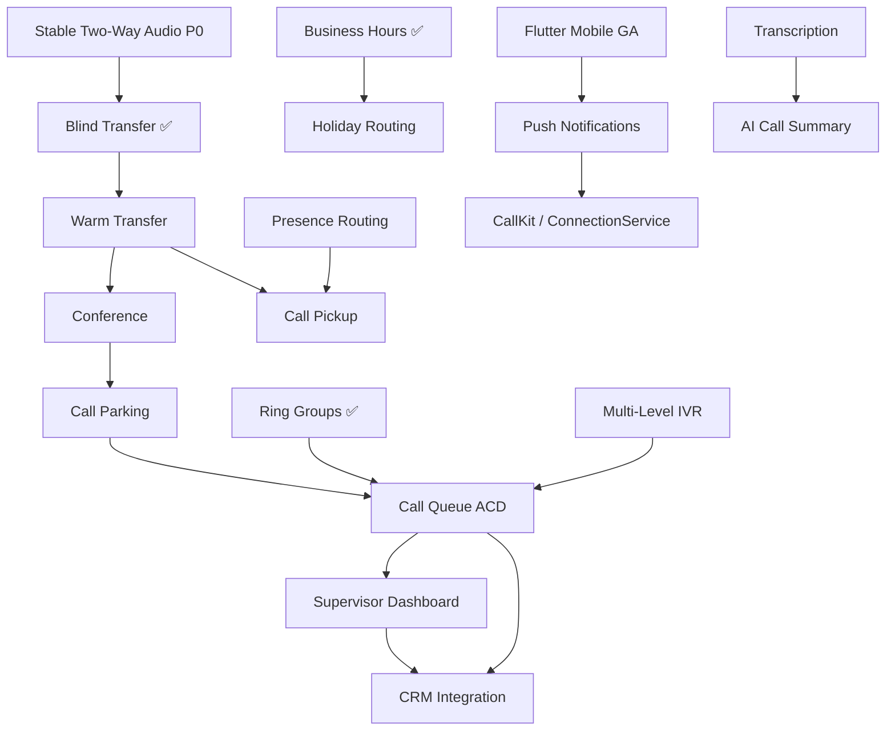

# Feature Dependencies

Which features must exist before others can be built. **No circular dependencies** in this graph.

---

## Primary dependency chain

---

## Dependency table

| Feature | Requires first | Reason |
|---------|----------------|--------|
| **Warm transfer** | Blind transfer ✅, bridge grace ✅, stable audio | Extends `callTransferControl.js` FSM |
| **Conference** | Warm transfer patterns, hold/unhold Call Control | 3-way consult leg |
| **Call parking** | Conference / multi-leg bridge | Park slot + retrieve |
| **Call queue** | Ring groups ✅, presence (recommended), Redis sessions | Agent selection + enqueue |
| **Supervisor dashboard** | Queues, presence, active call index | Monitor/barge/whisper |
| **Call pickup** | Presence routing, active call index (`ccs:active:*`) | Pick up ringing extension |
| **Multi-level IVR** | Single-level IVR 🔄, Call Control gather | Deeper FSM states |
| **Holiday routing** | Business hours ✅ | Calendar exceptions |
| **Flutter GA (v2.0)** | P0 audio stable, feature parity list | Mobile is release bundle |
| **CallKit / ConnectionService** | Push notifications reliable | OS incoming call UI |
| **CRM integration** | Stable CDR, optional queue events | Screen-pop on ring/answer |
| **Transcription** | Recording ✅, storage pipeline | Audio source |
| **AI call summary** | Transcription | LLM input |
| **SSO / LDAP** | Enterprise auth design | IdP before directory sync |
| **Wallboard** | Queues + real-time metrics | Live queue stats |

---

## Parallel tracks (independent)

These can proceed in parallel if P0 is green:

| Track | Features | Shared dependency |
|-------|----------|-------------------|
| **Media stability** | Audio, ICE diagnostics, browser QA | P0 only |
| **Transfer & conference** | Warm → conference → parking | Call Control FSM |
| **Routing** | IVR, holidays, advanced ring groups | Inbound routing |
| **Mobile** | Flutter, push, CallKit | Token API (exists) |
| **Platform** | ECS, monitoring, load tests | Deployment KB |
| **Enterprise** | SSO, CRM | Auth + CDR APIs |
| **AI** | Transcription, summary | Recording + webhook pipeline |

---

## Anti-patterns (do not build)

| Attempt | Problem |
|---------|---------|
| Queues before warm transfer stable | Transfer FSM conflicts with queue state |
| Supervisor before queues | Nothing to supervise |
| AI summary before recording pipeline | No audio source |
| CRM before tenant CDR reliable | Screen-pop data incomplete |
| iOS CallKit before push reliable | Missed incoming calls |
| Second inbound call flow (TeXML duplicate) | Architecture violation |

---

## Circular dependency check

| Pair | Verdict |
|------|---------|
| Warm ↔ Conference | Linear: warm first |
| Queue ↔ Supervisor | Linear: queue first |
| Presence ↔ Pickup | Linear: presence first |
| Mobile ↔ Push | Linear: mobile base first |
| Transcription ↔ AI summary | Linear: transcription first |

**Result:** No circular dependencies in approved roadmap.

---

## Related docs

- [02-priority-roadmap.md](./02-priority-roadmap.md)
- [04-release-plan.md](./04-release-plan.md)
- [../pbx/15-blind-transfer.md](../pbx/15-blind-transfer.md)
- [../pbx/16-attended-transfer.md](../pbx/16-attended-transfer.md)
- [../../call-transfer-implementation-plan.html](../../call-transfer-implementation-plan.html)
